## 依赖

```xml
 <!--lombok1.18.18-->
<dependency>
    <groupId>org.projectlombok</groupId>
    <artifactId>lombok</artifactId>
    <version>${lombok.version}</version>
    <scope>provided</scope>
</dependency>
```

## **1. @Getter/@Setter**

为字段生成Getter和Setter方法，可以注解到字段或者类上(注解在类上会为类中的所有字段生成Getter和Setter方法)，默认是public类型的，如果需要的话可以修改方法的访问级别。

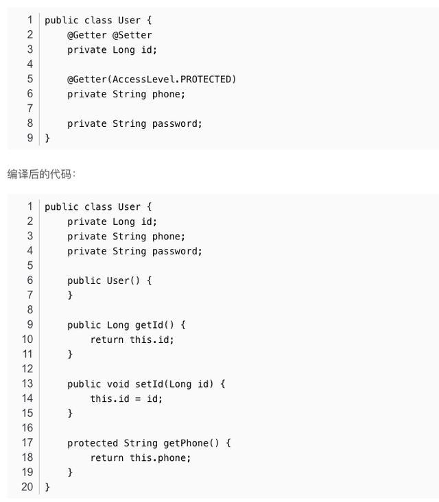

结果解释：

id字段生成了Getter&Setter,访问修饰符是public

phone只生成了Getter方法，因为只使用了@Getter而没有使用@Setter, 并且访问修饰符是protected

password 上并没有注解，所以什么都不生成

注意：Lombok中的注解一般都会包含一个无参构造函数注解@NoArgsConstructor(用于生成无参构造函数的) ，所以还会额外生成一个无参构造函数

@Getter @Setter 注解在类上，表示为类中的所有字段生成Getter&Setter方法。

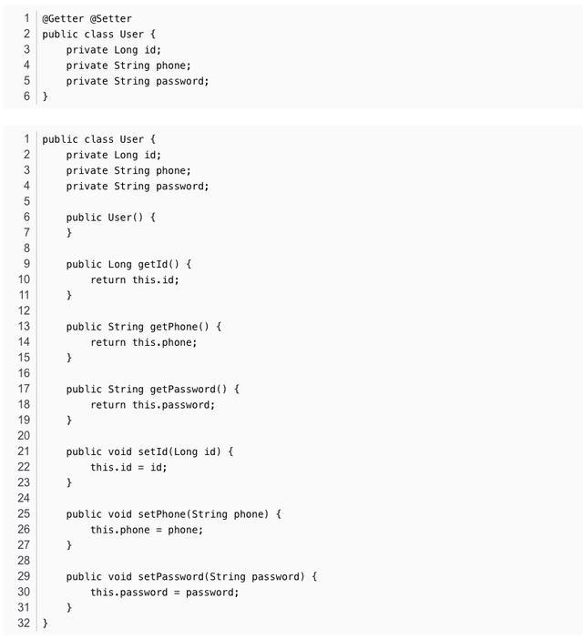

## **2. @NonNull**

为字段赋值时(即调用字段的setter方法时)，如果传的参数为null，则会抛出空异常NullPointerException，生成setter方法时会对参数是否为空检查

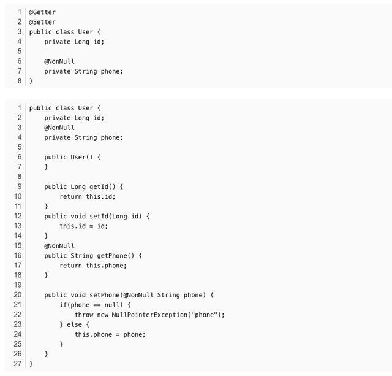

## 3. @NoArgsConstructor

生成一个无参构造方法。当类中有final字段没有被初始化时，编译器会报错，此时可用@NoArgsConstructor(force = true)，然后就会为没有初始化的final字段设置默认值 0 / false / null, 这样编译器就不会报错。对于具有约束的字段（例如@NonNull字段），不会生成检查或分配，因此请注意，正确初始化这些字段之前，这些约束无效。

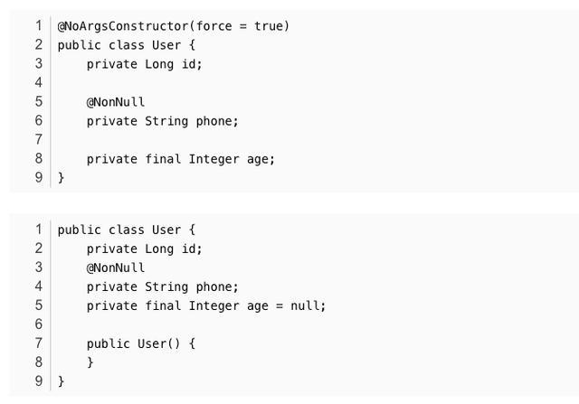

## 4. @RequiredArgsConstructor

生成构造方法（可能带参数也可能不带参数），如果带参数，这参数只能是以final修饰的未经初始化的字段，或者是以@NonNull注解的未经初始化的字段。

```java
//生成无参与有参（nonnull在字段上，就生成多少个参数）
@Data
@NoArgsConstructor
@RequiredArgsConstructor
public class User {
    @NonNull
    private String username;
    private String password;
    private String phone;
    private String address;
}
```

@RequiredArgsConstructor(staticName = “of”)会生成一个of()的静态方法，并把构造方法设置为私有的

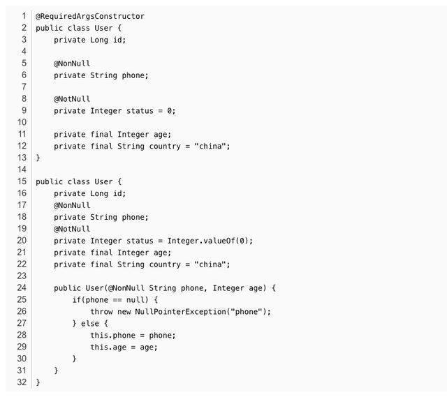

必要的构造函数只会生成final修饰的未经初始化的字段或者是以@NonNull注解的未经初始化的字段， 所以生成了public User(@NonNull String phone, Integer age)构造函数

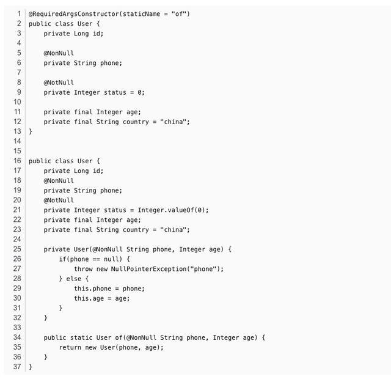

## **5. @AllArgsConstructor**

生成一个全参数的构造方法

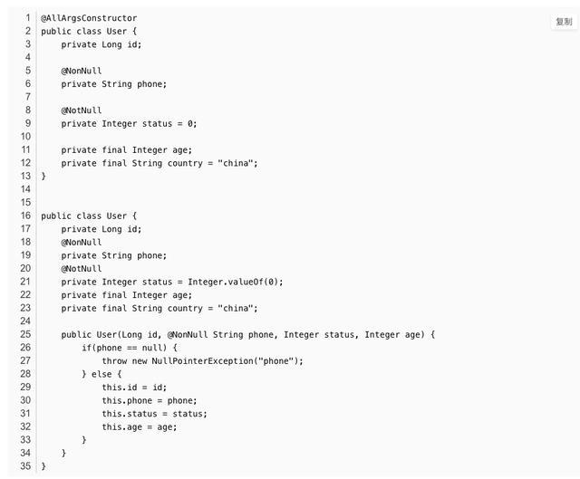

## 6. @ToString

生成toString()方法，默认情况下它会按顺序（以逗号分隔）打印你的类名称以及每个字段。可以这样设置不包含哪些字段,可以指定一个也可以指定多个@ToString(exclude = “id”) / @ToString(exclude = {“id”,“name”})

如果继承的有父类的话，可以设置callSuper 让其调用父类的toString()方法，例如：@ToString(callSuper = true)

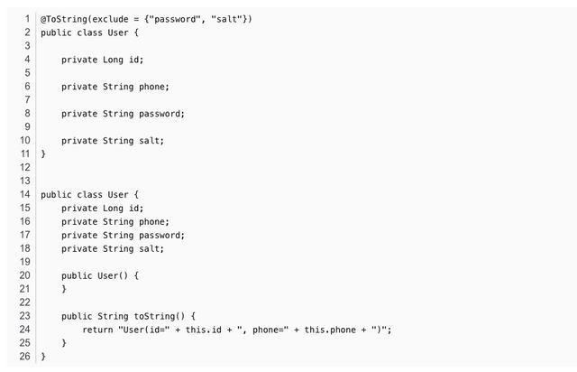

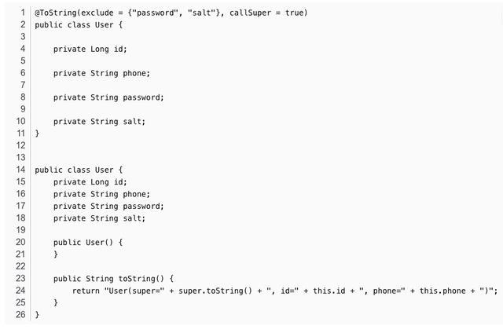

## 7. @EqualsAndHashCode

生成hashCode()和equals()方法，默认情况下，它将使用所有非静态，非transient字段。但可以通过在可选的exclude参数中来排除更多字段。或者，通过在of参数中命名它们来准确指定希望使用哪些字段。

// exclude 排除字段

@EqualsAndHashCode(exclude = {“password”, “salt”})

// of 指定要包含的字段

@EqualsAndHashCode(of = {“id”, “phone”, “password”})

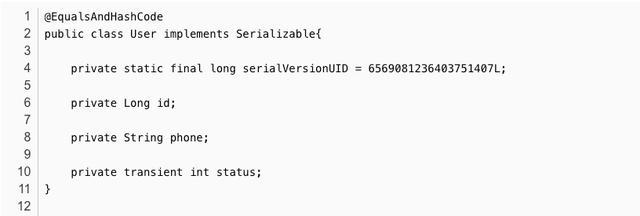

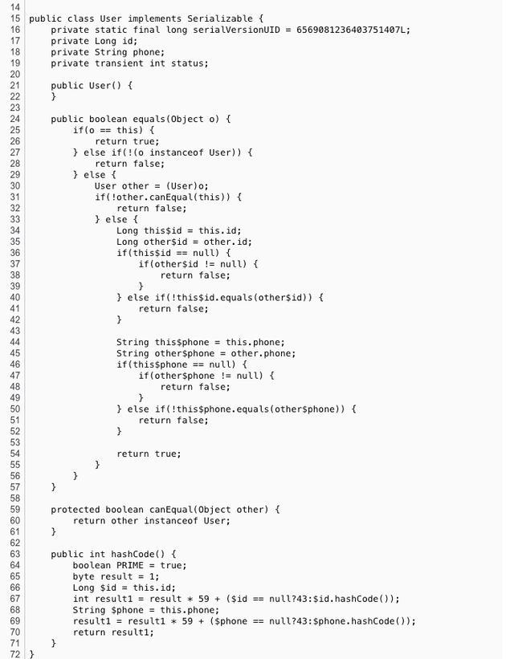

## **8. @Data**

@Data 包含了 @ToString、@EqualsAndHashCode、@Getter / @Setter和@RequiredArgsConstructor的功能

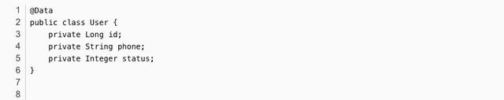

## **9. @Value**

@Value 将字段都变成不可变类型:使用final修饰， 同时还包含@ToString、@EqualsAndHashCode、@AllArgsConstructor 、@Getter(注意只有Getter没有Setter)

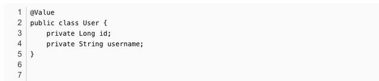

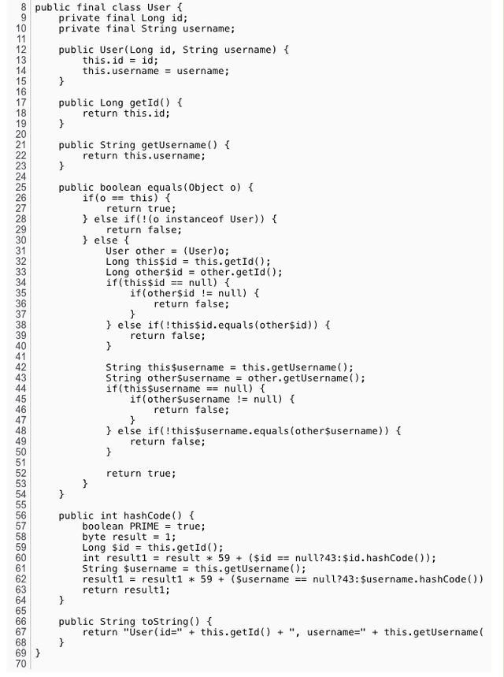

## 10. @Log

生成log对象，用于记录日志，可以通过topic属性来设置getLogger(String name)方法的参数 例如 @Log4j(topic = “com.xxx.entity.User”)，默认是类的全限定名，即 类名.class，log支持以下几种：

@Log java.util.logging.Logger

@Log4j org.apache.log4j.Logger

@Log4j2 org.apache.logging.log4j.Logger

@Slf4j org.slf4j.Logger

@XSlf4j org.slf4j.ext.XLogger

@CommonsLog org.apache.commons.logging.Log

@JBossLog org.jboss.logging.Logger


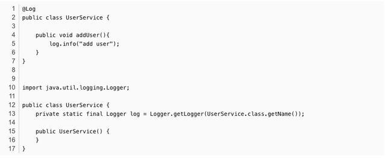

## **11. @SneakyThrows**


## **12. @Synchronized**

给方法加上同步锁

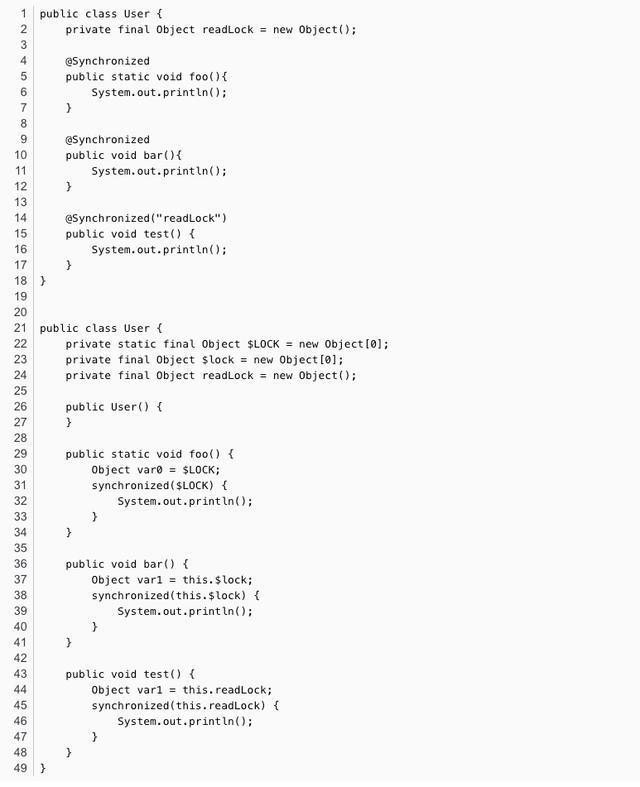

## **13. @Cleanup**

主要用来修饰 IO 流相关类, 会在 finally 代码块中对该资源进行 close();


## **14. @Getter(lazy = true)**

@Getter(lazy = true)

标注字段为懒加载字段，懒加载字段在创建对象时不会进行初始化，而是在第一次访问的时候才会初始化，后面再次访问也不会重复初始化

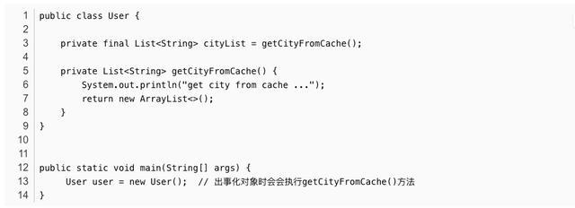

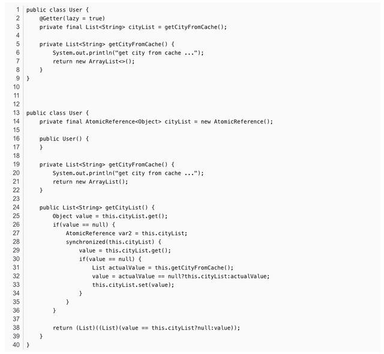

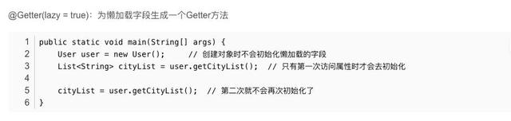

## **15. @Wither**

提供了给final字段赋值的一种方法

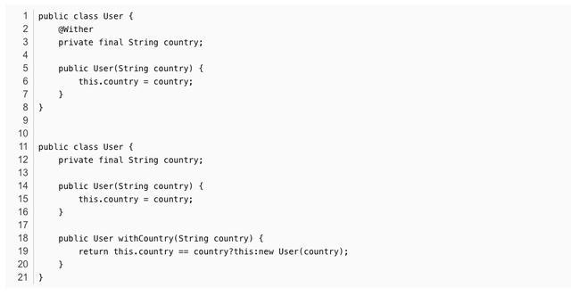

## **16. @Builder**

@Builder注释为你的类生成复杂的构建器API。

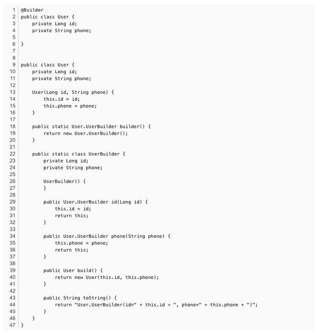

## **17. @Delegate**

为List类型的字段生成一大堆常用的方法，其实这些方法都是List中的方法

注意：一个类中只能使用一个@Delegate注解，因为使用多个会生成多个size()方法，从而会编译报错。

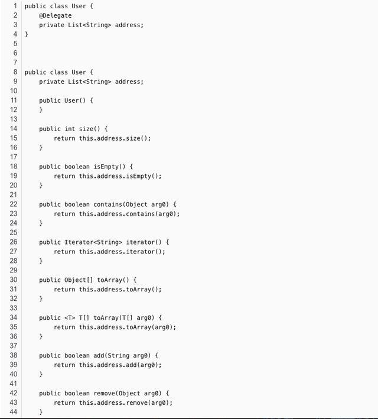

lombok.config

lombok.config配置文件是通过一些设置来控制代码生成的规则或者称之为习惯，配置文件的位置应放在src/mian/java，不要放置在src/main/resources。

注意配置文件和要使用注解的类要在同一套代码中，要么同时在src/main/java 要么同时在 src/test/java中

lombok.config

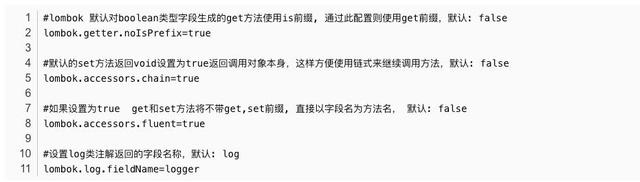

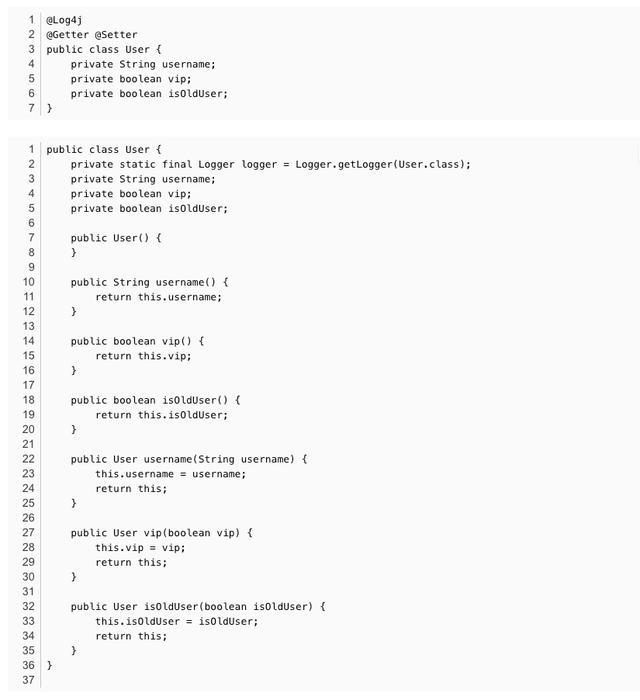