## 协议与中间件

### 什么是中间件

中间件是介于应用系统和[系统软件](https://baike.baidu.com/item/系统软件/215962)之间的一类软件，它使用系统软件所提供的基础服务（功能），衔接网络上应用系统的各个部分或不同的应用，能够达到资源共享、功能共享的目的。目前，它并没有很严格的定义，但是普遍接受IDC的定义：中间件是一种独立的系统软件服务程序，分布式应用软件借助这种软件在不同的技术之间共享资源，中间件位于客户机服务器的操作系统之上，管理计算资源和网络通信。从这个意义上可以用一个等式来表示中间件：中间件=平台+通信，这也就限定了只有用于分布式系统中才能叫中间件，同时也把它与支撑软件和实用软件区分开来

### 什么是协议

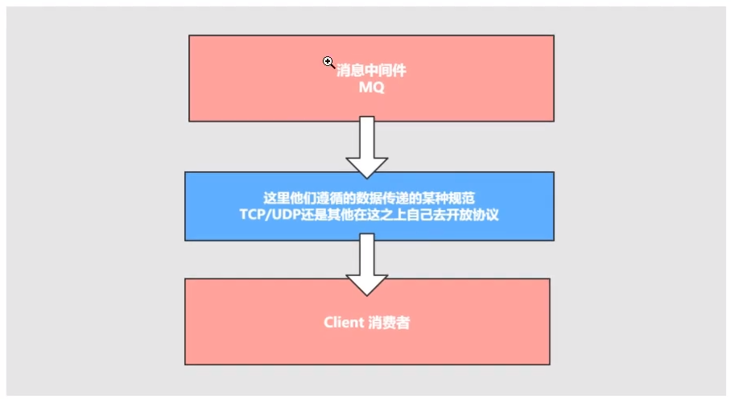

我们知道消息中间件负责数据的传递，存储，和分发消费三个部分，数据的存储和分发的过程中肯定要遵循某种约定成俗的规范，你是采用底层的TCP/IP，UDP协议还是其他的自己构建的等等，而这些约定成俗的规范就称之为：协议。

所谓协议是指：

1. 计算机底层操作系统和应用程序通讯时共同遵守的一组约定，只有遵循共同的约定和规范，系统和底层操作系统之间才能相互交流。
2. 和一般的网络应用程序的不同在于它主要负责数据的接受和传递，所以性能比较的高
3. 协议对数据格式和计算机之间交换数据都必须严格遵守规范

### 网络协议的三要素

1. 语法：语法是用户数据与控制信息的结构与格式以及数据出现的顺序。
2. 语义：语义是解释控制信息每个部分的意义。他规定了需要发出何种控制信息以及完成的动作与做出什么样的响应。
3. 时序：时序是对事件发生顺序的详细说明

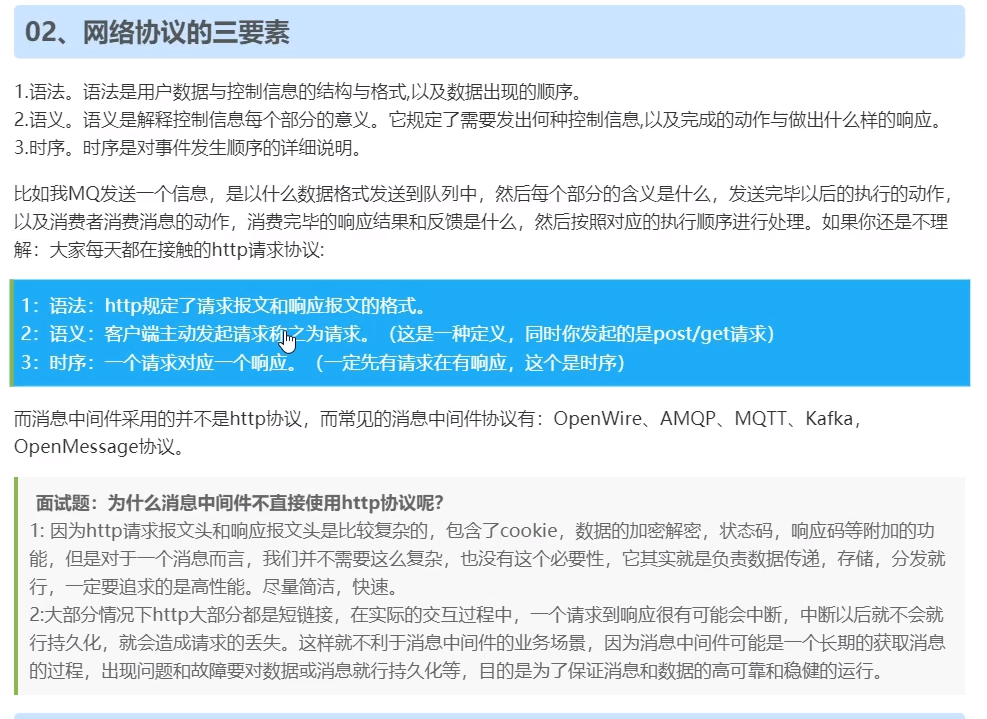

### AMQP协议

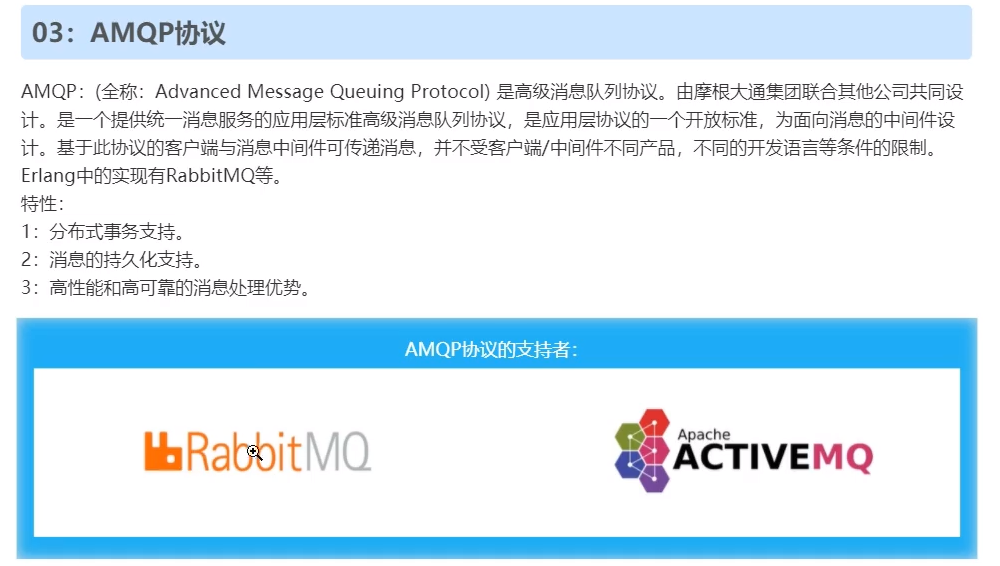

### MQTT协议

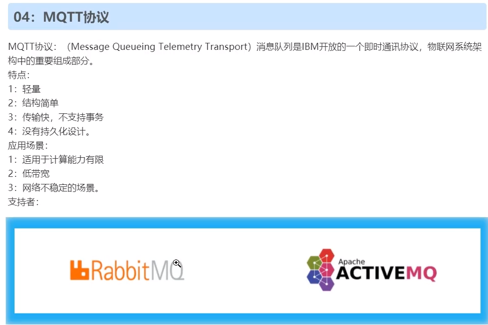

### OpenMessage协议

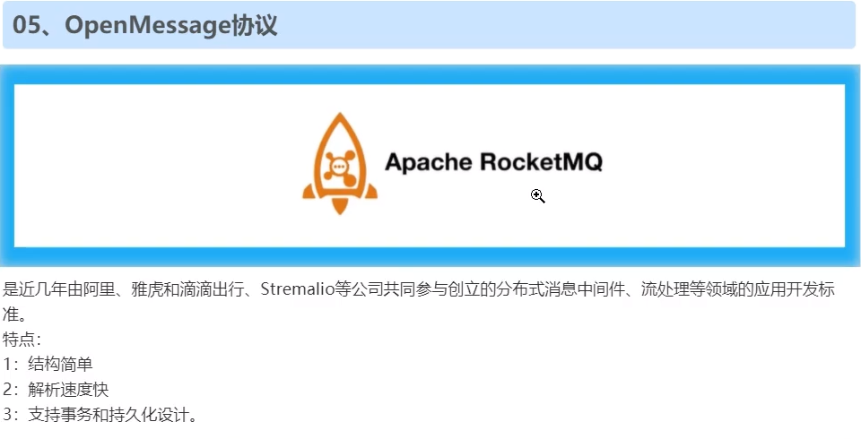

### KafKa协议

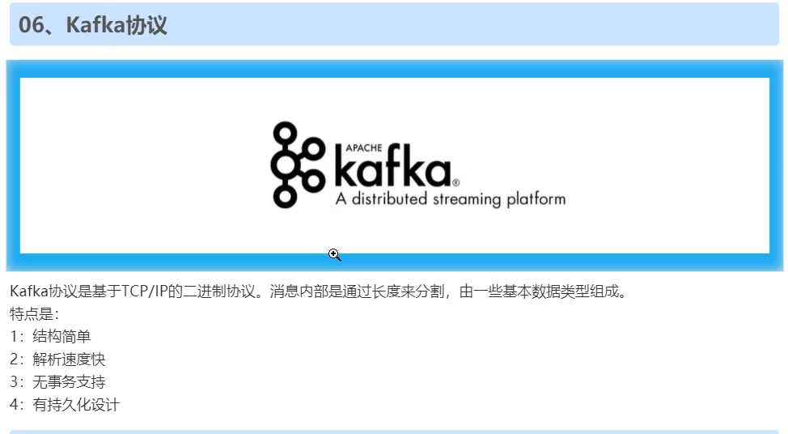

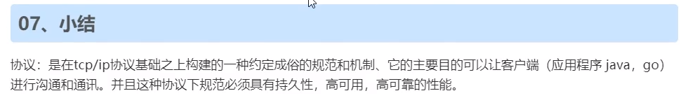

## 消息队列持久化

### 持久化

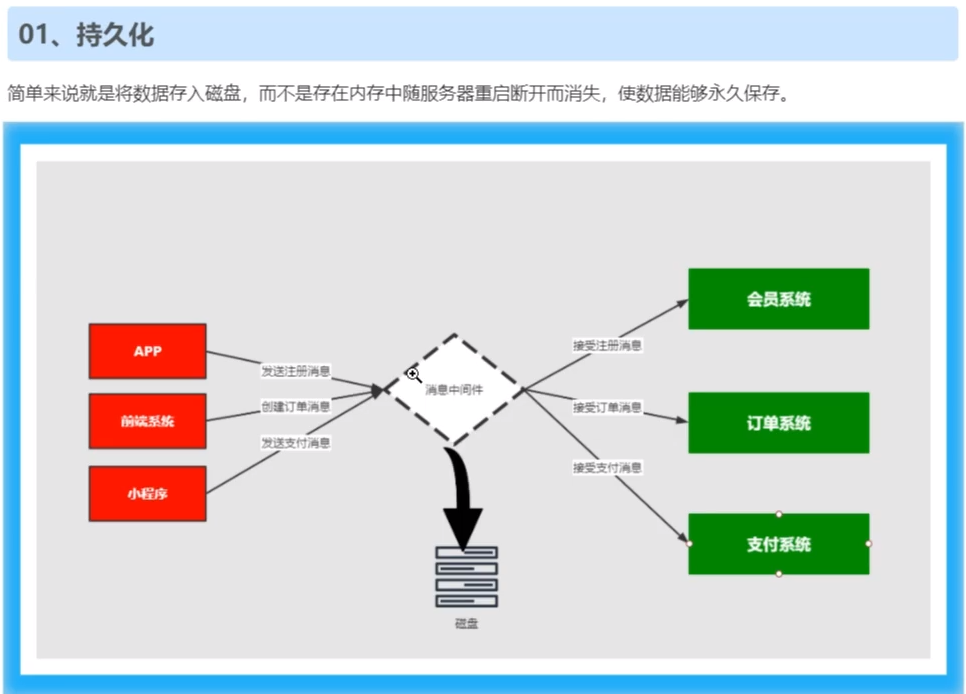

### 常见的持久化方式

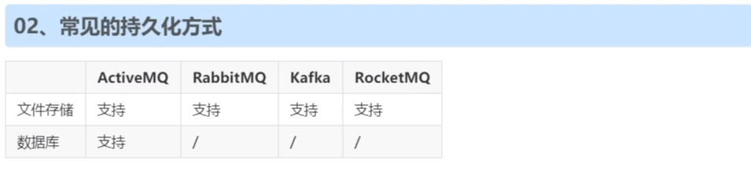

## 消息队列的分发策略

### 分发策略

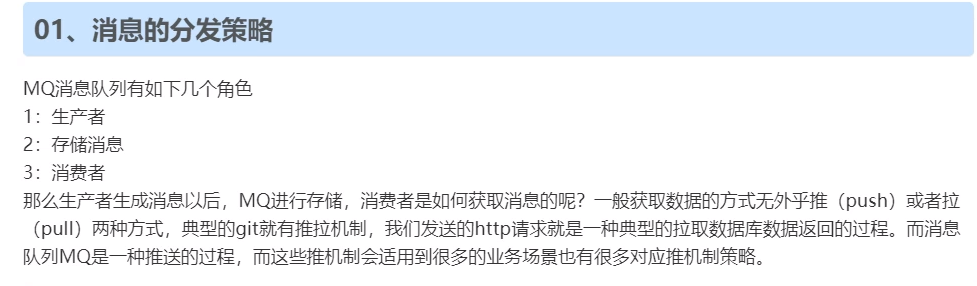

### 场景一

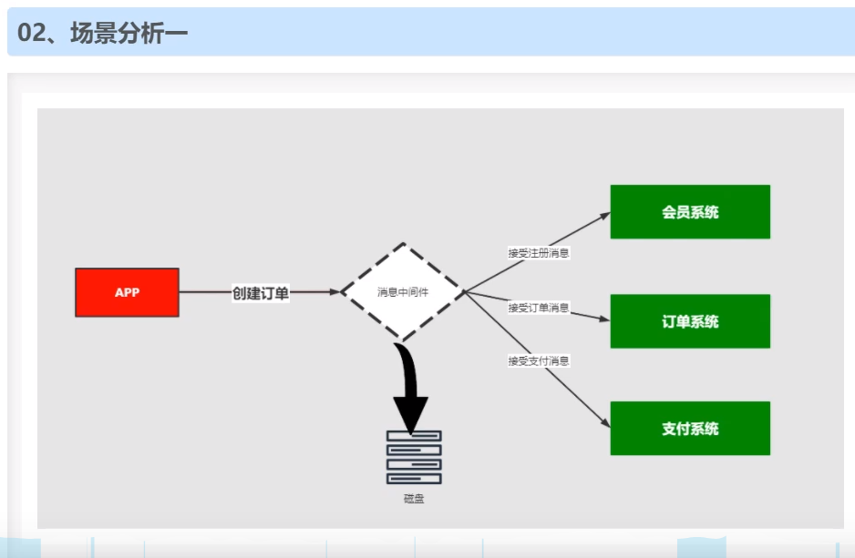

### 场景二

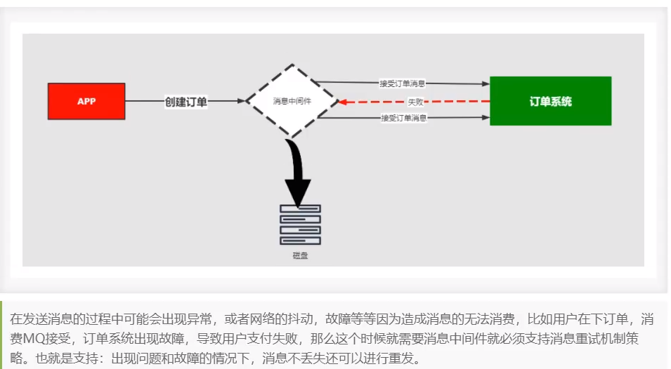

### 消息分发策略的机制和对比

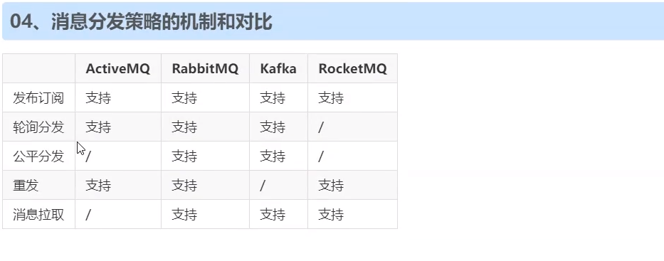

## 消息队列高可用和高可靠

### 什么是高可用机制

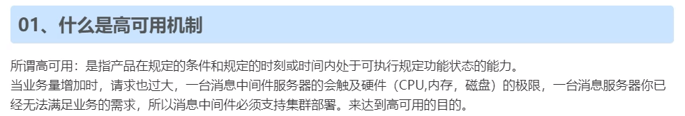

### 集群模式1- Master-slave主从共享数据的部署方式

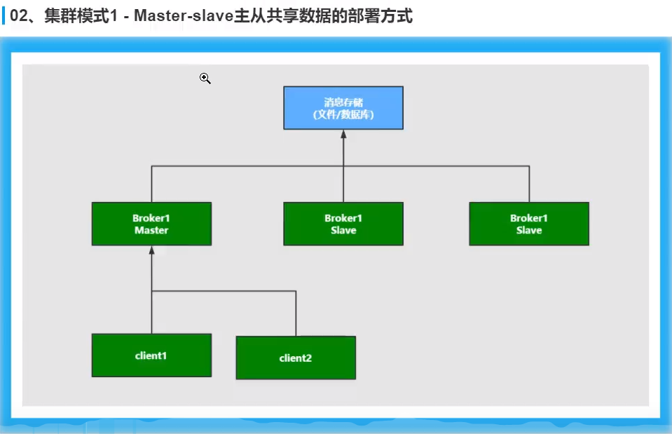


### 集群模式2- Master -slave主从同步部署方式

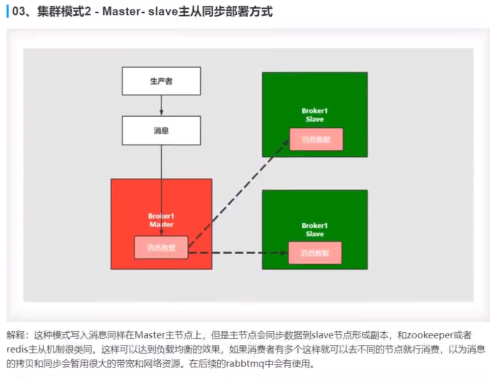

### 集群模式3-多主集群同步部署模式


### 集群模式4- 多主集群转发部署模式

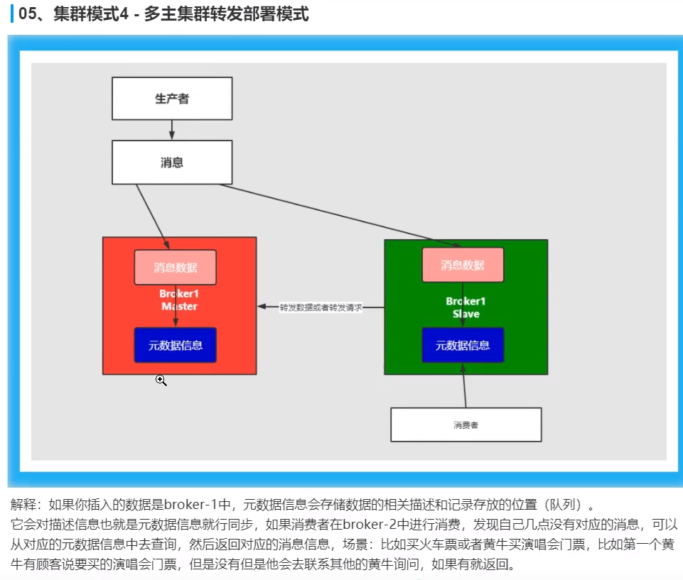

### 集群模式5 Master-slave 与Breoker-cluster组合的方案


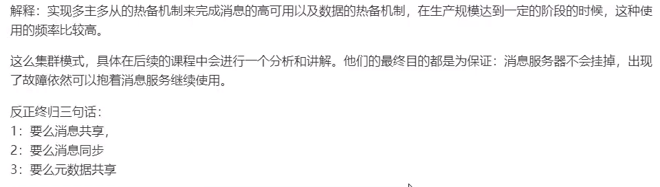

### 什么是高可靠机制

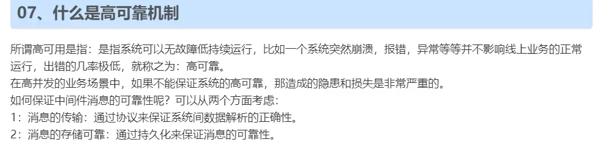

## RabbitMQ简介

**RabbitMQ**是实现了高级消息队列协议（AMQP）的开源消息代理软件（亦称面向消息的中间件）。RabbitMQ服务器是用[Erlang](https://baike.baidu.com/item/Erlang)语言编写的，而集群和故障转移是构建在[开放电信平台](https://baike.baidu.com/item/开放电信平台)框架上的。所有主要的[编程语言](https://baike.baidu.com/item/编程语言/9845131)均有与代理接口通讯的[客户端](https://baike.baidu.com/item/客户端/101081)库。

## 安装RabbitMQ

到官网下载centos7版本的，放到/usr/local/rabbitMQ，文件如下

erlang-23.3.1-1.el7.x86_64.rpm

rabbitmq-server-3.8.14-1.el7.noarch.rpm

1.输入以下

```
yum install -y socat
```

2.输入

```
rpm -ivh erlang-23.3.1-1.el7.x86_64.rpm--force --nodeps
rpm -ivh rabbitmq-server-3.8.14-1.el7.noarch.rpm --force --nodeps
```

3.启动

```
systemctl start rabbitmq-server 启动
systemctl stop rabbitmq-server 关闭
systemctl status rabbitmq-server 查看运行状态
```

4.安装客户端插件

```bash
rabbitmq-plugins enable rabbitmq_management
#启动
rabbitmqctl start_app
```

## 授权账号和密码

### 新增用户

```
rabbitmqctl add_user admin admin
```

### 设置用户分配操作权限

```
rabbitmqctl set_user_tags admin administrator
```

### 用户级别

1. administrator 可以登录控制台、查看所有信息、可以对rabbitmq进行管理
2. monitoring 监控者 登录控制台，查看所有信息
3. policymaker 策略指定者，登录控制台，指定策略
4. management 普通管理员 登录控制台

### 为用户添加资源权限

分配了超级管理员之后可以不用执行此命令

```
rabbitmqctl set_permissions -p / admin ".*" ".*" ".*"
```

## 在Docker上安装

安装并运行

```
docker run -di --name myrabbit -e RABBITMQ_DEFAULT_USER=admin -e RABBITMQ_DEFAULT_PASS=admin -p 15672:15672 -p 5672:5672 -p 25672:25672 -p 61613:61613 -p 1883:1883 rabbitmq:management
```

## RabbitMQ的角色分类

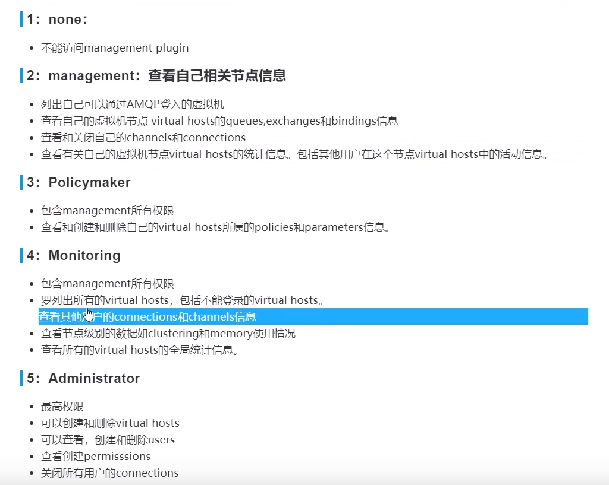

## Maven依赖

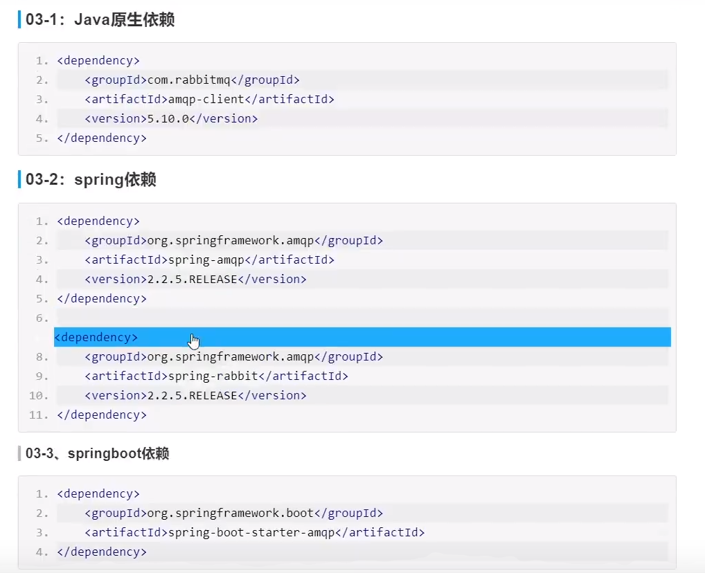

## 简单的入门案例

RabbitMQ的七种模式，官网图解地址：https://www.rabbitmq.com/getstarted.html

### 生产者

```java
public class Producer {
    public static void main(String[] args) {
        Connection connection =null;
        Channel channel =null;
        try {
            //创建连接
            ConnectionFactory connectionFactory = new ConnectionFactory();
            connectionFactory.setUsername("admin");
            connectionFactory.setPassword("admin");
            connectionFactory.setPort(5672);
            connectionFactory.setHost("47.112.181.157");
            connectionFactory.setVirtualHost("/");
            //创建连接Connection
            connection = connectionFactory.newConnection("生产者");
            //通过连接获取通道Channel
            channel = connection.createChannel();
            //通过创建交换机，生命队列，绑定关系，路由key，发送消息和接受消息
            String queueName = "queue1";
            channel.queueDeclare(queueName,false,false,false,null);
            //准备消息内容
            //发送消息队列
            channel.basicPublish("",queueName,null,"今晚打老虎".getBytes());
            System.out.println("发送成功");

        } catch (Exception e) {
            e.printStackTrace();
        } finally {
            //关闭连接
            if(connection!=null && connection.isOpen()){
                try {
                    connection.close();
                } catch (IOException e) {
                    e.printStackTrace();
                }
            }
        }
    }
}
```

### 消费者

```java
public class Consumer {
    public static void main(String[] args) {
        Connection connection =null;
        Channel channel =null;
        try {
            //创建连接
            ConnectionFactory connectionFactory = new ConnectionFactory();
            connectionFactory.setUsername("admin");
            connectionFactory.setPassword("admin");
            connectionFactory.setPort(5672);
            connectionFactory.setHost("47.112.181.157");
            connectionFactory.setVirtualHost("/");
            //创建连接Connection
            connection = connectionFactory.newConnection("消费者");
            //通过连接获取通道Channel
            channel = connection.createChannel();
            //通过创建交换机，生命队列，绑定关系，路由key，发送消息和接受消息
            String queueName = "queue1";

            channel.basicConsume(queueName, true, (consumerTag, message) -> {
                System.out.println(consumerTag);
                System.out.println("收到的消息：" + new String(message.getBody()));
            }, consumerTag -> {
                System.out.println("接收失败了");
            });
            System.in.read();
        } catch (Exception e) {
            e.printStackTrace();
        } finally {
            //关闭连接
            if(connection!=null && connection.isOpen()){
                try {
                    connection.close();
                } catch (IOException e) {
                    e.printStackTrace();
                }
            }
        }

    }
}
```

## RabbitMQ的核心组成部分

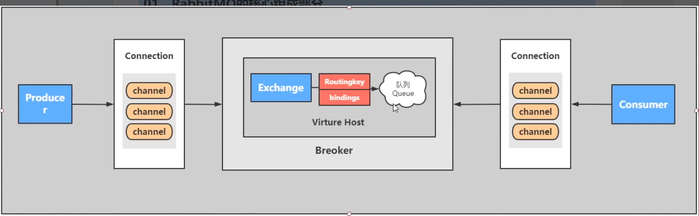

核心概念：

- Server：又称Broker，接受客户端的连接，实现AMQP实体服务。安装rabbitmq-server
- Connection ：连接，应用程序与Broker的网络连接TCP/IP三次握手和四次挥手
- Channel ：网络信道，几乎所有的操作都在Channel中进行，Channel是进行消息读写的通道，客户端可以建立一个Channel，每个Channel代表一个会话任务。
- Message ：消息，服务与应用程序之间传送的数据，由Properties和body组成，Properties可是对消息进行修饰，比如消息的优先级，延迟等高级特性，Body则就是消息体的内容
- Virtual Host 虚拟地址，用于进行逻辑隔离，最上层的消息路由，一个虚拟主机路由可以有若干个Exchange和Queue，同一个虚拟主机里面不能有相同名字的Exchange
- Exchange：交换机，接受消息，根据路由键发送消息到绑定的队列。（不具备消息存储的能力）
- Bindings ：Exchange和Queue之间的虚拟连接，Binding中可以保护多个routing key。

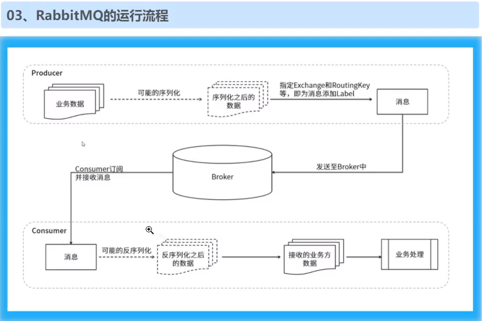

## Fanout模式

指定一个fanout模式的交换机，无需路由key绑定多个队列，交换机发一条消息，所有绑定fanout交换机的队列都能收到消息


## Routing（direct）模式

指定一个direct模式的交换机，通过路由键绑定队列如下图，交换机通过路由键给指定队列发消息，只有绑定了对应的路由键的队列才能收到。

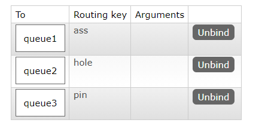


## Topics模式

routing的升级版，topics模式的路由key可以模糊匹配，如下图，**其中‘*’表示有且只有一级**，如下的queue1，可匹配com.ex,但不可匹配com.ex.xxx, **而#可表示零个或一级或多级**，可以任意匹配

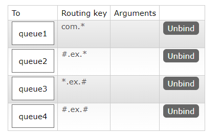

## Hearder模式

指定参数的交换机，比如交换机指定参数x=1，队列要获取消息就指定x=1.

### ConnectUtil

```java

public class ConnectUtil {
    interface ConnectConstant{
        String DEFAULT_HOST = "47.112.181.157";
        int DEFAULT_PORT = 5672;
        String DEFAULT_USERNAME = "admin";
        String DEFAULT_PASSWORD = "admin";
    }
    public static Connection buildConnection(String host,int port,String username,String password,String virtualPath,String connectionName) throws IOException, TimeoutException {
        ConnectionFactory connectionFactory = new ConnectionFactory();
        connectionFactory.setHost(host);
        connectionFactory.setPort(port);
        connectionFactory.setUsername(username);
        connectionFactory.setPassword(password);
        connectionFactory.setVirtualHost(virtualPath);
        if(connectionName==null){
            return connectionFactory.newConnection();
        }
        return connectionFactory.newConnection(connectionName);
    }
    public static Connection buildDefaultConnection(String connectionName) throws IOException, TimeoutException {
        if (connectionName == null){
            return buildConnection(ConnectConstant.DEFAULT_HOST,ConnectConstant.DEFAULT_PORT,
                    ConnectConstant.DEFAULT_USERNAME,ConnectConstant.DEFAULT_PASSWORD,"/",null);
        }
        return buildConnection(ConnectConstant.DEFAULT_HOST,ConnectConstant.DEFAULT_PORT,
                ConnectConstant.DEFAULT_USERNAME,ConnectConstant.DEFAULT_PASSWORD,"/",connectionName);
    }
    public static void close(Connection connection)  {
       if(connection !=null && connection.isOpen()){
           try {
               connection.close();
           } catch (IOException e) {
               e.printStackTrace();
           }
       }
    }
}
```

### 生产者

```java
public class Producer {
    public static void main(String[] args) {
        Connection connection =null;
        try {
            //创建连接Connection
            connection = ConnectUtil.buildDefaultConnection("生产者");
            //通过连接获取通道Channel
            Channel channel = connection.createChannel();
            //设置参数
            Map<String,Object> map = new HashMap<>();
            map.put("x","1");
            AMQP.BasicProperties properties = new AMQP.BasicProperties(null, null, map, null,
                    null, null, null, null,
                    null, null, null, null, null, null);
            //发送消息队列
            /*
            参数1：交换机名称
            参数2：路由键
            参数3：参数map
            参数4：发送的消息
             */
            channel.basicPublish("headers_ex","",properties,"今晚打老虎".getBytes());
            System.out.println("发送成功");
        } catch (Exception e) {
            e.printStackTrace();
        } finally {
           ConnectUtil.close(connection);
        }
    }
}

```

### 消费者

```java
public class Consumer {
    public static void main(String[] args) {
        for (int i = 0; i < 5; i++) {
            int j = i+1;
            new Thread(()->{
                consum("queue"+j);
            }, ("queue"+j)).start();
        }
        while (Thread.activeCount()>2){
            Thread.yield();
        }
        //consum("queue1");
    }
    public static void consum(String queueName){
        Connection connection =null;
        try {
            //创建连接Connection
            connection = ConnectUtil.buildDefaultConnection(queueName);
            //通过连接获取通道Channel
            Channel channel = connection.createChannel();
            //消费
            channel.basicConsume(queueName, true, (consumerTag, message) -> {
                byte[] body = message.getBody();
                System.out.println(queueName+"得到的消息："+new String(body));
            }, consumerTag -> System.out.println(queueName+"消费失败"));
            System.in.read();
        } catch (Exception e) {
            e.printStackTrace();
        } finally {
            ConnectUtil.close(connection);
        }
    }
}
```

## 自定义Exchange

```java
public class Producer {
    public static void main(String[] args) {
        Connection connection =null;
        try {
            //创建连接Connection
            connection = ConnectUtil.buildDefaultConnection("生产者");
            //通过连接获取通道Channel
            Channel channel = connection.createChannel();
            //定义交换机
            channel.exchangeDeclare("idrect", BuiltinExchangeType.DIRECT,true);
            //定义队列
            channel.queueDeclare("queue7",true,false,false,null);
            channel.queueDeclare("queue8",true,false,false,null);
            //交换机绑定队列
            channel.queueBind("queue7","idrect","q7");
            channel.queueBind("queue8","idrect","q8");
            //发送消息
            channel.basicPublish("idrect","q7",null,"今晚打老虎7".getBytes());
            channel.basicPublish("idrect","q8",null,"今晚打老虎8".getBytes());
            System.out.println("发送成功");

        } catch (Exception e) {
            e.printStackTrace();
        } finally {
           ConnectUtil.close(connection);
        }
    }
}
```

## 轮询分发

当有多个消费者来消费消息时，设置了自动应答，会采取轮询分发的机制，也就是从队列中取出消息，一人发一个，从头到尾，挨个取出，挨个发送

### 生产者

```java
public class Producer {
    public static void main(String[] args) {
        Connection connection =null;
        try {
            //创建连接Connection
            connection = ConnectUtil.buildDefaultConnection("生产者");
            //通过连接获取通道Channel
            Channel channel = connection.createChannel();
            //定义交换机
            channel.exchangeDeclare("idrect", BuiltinExchangeType.DIRECT,true);
            //定义队列
            channel.queueDeclare("queue1",true,false,false,null);
            //交换机绑定队列
            channel.queueBind("queue1","idrect","");
            //发送消息
            for (int i = 0; i < 100; i++) {
                channel.basicPublish("idrect","",null,("今晚打老虎"+i).getBytes());
            }
            System.out.println("发送成功");

        } catch (Exception e) {
            e.printStackTrace();
        } finally {
           ConnectUtil.close(connection);
        }
    }
}
```

### 消费者

```java
public class Consumer {
    public static void consum(String queueName,String consumerName) {
        Connection connection =null;
        AtomicInteger count = new AtomicInteger();
        try {
            //创建连接Connection
            connection = ConnectUtil.buildDefaultConnection(queueName);
            //通过连接获取通道Channel
            Channel channel = connection.createChannel();
            //消费
            //第二个参数为设置自动应答
            channel.basicConsume(queueName, true, (consumerTag, message) -> {
                byte[] body = message.getBody();
                System.out.println(consumerName+"在"+queueName+"得到的消息："+new String(body));
                System.out.println(consumerName+"得到"+(count.incrementAndGet())+"条");
            }, consumerTag -> System.out.println(queueName+"消费失败"));
            System.in.read();
        } catch (Exception e) {
            e.printStackTrace();
        } finally {
            ConnectUtil.close(connection);
        }
    }
}
```

### Work1

```
public class Work1 {
    public static void main(String[] args) {
        consum("queue1","work1");
    }
}
```

### Work2

```
public class Work2 {
    public static void main(String[] args) {
        consum("queue1","work2");
    }
}
```

## 公平分发

```java
 public static void consum(String queueName,String consumerName,Long sleepTime) {
        Connection connection =null;
        AtomicInteger count = new AtomicInteger();
        try {
            //创建连接Connection
            connection = ConnectUtil.buildDefaultConnection(queueName);
            //通过连接获取通道Channel
            Channel channel = connection.createChannel();
            channel.basicQos(1);
            //消费
            channel.basicConsume(queueName, false, (consumerTag, message) -> {
                byte[] body = message.getBody();
                System.out.println(consumerName+"在"+queueName+"得到的消息："+new String(body));
                System.out.println(consumerName+"得到"+(count.incrementAndGet())+"条");
                if(sleepTime!=null){
                    try {
                        Thread.sleep(sleepTime);
                    } catch (InterruptedException e) {
                        e.printStackTrace();
                    }
                }
                channel.basicAck(message.getEnvelope().getDeliveryTag(),false);
            }, consumerTag -> System.out.println(queueName+"消费失败"));
            System.in.read();
        } catch (Exception e) {
            e.printStackTrace();
        } finally {
            ConnectUtil.close(connection);
        }
    }
```

## RabbitMQ的应用场景

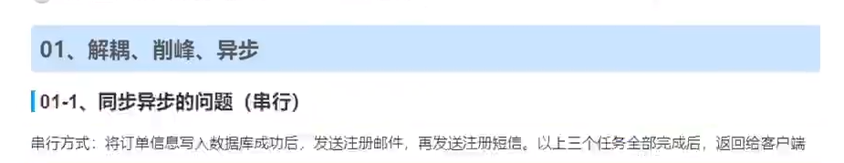

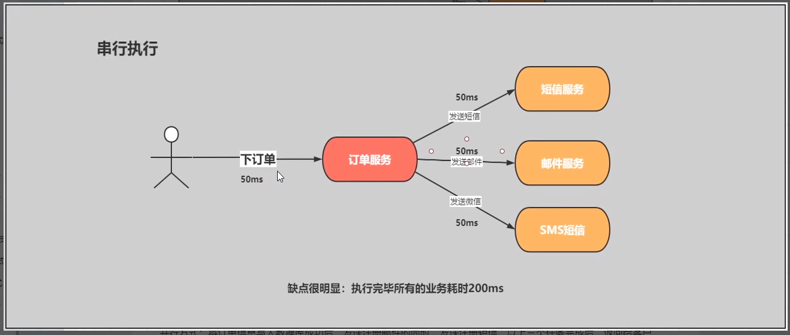

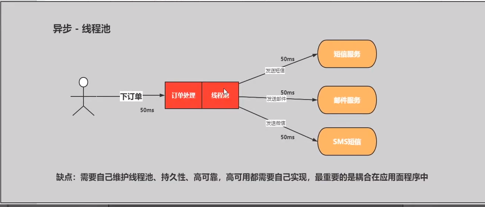


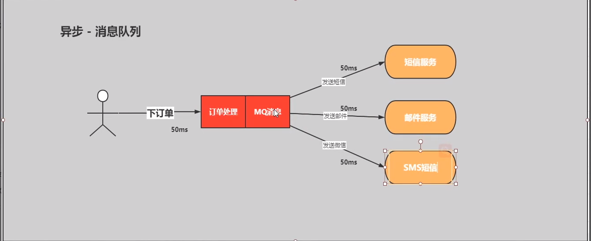

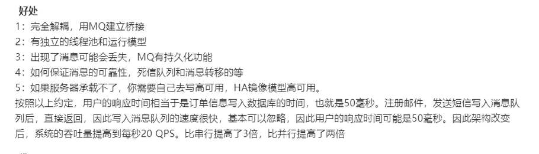

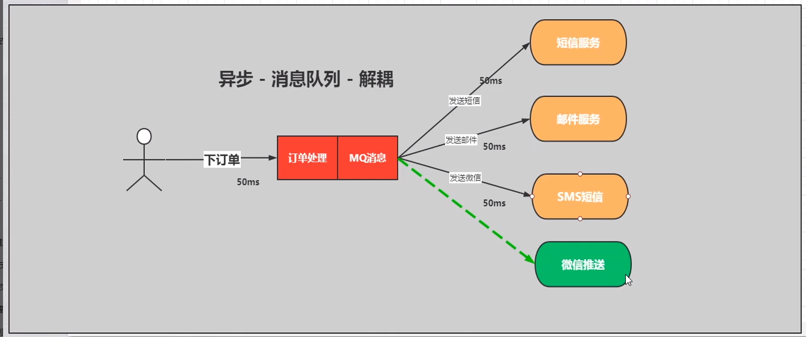

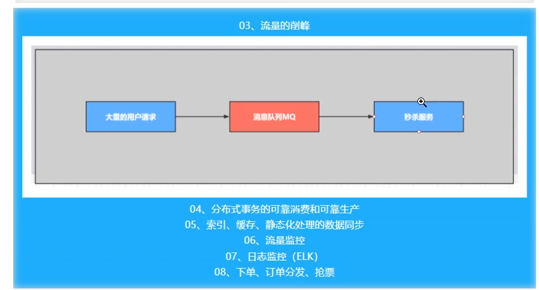

## Springboot整合

### 依赖

```xml
<dependency>
            <groupId>org.springframework.boot</groupId>
            <artifactId>spring-boot-starter-amqp</artifactId>
        </dependency>
        <dependency>
            <groupId>org.springframework.boot</groupId>
            <artifactId>spring-boot-starter-web</artifactId>
        </dependency>
        <dependency>
            <groupId>org.springframework.boot</groupId>
            <artifactId>spring-boot-starter-test</artifactId>
        </dependency>
        <dependency>
            <groupId>org.springframework.amqp</groupId>
            <artifactId>spring-rabbit-test</artifactId>
        </dependency>
        <dependency>
            <groupId>org.projectlombok</groupId>
            <artifactId>lombok</artifactId>
        </dependency>
```

### Fanout模式配置

#### 配置交换机与队列，以及绑定

```java
@Configuration
public class RabbitMQConfig {

    @Bean
    public FanoutExchange buildFanoutExchange(){
        return new FanoutExchange("i_fanout_ex",true,false);
    }

    @Bean
    public Queue smsQueue(){
        return new Queue("smsQueue",true);
    }
    @Bean
    public Queue dxQueue(){
        return new Queue("dxQueue",true);
    }
    @Bean
    public Queue emailQueue(){
        return new Queue("emailQueue",true);
    }

    @Bean
    public Binding smsBinding(){
        return BindingBuilder.bind(smsQueue()).to(buildFanoutExchange());
    }

    @Bean
    public Binding dxBinding(){
        return BindingBuilder.bind(dxQueue()).to(buildFanoutExchange());
    }
    @Bean
    public Binding emailBinding(){
        return BindingBuilder.bind(emailQueue()).to(buildFanoutExchange());
    }
}
```

#### 模拟下订单

```java
@Service
public class UserServiceProducer {
    @Autowired
    RabbitTemplate rabbitTemplate;

    //模拟下单
    public void makeOrder(String uid,String productId,Integer num){
        //模拟订单id
        String orderId = UUID.randomUUID().toString();
        rabbitTemplate.convertAndSend("i_fanout_ex","",orderId);
        System.out.println("订单派发成功=========》");
    }
}
```

#### 模拟发短信、发邮件

```java
@RabbitListener(queues = {"emailQueue"})
@Service
public class EmailConsumer {
    @RabbitHandler
    public void reviseMessage(String message){
        System.out.println("发送邮件===》"+message);
    }
}
```

```java
@RabbitListener(queues = {"dxQueue"})
@Service
public class DxConsumer {
    @RabbitHandler
    public void reviseMessage(String message){
        System.out.println("发送短信===》"+message);
    }
}
```

```java
@RabbitListener(queues = {"smsQueue"})
@Service
public class SsmConsumer {
    @RabbitHandler
    public void reviseMessage(String message){
        System.out.println("发送ssm===》"+message);
    }
}
```

### Direct模式配置

#### 配置交换机与队列，以及绑定

尽可能让交换机以及队列名称不同

```java

@Configuration
public class RabbitMQConfig {

    @Bean
    public DirectExchange buildExchange(){
        return new DirectExchange("i_direct_ex",true,false);
    }

    @Bean
    public Queue smsQueue(){
        return new Queue("smsQueue_direct",true);
    }
    @Bean
    public Queue dxQueue(){
        return new Queue("dxQueue_direct",true);
    }
    @Bean
    public Queue emailQueue(){
        return new Queue("emailQueue_direct",true);
    }

    @Bean
    public Binding smsBinding(){
        return BindingBuilder.bind(smsQueue()).to(buildExchange()).with("sms");
    }

    @Bean
    public Binding dxBinding(){
        return BindingBuilder.bind(dxQueue()).to(buildExchange()).with("dx");
    }
    @Bean
    public Binding emailBinding(){
        return BindingBuilder.bind(emailQueue()).to(buildExchange()).with("email");
    }
}
```

#### 生产消息

```java
@Service
public class UserServiceProducer {
    @Autowired
    RabbitTemplate rabbitTemplate;

    //模拟下单
    public void makeOrder(String uid,String productId,Integer num){
        //模拟订单id
        String orderId = UUID.randomUUID().toString();
        rabbitTemplate.convertAndSend("i_direct_ex","sms",orderId);
        rabbitTemplate.convertAndSend("i_direct_ex","dx",orderId);
        rabbitTemplate.convertAndSend("i_direct_ex","email",orderId);
        System.out.println("订单派发成功=========》");
    }
}
```

### Topics模式

#### 配置交换机与队列，以及绑定，注解方式

```java
@RabbitListener(bindings = {
        @QueueBinding(value = @Queue(name = "email_queue_topics",durable = "true",autoDelete = "false"),
        exchange = @Exchange(name = "i_topics_ex",type = ExchangeTypes.TOPIC),key = "#.email.#")
})
@Service
public class EmailConsumer {
    @RabbitHandler
    public void reviseMessage(String message){
        System.out.println("发送邮件===》"+message);
    }
}

```

## 过期时间TTL

### 对整个队列设置过期时间

直接在队列bean中设置参数x-message-ttl，过期时间一定要是int类型

```java
@Bean
    public Queue smsQueue(){
        //设置过期时间
        Map<String,Object> map = new HashMap<>();
        map.put("x-message-ttl",5000);
        return new Queue("smsQueue_direct",true,false,false,map);
    }
```

### 对单个消息设置过期时间

当过期队列有过期消息，那么以时间最小的那个为准，也就是哪个时间先到，哪个先消失，过期消息过期了就会把移除，而过期队列则可以被移到死信队列中。

```java
 public void makeTTlOrder(){
        //模拟订单id
        String orderId = UUID.randomUUID().toString();
        MessagePostProcessor m = message -> {
            message.getMessageProperties().setExpiration("5000");
            message.getMessageProperties().setContentEncoding("utf-8");
            return message;
        };
        rabbitTemplate.convertAndSend("i_direct_ex","email",orderId,m);
        System.out.println("订单派发成功=========》");
    }
```

## 死信队列

### 概述

DLX，全称Dead-Letter-Exchange，可以被称之为死信交换机，也有人称之为死信邮箱，当消息在一个队列中变成死信（dead message）之后，它能被重新发送到另一个交换机中，这个交换机就是DLX，绑定DLX的队列就称之为死信队列。消息变成死信，可能是由以下原因：

- 消息被拒绝
- 消息过期
- 队列达到最大长度

DLX也是一个正常的交换机，和一般的交换机没有区别，它能在任何的队列上被指定，实际上就是设置某一个队列的属性，当这个队列中存在死信时，Rabbitmq就会自动将这个消息重新发布到设置的DLX上去，进而被路由到另一个队列，即死信队列。

要想使用死信队列，只需要在定义队列的时候设置队列参数**x-dead-letter-exchange**指定交换机即可

### 死信队列的配置

死信队列的使用跟其他的队列一样，也叫备胎队列

```java
@Configuration
public class RabbitMQConfig {
    //直接模式交换机
    @Bean
    public DirectExchange buildExchange(){
        return new DirectExchange("i_direct_ex",true,false);
    }
    //sms队列
    @Bean
    public Queue smsQueue(){
        Map<String,Object> map = new HashMap<>();
       //设置过期时间
        //map.put("x-message-ttl",5000);

        //设置最大消息数，超过最大消息数的消息会被放入死信队列中
        map.put("x-max-length",5);
        //死信交换机
        map.put("x-dead-letter-exchange","dead_direct_ex");
        //死信路由key
        map.put("x-dead-letter-routing-key","dead");
        return new Queue("smsQueue_direct",true,false,false,map);
    }
    //直接交换机绑定sms队列
    @Bean
    public Binding smsBinding(){
        return BindingBuilder.bind(smsQueue()).to(buildExchange()).with("sms");
    }

    //死信交换机
    @Bean
    public DirectExchange buildDeadExchange(){
        return new DirectExchange("dead_direct_ex",true,false);
    }
    //死信队列
    @Bean
    public Queue deadQueue(){
        return new Queue("dead_direct_ex",true);
    }
    //绑定死信队列
    @Bean
    public Binding deadBinding(){
        return BindingBuilder.bind(deadQueue()).to(buildDeadExchange()).with("dead");
    }
}
```

## 设置内存阈值警告

```bash
#根据你的服务器内存来设置
rabbitmqctl set_vm_memory_high_watermark absolute 50MB

#0.4相对于你服务器总内存
rabbitmqctl set_vm_memory_high_watermark 0.4
```

## 设置磁盘空间预警

```bash
rabbitmqctl set_disk_free_limit 1GB
rabbitmqctl set_disk_free_limit memory_limit 1.3
```

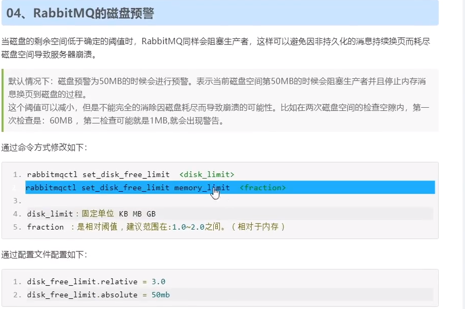

## RabbitMQ的内存换页

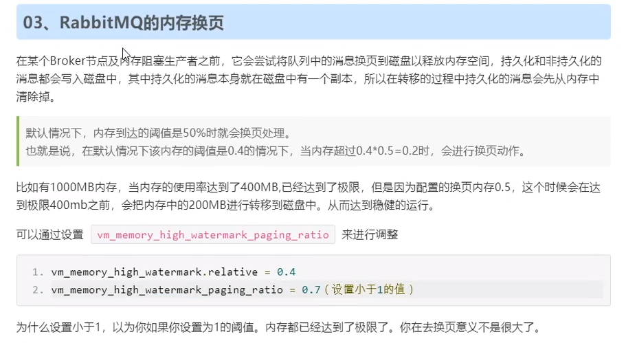

## RabbitMQ集群搭建

### 1.新建文件

```
mkdir rabbitmqcluster

mkdir rabbitmq01 rabbitmq02 rabbitmq03
```

### 2.启动容器

```bash
#启动第一个容器
docker run -d --hostname rabbitmq01 --name rabbitmqCluster01 -v /home/temp/rabbitmqcluster/rabbitmq01:/var/lib/rabbitmq -p 15672:15672 -p 5672:5672 -e RABBITMQ_ERLANG_COOKIE='rabbitmqCookie' rabbitmq:management

#启动第二个容器
docker run -d --hostname rabbitmq02 --name rabbitmqCluster02 -v /home/temp/rabbitmqcluster/rabbitmq02:/var/lib/rabbitmq -p 15673:15672 -p 5673:5672 -e RABBITMQ_ERLANG_COOKIE='rabbitmqCookie'  --link rabbitmqCluster01:rabbitmq01 rabbitmq:management
```

### 3.进入容器1创建账号

```bash
#容器1
docker exec -it rabbitmqCluster01 /bin/bash

rabbitmqctl add_user admin admin

rabbitmqctl set_user_tags admin administrator

rabbitmqctl set_permissions -p / admin ".*" ".*" ".*"
#创建完账号尝试登录
```

### 4.集群设置

```bash
#进入容器1
rabbitmqctl stop_app
rabbitmqctl reset
rabbitmqctl start_app
exit

#进入容器2
docker exec -it rabbitmqCluster02 bash
rabbitmqctl stop_app
rabbitmqctl reset
rabbitmqctl join_cluster --ram rabbit@rabbitmq01
rabbitmqctl start_app
exit
```

设置完毕后打开http://47.112.181.157:15672/ 查看overview

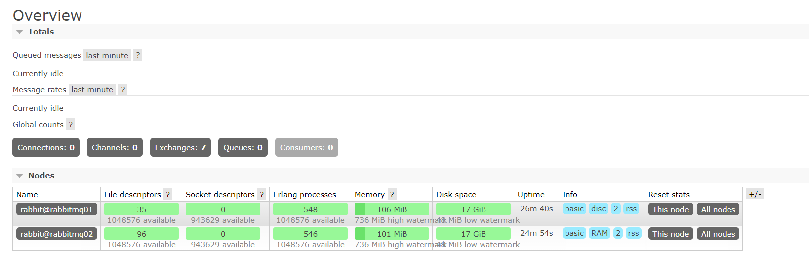

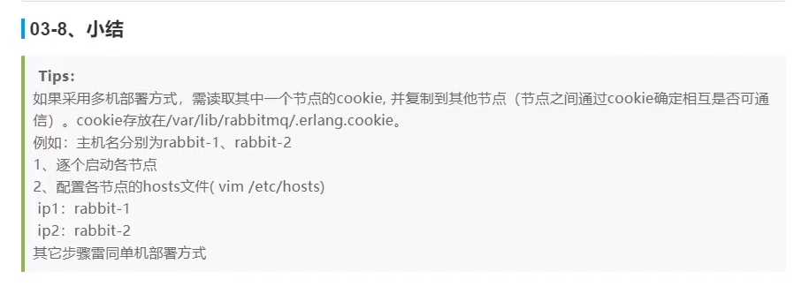

## 分布式事务的方式

### 1.二阶段提交（2PC）

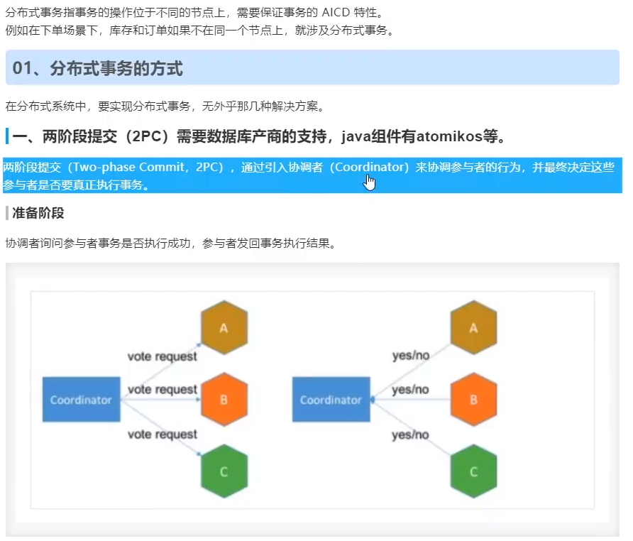

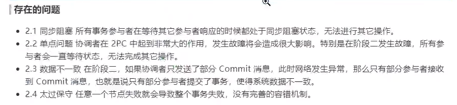

### 2.补偿事务（TCC）

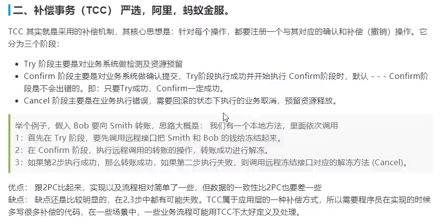

### 3.本地消息表

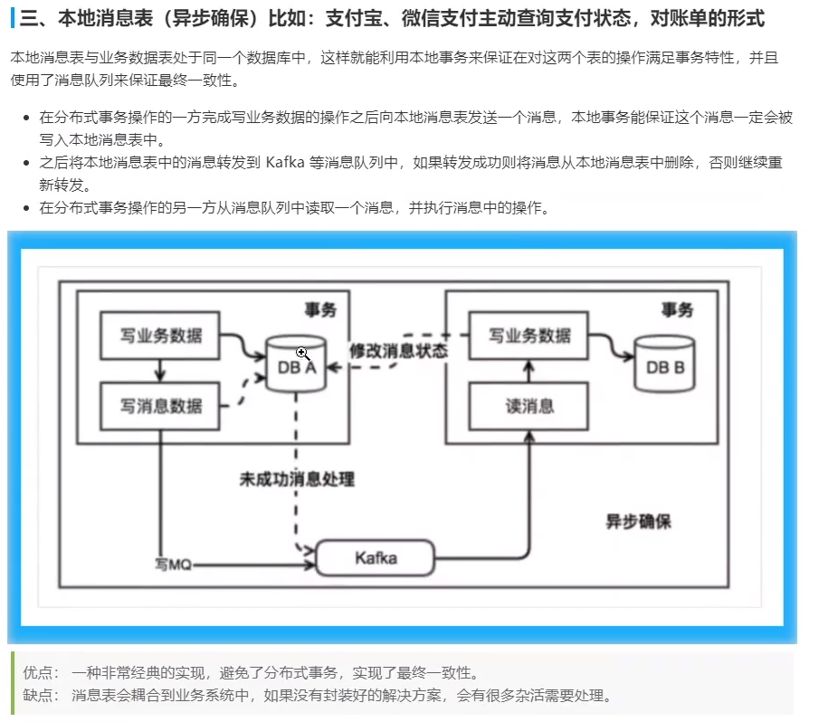

### 4.MQ事务消息 异步场景

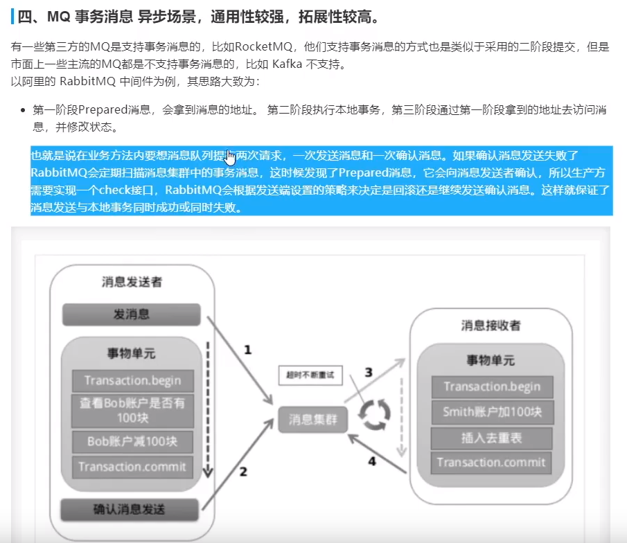

## 分布式场景示例

### 1.可靠生产

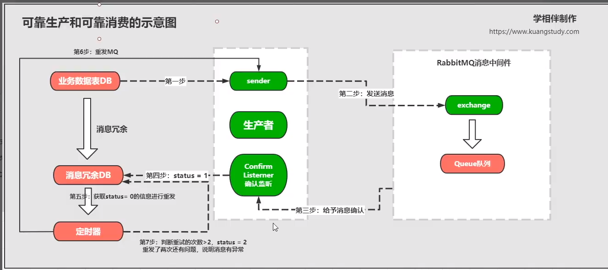

### 2.可靠生产问题

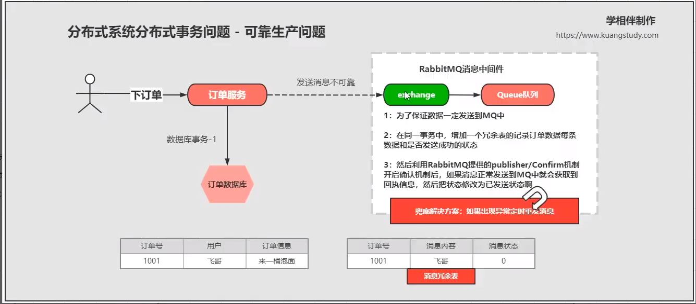

### 3.消费端异常死循环问题

默认情况下消息消费时，如果出现了异常那么消费端将不断重试，导致死循环，进而导致系统崩溃。

解决该问题的方法有：

#### 3.1自动确认+设置重试次数

注意：触发重试机制需要抛出异常，如果代码中catch了异常，那么重试机制会失效，

如果多次重试还是异常，那么消息会被丢失

```yaml
rabbitmq:
    host: 47.112.181.157
    port: 5672
    username: admin
    password: admin
    virtual-host: /
    #消息确认回调
    publisher-confirm-type: correlated
    #消息失败回调
    publisher-returns: true
    listener:
      simple:
        #自动应答
        acknowledge-mode: auto
        retry:
          #是否重试
          enabled: true
          #重试间隔
          initial-interval: 2000ms
          #最多重试多少次
          max-attempts: 3

```

#### 3.2 try+catch+手动Ack

设置不重发后，消息会被丢弃

```java
@RabbitListener(bindings = {
        @QueueBinding(value = @Queue(name = "test",durable = "true",autoDelete = "false"),
                exchange = @Exchange(name = "i_test",type = ExchangeTypes.TOPIC),
                key = "*.order")
})
public void saveOrder(String orderNum, Channel channel, Message message) throws InterruptedException, IOException {
    log.info("获取订单：{}，开始配送",orderNum);
    Rider rider = new Rider();
    rider.setOrderNum(orderNum);
    rider.setStatus("0");
    rider.setRemark("开始配送");

    try {
        riderService.save(rider);
        log.info("保存配送消息成功");
        //假设配送成功
        handle(orderNum,"1","配送成功","订单已配送完成");
        //手动告诉mq已经正常消费
        channel.basicAck(message.getMessageProperties().getDeliveryTag(),false);
    } catch (Exception e) {
        log.error("出现了异常：{}",e.getMessage());
        //参数1：消息的tag，参数2：多条处理，参数3：是否重发
        //如果最后一个参数为true，那么就变成了无限重试，也就是死循环
        channel.basicNack(message.getMessageProperties().getDeliveryTag(),false,false);
    }
}
```

#### 3.3 try+catch+死信队列

死信队列

```java
@RabbitListener(bindings ={
         @QueueBinding(
                 value = @Queue(name = "deadQueue", durable = "true", autoDelete = "false"),
                 exchange = @Exchange(name = "deadEx", type = ExchangeTypes.DIRECT),
                 key = "deadKey"
         )
})
public void deadHandle(Message message){
    log.info("这是一条死消息：{}",message);
    log.info("tap:{}",message.getMessageProperties().getDeliveryTag());
}
```

队列配置

```java
@RabbitListener(bindings = {
        @QueueBinding(
                value = @Queue(name = "test",durable = "true",autoDelete = "false",
                arguments = {
                        @Argument(name="x-dead-letter-exchange",value = "deadEx"),
                        @Argument(name = "x-dead-letter-routing-key",value = "deadKey")
                }),
                exchange = @Exchange(name = "i_test",type = ExchangeTypes.TOPIC),
                key = "*.order")
})
public void saveOrder(String orderNum, Channel channel, Message message) throws InterruptedException, IOException {
    log.info("获取订单：{}，开始配送",orderNum);
    Rider rider = new Rider();
    rider.setOrderNum(orderNum);
    rider.setStatus("0");
    rider.setRemark("开始配送");

    try {
        riderService.save(rider);
        log.info("保存配送消息成功");
        //假设配送成功
        handle(orderNum,"1","配送成功","订单已配送完成");
        //手动告诉mq已经正常消费
        channel.basicAck(message.getMessageProperties().getDeliveryTag(),false);
    } catch (Exception e) {
        log.error("出现了异常：{}",e.getMessage());
        //参数1：消息的tag，参数2：多条处理，参数3：是否重发
        channel.basicNack(message.getMessageProperties().getDeliveryTag(),false,false);
    }
}
```

### 消息确认机制

#### ConfirmCallback

消息到达RabbitMQ节点也就是到达交换机后返回一个ack（布尔值），当消息发送到不存在的交换机时，ack为false

```java
 /*
        1.注意存有消息id
        2.ack表示消息是否发送成功
        3.发送失败原因
         */
rabbitTemplate.setConfirmCallback((correlationData, ack, cause) -> {
            String msgId = correlationData.getId();
            if(ack){
                log.info("{}====>消息发送成功",msgId);
                //修改冗余表消息状态
                mailLogService.update(new MailLog(),new LambdaUpdateWrapper<>(MailLog.class)
                        .set(MailLog::getStatus,RabbitConstant.MESSAGE_SUCCESS).eq(MailLog::getMsgId,msgId));
            }else{
                log.info("{}====>消息发送失败",msgId);
                log.info("原因====>{}",cause);
                mailLogService.update(new MailLog(),new LambdaUpdateWrapper<>(MailLog.class)
                        .set(MailLog::getStatus,RabbitConstant.MESSAGE_FAIL).eq(MailLog::getMsgId,msgId));
            }
        });
```

#### ReturnsCallback

消息从交换机分发到Queue时，如果路由不到任意一个Queue或者说使用了不存在的路由key进行路由，就会触发此回调

```java
rabbitTemplate.setReturnsCallback(returned -> log.info("消息发送到队列失败====>{}",returned.toString()));
rabbitTemplate.setMandatory(true);//开启此回调
```

### 消息可靠生产的解决方案

1. 新建一个冗余表，内有msgID（需要是唯一，不能用自增），消息状态，重试次数等字段
2. 发消息之前，先把消息入库，消息状态置为0（初始状态：发送中）
3. 编写回调ConfirmCallback，如果ack为true，根据msgID修改库中的消息的状态为1（发送成功），如果为false，那么修改为2（发送失败）或者什么都不做，等待后续定时任务扫描重发。
4. 针对由于网络波动或者其他原因发送失败的消息，应该使用一个定时任务来扫描数据库，扫描消息状态为零，重试次数小于3的消息，将扫描到的消息重发，如果重试次数超过3次，则放弃（如果是重要的消息，切记不能放弃）。

优点：该方案简单，易实施

缺点：

1.如果一个消息刚刚入库，由于网络原因RabbitMQ没来得及返回ack，这个消息就被定时任务扫描到了并重发，就会造成了消息重复，消费端因此会重复消费同一条消息，所以消费端就要做幂等性处理

2.如果在并发高的情况下，数据库的压力会很大，可考虑用redis来替代，或者对mysql集群，分表分库来提高可用性

### 消息可靠消费的方案

消息端消费时可能会出现的问题：

1.消息重复消费

2.消费消息出现了异常导致死循环

解决方案步骤如下

1.配置rabbitMQ手动应答

2.使用redis来解决重复消费的问题，消费完一条消息就把消息id放入redis中，消费前先到redis中寻找该消息id是否存在，如果存在那么放弃这条消息不消费

3.如果出现了异常，可绑定死信队列，把消息放入死信队列中，人工来处理死信队列或者其他方式。

具体实现

rabbitMQ配置

```yml
#手动ack
    listener:
      simple:
        acknowledge-mode: manual
```

代码

```java
  @RabbitListener(queues = {RabbitConstant.MAIL_QUEUE})
    public void sendWelcomeMail(Message<Employee> message, Channel channel , org.springframework.amqp.core.Message msg) throws MessagingException, IOException {
        MessageProperties messageProperties = msg.getMessageProperties();
        byte[] body = msg.getBody();
        log.info("body:{}",new String(body));
        //获取消息
        Employee employee = message.getPayload();
        MessageHeaders headers = message.getHeaders();
        //tagId
        long tagId = messageProperties.getDeliveryTag();
        //获取msgId
        String msgId = (String) headers.get("spring_returned_message_correlation");
        HashOperations<String, Object, Object> hashOps = redisTemplate.opsForHash();
        try {
            Map<Object, Object> entries = hashOps.entries(RabbitConstant.MESSAGE_CONSUMER_CONFIRM);
            if(entries.containsKey(msgId)){
                //消息已经被消费了
                log.error("消息已经被消费了=====》{}",msgId);
                channel.basicAck(tagId,false);
                return;
            }

//            log.error("出现了异常");
//            int a = 1/0;//模拟异常
            MimeMessage mimeMessage = javaMailSender.createMimeMessage();
            MimeMessageHelper mimeMessageHelper = new MimeMessageHelper(mimeMessage);
            //发件人
            mimeMessageHelper.setFrom(mailProperties.getUsername());
            //收件人
            mimeMessageHelper.setTo(employee.getEmail());
            //主题
            mimeMessageHelper.setSubject("欢迎新员工");
            //发送时间
            mimeMessageHelper.setSentDate(new Date());
            //邮件内容
            Context context = new Context();
            context.setVariable("name",employee.getName());
            context.setVariable("gender",employee.getGender());
            context.setVariable("departmentId",employee.getDepartmentId());
            context.setVariable("jobLevelId",employee.getJobLevelId());
            String welcomeNewEmp = templateEngine.process("welcomeNewEmp", context);
            mimeMessageHelper.setText(welcomeNewEmp,true);
            //发送邮件
            javaMailSender.send(mimeMessage);
            log.info("发送邮件成功");
            //记录消息已经消费了
            hashOps.put(RabbitConstant.MESSAGE_CONSUMER_CONFIRM,msgId,"OK");
            channel.basicAck(tagId,false);
        } catch (Exception e) {
            log.error("抓住了异常,消息ID:{},详情====》{}",msgId,e);
            channel.basicNack(tagId,false,false);
        }
    }

```

