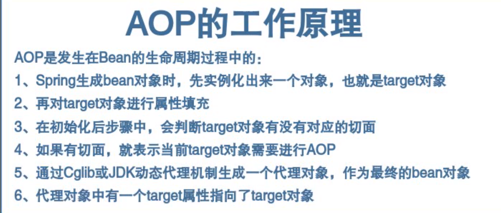

## 基本概念

**Aspect(切面)**:跨多个类的关注点的模块化。事务管理是企业Java应用程序中横切关注的一个很好的例子。在Spring AOP中，方面是通过使用常规类（基于模式的方法）或使用@Aspect注释（@AspectJ样式）注释的常规类来实现的。

### Advice

- Advice可以理解为通知、建议，在Spring中通过定义Advice来定义代理逻辑

### Pointcut

- Pointcut是切点，表示Advice对应的代理逻辑应用在哪个类、哪个方法上

### Advisor

- Advisor等于Advice+Pointcut，表示代理逻辑和切点的一个整体，程序员可以通过定义或封装一个Advisor，来定义切点和代理逻辑。

### Weaving

- Weaving表示织入，将Advice代理逻辑在源代码级别嵌入到切点的过程，就叫做织入

### Target

- Target表示目标对象，也就是被代理对象，在AOP生成的代理对象中会持有目标对象

### Join Point

- Join Point表示连接点，在Spring AOP中，就是方法的执行点。

## 工作原理



## 1.maven依赖

```xml
<dependency>
    <groupId>org.springframework</groupId>
    <artifactId>spring-context</artifactId>
    <version>${spring.version}</version>
</dependency>
<dependency>
    <groupId>org.aspectj</groupId>
    <artifactId>aspectjweaver</artifactId>
    <version>${aspectj.version}</version>
</dependency>
<!--下面用于展示aop方式的事务-->
<dependency>
    <groupId>org.springframework</groupId>
    <artifactId>spring-test</artifactId>
    <version>${spring.version}</version>
</dependency>
<dependency>
    <groupId>org.springframework</groupId>
    <artifactId>spring-jdbc</artifactId>
    <version>${spring.version}</version>
</dependency>

```

## 2.xml方式

```xml
<aop:config ><!--aop配置-->
    <aop:aspect ref="myTimeAdvice"><!--配置切面类-->
        <aop:pointcut id="timeLog" expression="execution(* com.ex.ssm.mapper.*.*(..))"/>
        <aop:before method="before" pointcut-ref="timeLog"/>
        <aop:after method="after" pointcut-ref="timeLog"/>
        <aop:after-returning method="end" pointcut-ref="timeLog"/>
        <aop:after-throwing method="throwing" pointcut-ref="timeLog" />
    </aop:aspect>
</aop:config>
```

切面类

```java
@Aspect //需声明EnableAspectJAutoProxy 注意:使用注解AfterReturning在After之前执行.建议使用around
@Component//xml方式留Component注解即可,其他注解去掉
public class TimeRecordAspectAdvice {
    private static final Logger log = LoggerFactory.getLogger(TimeRecordAdvice.class);
    private Long startTime;
    
@Pointcut("execution(* com.ex.smp.service.*.*(..))")
public void expression(){}

@Before("expression()")
public void before(){
    log.info("startTime:{}",sf.format(new Date(startTime)));
    startTime = System.currentTimeMillis();
}
@After("expression()")
public void after(){
    log.info("结束,当前时间为{}",new SimpleDateFormat("yyyy-MM-dd HH:mm:ss.SSS").format(new Date()));
    Long endTime = System.currentTimeMillis();
    log.info("总执行时间为{}ms", endTime -startTime);
}
@AfterReturning("expression()")
public void end(){
    log.info("最终,当前时间为{}",new SimpleDateFormat("yyyy-MM-dd HH:mm:ss.SSS").format(new Date()));
}

@AfterThrowing("expression()")
public void throwing(){
    log.info("异常,当前时间为{}",new SimpleDateFormat("yyyy-MM-dd HH:mm:ss.SSS").format(new Date()));
}

@Around("expression()")
public Object around(ProceedingJoinPoint point){
    Object[] args = point.getArgs();
    try {
        log.info("前");
        Object result = point.proceed(args);
        log.info("后");
        return result;
    } catch (Throwable throwable) {
        throwable.printStackTrace();
        log.info("异常");
        throw new RuntimeException(throwable);
    }finally {
        log.info("最终");
    }
}
    }
```
## 3.注解方式

```xml
<!--启用aop自动代理，切面类请看上面-->
<aop:aspectj-autoproxy/>
```

## 4. Aop事务处理

### 1.xml 方式

```xml
<!--aop基础配置,配置aop作用在那个类-->
<aop:config>
    <aop:pointcut id="txAdvices" expression="execution(* com.ex.ssm.service.impl.*.*(..))"/>
    <aop:advisor advice-ref="myAdvice" pointcut-ref="txAdvices" />
</aop:config>

<!--配置事务作用的方法以及事务的行为-->
<tx:advice id="myAdvice">
    <tx:attributes>
        <tx:method name="find*" read-only="true" />
        <tx:method name="tr*" no-rollback-for="java.lang.RuntimeException"/><!--运行时异常不回滚-->
    </tx:attributes>
</tx:advice>
```

### 2 . 注解方式

```xml
<tx:annotation-driven />
<!--在需要的方法加上@Transactional-->
```