## BeanDefinition

### 什么是BeanDefinition

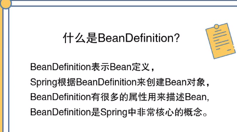

### BeanDefinition的重要属性

- beanClass
- scope              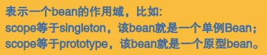
- isLazy
- dependsOn
- primary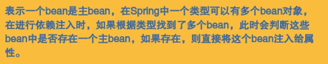
- initMethodName

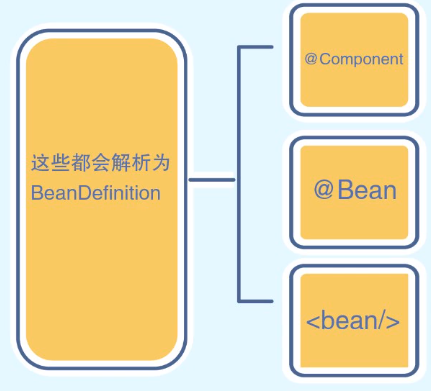

## BeanFactory

### 什么是BeanFactory

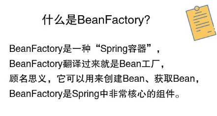

### 与BeanDefinition及Bean对象的关系


### BeanFactory的核心子接口和实现类

- ListableBeanFactory
- ConfigurableBeanFactory
- AutowireCapableBeanFactory
- AbstractBeanFactory
- DefaultListableBeanFactory

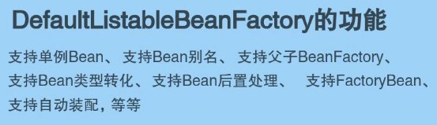

## Bean生命周期

### 什么是Bean生命周期

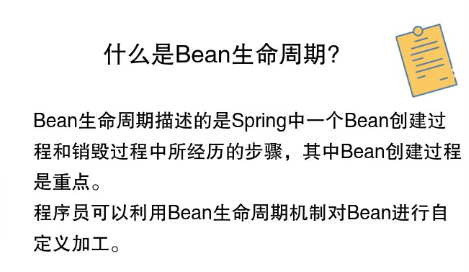

### 生命周期

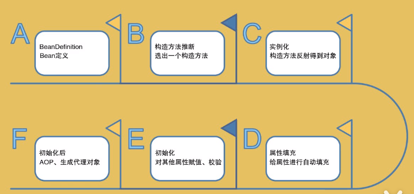

## @Autowired

### 概念

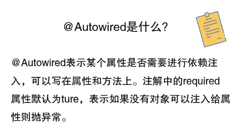

### 查找规则

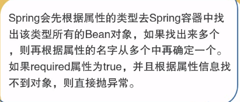

### 在构造方法上时

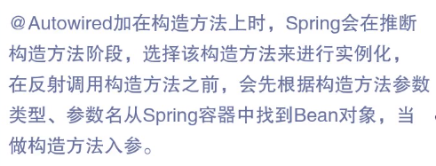

## @Resource

### 概念

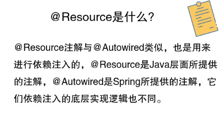

### 查找规则

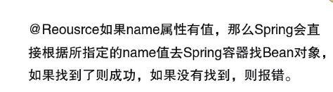

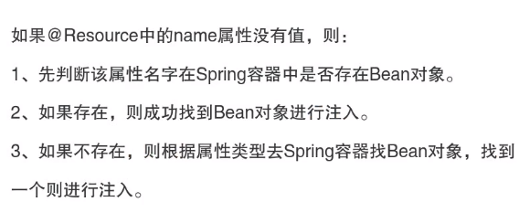

## @Value

### 概念


### 注入方式


## FactoryBean

### 概念


### 主要方法

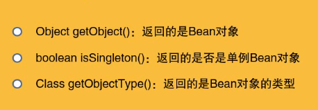

### 示例

```java
@Component
public class AccountBean implements FactoryBean<Account> {
    /**
     * 获取Bean对象
     */
    @Override
    public Account getObject() throws Exception {
        return new Account();
    }

    /**
     * Bean类型
     */
    @Override
    public Class<?> getObjectType() {
        return Account.class;
    }

    /**
     * 是否单例
     */
    @Override
    public boolean isSingleton() {
        return true;
    }
}
```

### 特殊点

上述代码，实际上对应了两个Bean对象

1. beanName为accountBean，bean对象为getObject方法所返回的Account对象
2. beanName为&accountBean，bean对象为AccountBean的实例对象

### 与BeanFactory的区别

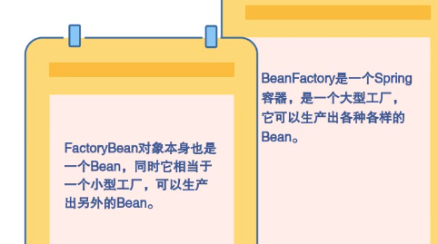

### 应用

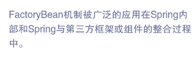

## ApplicationContext

### 概念

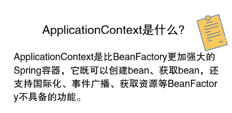

### 继承的接口

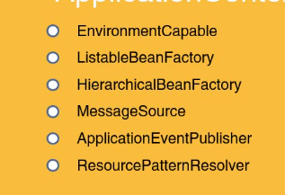

- EnvironmentCapable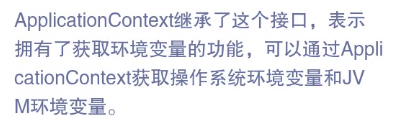
- ListableBeanFactory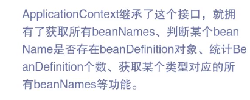
- HierarchicalBeanFactory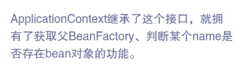
- MessageSource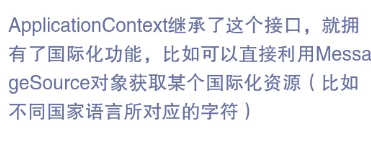
- ApplicationEventPublisher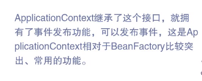
- ResourcePatternResolver

## BeanPostProcessor

### 概念

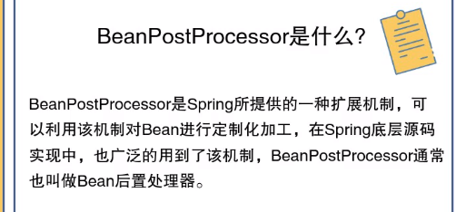

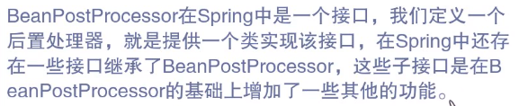

### 它的方法

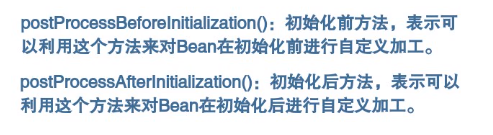

```java
@Component
@Slf4j
public class IBeanPostProcessor implements BeanPostProcessor {
    //初始化后对bean做些什么，返回null表示什么都不做，继续生命周期
    @Override
    public Object postProcessAfterInitialization(Object bean, String beanName) throws BeansException {
        return null;
    }
    
//初始化前对bean做些什么
    @Override
    public Object postProcessBeforeInitialization(Object bean, String beanName) throws BeansException {
        if ("accountMapper".equals(beanName)) {
            log.info("这里有个accountMapper,快欺负它");
        }
        return bean;
    }

}
```

### 子接口

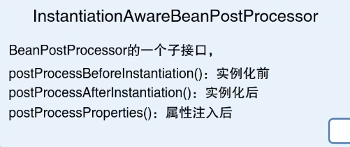

#### InstantiationAwareBeanPostProcessor

可以在bean实例化前后做出影响

```java
@Component
class InitBeanPostProcessor implements InstantiationAwareBeanPostProcessor {

    //实例化前，如果直接返回Object对象那么Spring会把它当成bean保存，不会进行接下来的生命周期步骤，直接执行了BeanPostProcessor的初始化后操作，如果返回null，那么继续生命周期
    @SneakyThrows
    @Override
    public Object postProcessBeforeInstantiation(Class<?> beanClass, String beanName) {
        if (Account.class.isAssignableFrom(beanClass)){
            Account account = (Account) beanClass.getConstructor().newInstance();
            account.setAccountName("aaa");
            account.setBalance(1000L);
            return account;
        }
        return null;
    }
    //实例化后，返回false，后面的postProcessProperties方法执行不了
    @Override
    public boolean postProcessAfterInstantiation(Object bean, String beanName) throws BeansException {
        if(bean instanceof Account){
            log.info("account:{}",bean);
            return false;
        }
        return true;
    }
}
```

## InitializingBean

方法 afterPropertiesSet，执行在bean实例属性填充后，用于检查属性或者填充属性

```java
@Override
    public void afterPropertiesSet() throws Exception {
        log.info("account:{}",this);
    }
```

## AOP

模仿AOP，在accountService执行前后增加时间打印并计算执行时间

```java
@Slf4j
@Component
public class InitBeanPostProcessor implements InstantiationAwareBeanPostProcessor {
    @Override
    public Object postProcessAfterInitialization(Object bean, String beanName) throws BeansException {
        if (bean instanceof AccountService) {
            return Proxy.newProxyInstance(bean.getClass().getClassLoader(), bean.getClass().getInterfaces(), (proxy, method, args) -> {
                ITimeLog iTimeLog = new ITimeLog();
                iTimeLog.before();
                Object result = method.invoke(bean, args);
                iTimeLog.after();
                return result;
            });
        }
        return null;
    }
}
```

