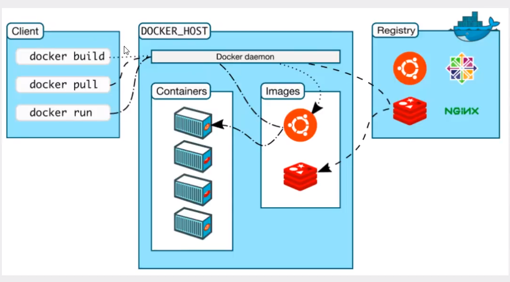
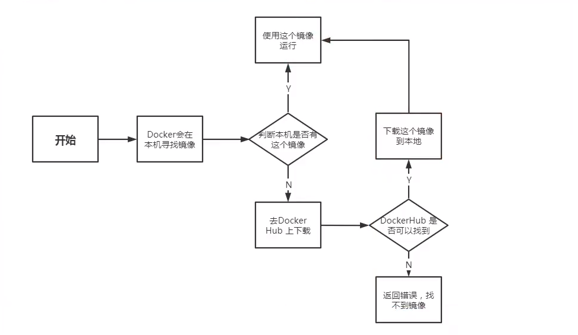
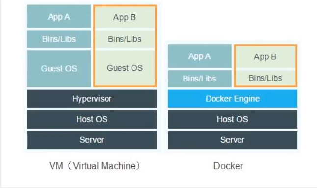
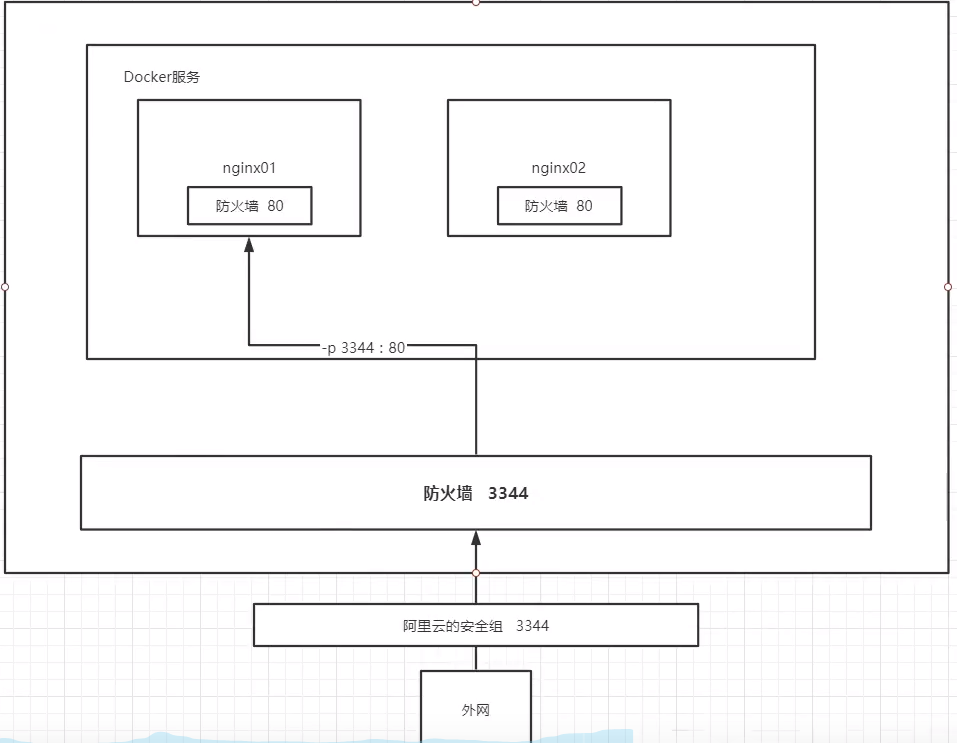
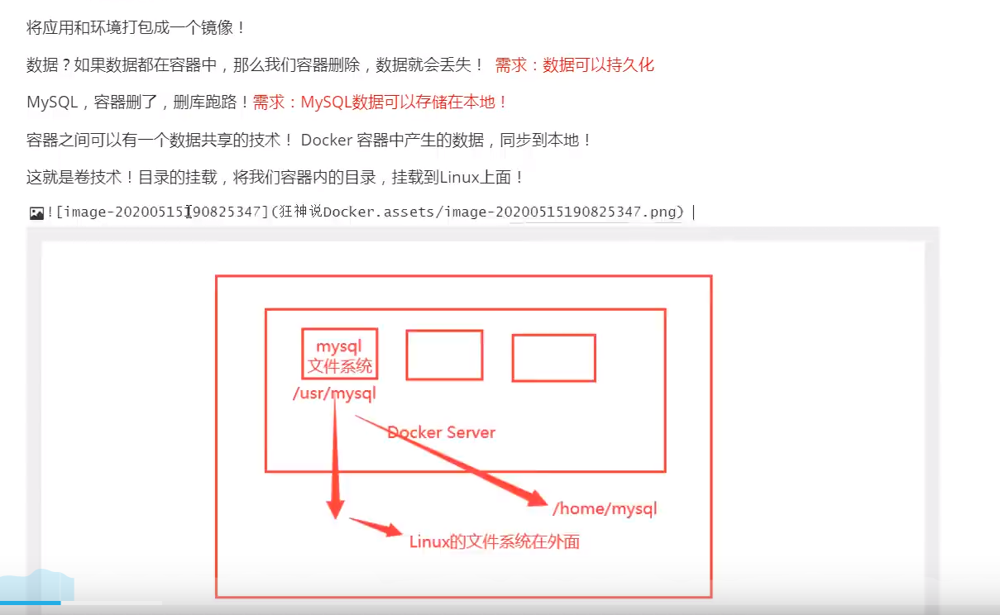
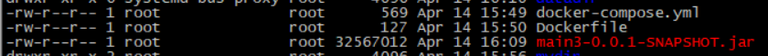

## Docker简介

Docker 是一个开源的应用容器引擎，基于 [Go 语言](https://www.runoob.com/go/go-tutorial.html) 并遵从 Apache2.0 协议开源。

Docker 可以让开发者打包他们的应用以及依赖包到一个轻量级、可移植的容器中，然后发布到任何流行的 Linux 机器上，也可以实现虚拟化。

容器是完全使用沙箱机制，相互之间不会有任何接口（类似 iPhone 的 app）,更重要的是容器性能开销极低。

## Docker的应用场景

- Web 应用的自动化打包和发布。
- 自动化测试和持续集成、发布。
- 在服务型环境中部署和调整数据库或其他的后台应用。
- 从头编译或者扩展现有的 OpenShift 或 Cloud Foundry 平台来搭建自己的 PaaS 环境。

## Docker与虚拟化技术的不同：

- 传统虚拟机，虚拟出一套硬件，运行一个完整的操作系统，然后在这个系统上安装和运行软件
- 容器内的应用直接运行在宿主机的内核，容器是没有自己的内核的，也没有虚拟我们的硬件环境，所以轻便
- 每个容器互相隔离，每个容器都有一个属于自己的文件系统，互不影响

## DevOps（开发、运维）

### 应用更快的交付和部署

传统：一堆帮助文档，安装程序

Docker：打包镜像发布测试，一键运行

### 便捷的升级和扩容

使用了Docker之后，我们部署应用像搭积木一样！

项目打包为一个镜像，扩展

### 更简单的系统运维

在容器化之后，我们的开发，测试环境都是高度一致的。

### 更高效的计算机资源利用：

1核2g的配置，可以运行几十个tomcat？？？

Docker是内核级别的虚拟化，可以在一个物理机上同时运行很多的容器实例！服务器的性能可以被压榨到极致

## Docker的基本组成



### 镜像（image）：

docker镜像就好比一个模板，可以通过这个来模拟创建容器服务,通过这个镜像可以创建多个容器（）最终服务运行或者项目运行就是在容器中的

### 容器（contains）：

Docker利用容器技术，独立运行一个或者一个组应用，通过镜像来创建的。

启动，停止，删除，基本命令

目前就可以把这个容器理解为就是一个简易的linux系统

### 仓库（repository）：

仓库就是存放镜像的地方！

仓库分为共有仓库和私有仓库

Docker Hub（默认是国外的）

可以配置国内镜像，比如阿里云

## 安装Docker

#### 卸载旧版本

```bash
sudo yum remove docker \
                  docker-client \
                  docker-client-latest \
                  docker-common \
                  docker-latest \
                  docker-latest-logrotate \
                  docker-logrotate \
                  docker-engine
```

#### 安装yum环境

```
sudo yum install -y yum-utils
```

#### 使用阿里云仓库

```
sudo yum-config-manager \
    --add-repo \
    http://mirrors.aliyun.com/docker-ce/linux/centos/docker-ce.repo
```

#### 安装Docker  

```
sudo yum install docker-ce docker-ce-cli containerd.io
```

#### 更新yum软件包索引

```
yum makecache fast
```

#### 查看docker版本

```
docker -v 或 docker version
```

#### 启动docker服务

```
systemctl start docker
```

#### 运行helloWorld程序

```
docker run hello-world
```

#### 查看所有镜像

```
docker images
```

#### 卸载docker

```bash
sudo yum remove docker-ce docker-ce-cli containerd.io
#删除所有容器以及镜像
sudo rm -rf /var/lib/docker
sudo rm -rf /var/lib/containerd
```

#### 配置阿里云镜像加速

```bash
#容器镜像服务-》镜像工具-》镜像加速器-》操作文档-》CentOS
```

#### docker ps 莫名其妙的出错

可能是上一次没有正常退出docker，以下三步解决

```bash
systemctl stop docker.socket
sudo systemctl restart docker
docker ps
```


## docker run hello-world流程



## Docker工作原理

### docker是怎样工作的

docker是一个Client-Server结构的系统，docker的守护进程运行在主机上，通过Socket从客户端访问！

DockerServer接收到Docker-Client的指令，就会执行这个命令

### docker为什么比VM快

1. Docker有着比虚拟机更少的抽象层
2. Docker利用的是宿主机的内核，vm需要的是Guest OS



## Docker的常用命令

### 帮助命令

```bash
docker version
docker info
docker --help
```

### 镜像命令

#### 查看所有镜像

```bash
docker images 

[root@izwz910hz2krcs95fx04b4z ~]# docker images
REPOSITORY    TAG       IMAGE ID       CREATED       SIZE
hello-world   latest    d1165f221234   5 weeks ago   13.3kB

#解析
REPOSITORY 镜像的仓库源
TAG        镜像的标签
IMAGE ID   镜像ID
CREATED    镜像创建时间
SIZE       镜像大小

#可选项
--all , -a		查看所有镜像，默认
--digests		Show digests
--filter , -f		Filter output based on conditions provided
--format		Pretty-print images using a Go template
--no-trunc		Don't truncate output
--quiet , -q		只显示镜像id
```

#### 镜像搜索

```
docker search mysql
#过滤
docker search mysql -f stars=3000
```

#### 镜像下载

```bash
#格式
docker pull [OPTIONS] NAME[:TAG|@DIGEST]
#例子，tag是版本，不写默认用最新版
docker pull mysql

[root@izwz910hz2krcs95fx04b4z ~]# docker pull mysql
Using default tag: latest
latest: Pulling from library/mysql
f7ec5a41d630: Pull complete   #分层下载
9444bb562699: Pull complete 
6a4207b96940: Pull complete 
181cefd361ce: Pull complete 
8a2090759d8a: Pull complete 
15f235e0d7ee: Pull complete 
d870539cd9db: Pull complete 
5726073179b6: Pull complete 
eadfac8b2520: Pull complete 
f5936a8c3f2b: Pull complete 
cca8ee89e625: Pull complete 
6c79df02586a: Pull complete 
Digest: sha256:6e0014cdd88092545557dee5e9eb7e1a3c84c9a14ad2418d5f2231e930967a38
Status: Downloaded newer image for mysql:latest
docker.io/library/mysql:latest #docker.io真实地址

docker pull mysql 
#等价于
docker pull docker.io/library/mysql:latest

#指定版本，这个版本一定要在docker hub上有才行
docker pull mysql:5.7
```

#### 镜像删除

```bash
#根据id删除，可以加空格跟多个id
docker rmi -f cbe8815cbea8
#删除所有镜像
docker rmi -f $(docker images -ap)

docker image inspect --format='{{.RepoTags}} {{.Id}} {{.Parent}}' $(docker image ls -q --filter since=4978dc1fb3b9)
```

### 容器命令

有了镜像才可以创建容器

安装centos7

```
docker pull centos:7
```

#### 容器运行

```bash
docker run[可选参数] image

#参数说明
--name "name" #容器名称 tomcat01 用来区分容器
-d            #后台方式运行
-it           #使用交互方式运行，进入容器查看内容
-p            #指定容器的端口 -p 8080
     -p 主机端口：容器端口 （常用）
     -p 容器端口
     容器端口
     -p 随机指定端口
--rm 用完即删

#示例，镜像名字后面要跟版本，不跟版本默认最新也就是latest，没找到镜像会去下载镜像
docker run -it centos:7 /bin/bash
#启动nginx
docker run -d  --name nginx01 -p 3344:80 nginx
#启动自定义的镜像
docker run -d --name it01 -p 8080:8080 itomcat:1.0
```

#### 容器退出

```
exit
ctrl + p + q 退出不停止
```

#### 列出正在运行的容器

```bash
docker ps  #列出正在运行的容器
#参数
-a #列出正在运行的容器+历史运行过的容器
-n=? #显示最近创建的容器
-q #显示容器id
```

#### 删除容器

```bash
#删除容器
docker rm 容器id
#删除所有容器
docker rm -f $(docker ps -aq)
```

#### 启动与停止容器

```
docker start 容器id
docker restart containsId
docker stop id
docker kill id
```

#### 查看容器日志

```bash
#命令
docker logs -tf --tail 10 2c6083d8ad50

-tf #显示日志
--tail number #显示日志的条数
```

#### 查看容器中进程信息

```
docker top 容器id
```

#### 查看容器的元数据

```
docker inspect 容器id
```

#### 进入正在运行的容器

```
docker exec -it 容器id /bin/bash
docker attach 容器id
```

#### 从容器内拷贝文件到主机上

```bash
#在主机上操作
docker cp 容器id|name:/文件路径 /主机路径
#示例
docker cp 2c6083d8ad50:/home/aaa.java /home/temp
```

#### 从主机复制到容器里

```bash
#在主机上操作
docker cp /主机路径 容器id:/文件路径 
#示例
docker cp bbb.java 2c6083d8ad50:/home
```

#### 端口暴漏的概念



#### tomcat404问题

安装的tomcat404是因为webapps下没有项目，需要自行拷贝war到该目录下

## Commit镜像

提交容器成为一个新的副本

```bash
#命令格式
docker commit -m "提交的描述信息" -a "作者" 容器id 自定义目标镜像名:自定义版本
#示例
docker commit -m test -a dj e58f5dfbc302 itomcat:1.0
```

## 容器数据卷

### 什么是容器数据卷



总结：容器的持久化和同步操作！容器间也是可以数据共享的！

### 使用数据卷

#### 使用命令直接挂载

```bash
docker run -it -v 主机目录:容器目录

#示例
docker run -it -v /home/test:/home  centos:7 /bin/bash

可以用docker inspect id查看挂载是否成功
#挂载信息
Mounts": [
            {
                "Type": "bind",
                "Source": "/home/test",
                "Destination": "/home",
                "Mode": "",
                "RW": true,
                "Propagation": "rprivate"
            }
        ],
```

#### 启动mysql命令

```bash
docker run -d -p 3310:3306 -v /home/mysql/conf:/etc/mysql/conf.d -v /home/mysql/data:/var/lib/mysql -e MYSQL_ROOT_PASSWORD=123456 --name mysql01 mysql:5.7
```

#### 匿名与具名挂载

不建议使用匿名挂载

```bash
#匿名挂载
docker run -d -p 3344:80 --name nginx01 -v /etc/nginx nginx

#查看所有的挂载情况
docker volume ls

#具名挂载
docker run -d -p 3345:80 --name nginx02 -v jwdlh-nginx:/etc/nginx nginx

#查看卷挂载在哪里
docker volume inspect jwdlh-nginx
[root@izwz910hz2krcs95fx04b4z bin]# docker volume inspect jwdlh-nginx
[
    {
        "CreatedAt": "2021-04-13T08:53:15+08:00",
        "Driver": "local",
        "Labels": null,
        "Mountpoint": "/var/lib/docker/volumes/jwdlh-nginx/_data",
        "Name": "jwdlh-nginx",
        "Options": null,
        "Scope": "local"
    }
]
#区分具名、匿名、路径挂载
-v /容器内路径 #匿名
-v 卷名:/容器内路径 #具名
-v /主机路径:/容器内路径 #路径

#拓展：通过 -v /容器内路径：ro 、rw改变读写权限
ro 只读
rw 读写

#一旦设置了容器权限，容器对挂载出来的内容就有了限定
docker run -d -p 3345:80 --name nginx02 -v jwdlh-nginx:/etc/nginx:ro nginx
docker run -d -p 3345:80 --name nginx02 -v jwdlh-nginx:/etc/nginx:rw nginx
#ro 只要有ro就说明这个路径只能通过宿主机才能修改，容器内部无法操作
```

## 数据卷容器

多个容器共享数据

```bash
#创建c1，挂载c1文件夹
docker run -it --name c1 -v /home/c1:/c1  centos:7
#通过--volumes-from创建c2，此时容器c1，c2共享c1文件夹，实现了双向绑定
docker run -it --name c2 --volumes-from c1 centos:7
```

## Dockerfile

Dockerfile就是用来构建docker镜像的构建文件！命令脚本！通过这个脚本可以生成镜像

构建步骤：

1. 编写一个dockerfile文件
2. docker build 构建成为一个镜像
3. docker run 运行镜像
4. docker push 发布镜像（dockerhub、阿里云镜像仓库）

基础知识

1. 每个保留关键字（指令）都必须是大写字母
2. 执行顺序从上到下
3. #表示注释
4. 每一个指令都会创建提交一个新的镜像层，

dockerfile是面向开发的，以后要发布项目，做镜像，就需要编写dockerfile文件，这个文件十分简单

Docker镜像逐渐成为企业交付的标准，必须掌握

### Dockerfile的指令

```bash
FROM        #基础镜像，一切从这个构建
MAINTAINER  #镜像作者，姓名+邮箱
RUN         #镜像构建的时候运行的命令
ADD         #步骤：添加内容
WORKDIR     #镜像的工作目录
VOLUME      #挂载的目录
EXPOSE      #指定暴漏的端口
CMD         #指定这个容器启动的时候要运行的命令，只有最后一个会生效，可被替代 ,
#示例：   CMD ["ls","-a"]
ENTRYPOINT  #指定这个容器启动的时候要运行的命令，可以追加命令
ONBUILD     #当构建一个被继承Dockerfile，这个时候会运行ONBUILD的指令
COPY        #类似ADD，将文件拷贝的镜像
ENV         #构建的时候设置环境变量
```

### 编写自己的centos

#### 编写一个dockerfile

```bash
[root@izwz910hz2krcs95fx04b4z dockerfile-script]# cat dockerfile-centos 
FROM centos
MAINTAINER djttfor

ENV MYPATH /home
WORKDIR $MYPATH

RUN yum -y install vim
RUN yum -y install net-tools

EXPOSE 80

CMD echo $MYPATH
CMD echo "-----end-----"
CMD /bin/bash
```

#### docker build成一个镜像

```bash
docker build -f dockerfile-centos -t icentos:1.0 .
```

#### docker run

```
docker run -it --name ic01 icentos:1.0
```

#### docker history 

查看某镜像的构建历史，感觉没什么用

```
docker history bd431ca8553c
```

### tomcat实战

Dockerfile 

```bash
FROM centos

MAINTAINER djttfor

COPY readme.txt /usr/local/readme.txt

ADD jdk-8u151-linux-x64.tar.gz /usr/local/
ADD apache-tomcat-9.0.44.tar.gz /usr/local/

RUN yum -y install vim

ENV MYPATH /usr/local
WORKDIR $MYPATH

ENV JAVA_HOME /usr/local/jdk1.8.0_151
ENV CLASSPATH $JAVA_HOME/lib/dt.jar:$JAVA_HOME/lib/tools.jar
ENV CATALINA_HOME /usr/local/apache-tomcat-9.0.44
ENV CATALINA_BASH /usr/local/apache-tomcat-9.0.44
ENV PATH $PATH:$JAVA_HOME/bin:$CATALINA_HOME/lib:$CATALINA_HOME/bin

EXPOSE 8080

CMD /usr/local/apache-tomcat-9.0.44/bin/startup.sh && tail -F /url/local/apache-tomcat-9.0.44/logs/catalina.out
```

输入命令构建镜像

```bash
#文件名命名为Dockerfile，可不用指定文件名
docker build -t mytomcat:1.0 .
```

启动构建好的镜像

```bash
docker run -d --name it01 -p 8080:8080 -v /home/dockerfile-script/tomcat/test:/usr/local/apache-tomcat-9.0.44/webapps -v /home/dockerfile-script/tomcat/logs:/usr/local/apache-tomcat-9.0.44/logs/ -v /home/dockerfile-script/tomcat/bin:/usr/local/apache-tomcat-9.0.44/bin/  mytomcat:1.0

#
docker run -d --name it01 -p 8080:8080 -v /home/dockerfile-script/tomcat/test:/usr/local/apache-tomcat-9.0.44/webapps -v /home/dockerfile-script/tomcat/logs:/usr/local/apache-tomcat-9.0.44/logs/  mytomcat:1.0
```

docker上的tomcat一样有启动慢的问题

### Springboot部署实战

```
FROM java:8

MAINTAINER djttfor

# VOLUME 指定了临时文件目录为/tmp。
# 其效果是在主机 /var/lib/docker 目录下创建了一个临时文件，并链接到容器的/tmp
VOLUME /tmp 

ADD main3-0.0.1-SNAPSHOT.jar app.jar

# 运行jar包
RUN bash -c 'touch /app.jar'

ENTRYPOINT ["java","-Djava.security.egd=file:/dev/./urandom","-jar","/app.jar"]
```


### 发布自己的镜像

登录

```bash
docker login -u账号 
#最好用用户名/镜像名进行推送
docker tag 4978dc1fb3b9 jwslh/mytomcat:1.0
#推送
docker push jwslh/mytomcat:1.0
```

## Docker0网络

#### 原理

我们每启动一个docker容器，docker就会给docker容器分配一个ip，我们只要安装了docker，就会有一个网卡docker0

#### 查看docker所有的网络

```bash
[root@izwz910hz2krcs95fx04b4z ~]# docker network ls 
NETWORK ID     NAME      DRIVER    SCOPE
fa733bda04be   bridge    bridge    local
1eedf1b6c4f3   host      host      local
954ddcef1c88   none      null      local

#网络模式
bridge  #桥接 docker默认
none    #不配置网络
host    #和宿主机上共享网络
container #容器网络互连
```

#### 查看桥接模式下的IP

```
docker network inspect fa733bda04be
```

#### 查看容器的hosts文件

```bash
[root@izwz910hz2krcs95fx04b4z ~]# docker exec -it ic03 cat /etc/hosts 
127.0.0.1       localhost
::1     localhost ip6-localhost ip6-loopback
fe00::0 ip6-localnet
ff00::0 ip6-mcastprefix
ff02::1 ip6-allnodes
ff02::2 ip6-allrouters
172.17.0.3      ic02 ab8d748cb4ba
172.17.0.4      dfbef6b8ff80
```

#### 自定义网络

```bash
docker network create --driver bridge --subnet 192.168.0.0/16 --gateway 192.168.0.1 mynet

#driver 默认bridge （桥接）
#subnet 子网掩码 
#gateway 网关
```

#### 指定容器使用自定义网络

```
docker run -d -P --name t1 --net mynet tomcat:9.0
```

#### 测试网络（ping）

```
docker exec -it t1 ping t2 #ip地址也是可以的
```


## Docker Compose

Dockerfile build run 手动操作，单个容器

Docker编排

## Compose

- 服务Services，容器，应用
- 项目。一组关联的容器。博客、mysql

### 安装

下载

```
curl -L https://get.daocloud.io/docker/compose/releases/download/1.29.0/docker-compose-`uname -s`-`uname -m` > /usr/local/bin/docker-compose
```

授权

```
chmod 777 docker-compose
```

查看版本，出现版本表示下载成功

```
docker-compose version
```

查看日志

```
docker-compose logs -f
```


## springboot + mysql 实战

### yaml

```bash
version: '3'
services:
  djapp:
    build: .
    image: djapp
    ports:
      - "81:81"
  mysql:
    restart: always
    image: mysql:5.7
    container_name: my_mysql
    volumes:
      - ./mysql-file/mydir:/mydir
      - ./mysql-file/datadir:/var/lib/mysql
      - ./mysql-file/conf/my.cnf:/etc/my.cnf
      #      数据库还原目录 可将需要还原的sql文件放在这里
      - /docker/mysql/source:/docker-entrypoint-initdb.d
    environment:
      - "MYSQL_ROOT_PASSWORD=1998"
      - "MYSQL_DATABASE=base"
    ports:
      - 3306:3306

```

### Dockerfile

```bash
FROM java:8

MAINTAINER djttfor

COPY *.jar app.jar

# 运行jar包
EXPOSE 81

ENTRYPOINT ["java","-jar","/app.jar"]
```

准备好上面两个文件后，还需要打包好项目成jar，上传到同一个目录上



### mysql连不上问题

```bash
#登录上去

(3) 运行下列命令,navicat就可以通过root用户连接mysql了
  // ALTER USER 'username' IDENTIFIED WITH mysql_native_password BY 'password';
  $ ALTER USER 'root'@'%' IDENTIFIED WITH mysql_native_password BY '1998';

```

### 常用命令

首先先打开yaml所在的文件夹下，在该文件夹下输入命令才有效

```bash
docker-compose up #启动服务，自动帮你构建镜像，帮你启动容器，可以加-d 表示后台运行
docker-compose down #停止服务，并删除容器
```

## redis实战

```bash
#进入客户端
docker exec -it myredis  redis-cli -h 127.0.0.1 -p 6379 -a 123456 
```

#### redis.conf

准备好这个文件,事先在**docker-compose.yml**同目录下创建conf/redis.conf

```
requirepass 123456
appendonly no
daemonize no
port 6379
save 300 3

dbfilename dump6379.rdb

rdbcompression yes

rdbchecksum yes

dir /data

maxmemory-policy noeviction

stop-writes-on-bgsave-error yes


pidfile /var/run/redis.pid

loglevel notice

logfile /logs/6379.log
```

#### docker-compose.yml

```
version: '3'
services:
  #redis容器
  redis:
    #定义主机名
    container_name: myredis
    #使用的镜像
    image: redis:5.0.2
    #容器的映射端口
    ports:
      - 6379:6379
    command: redis-server /usr/local/conf/redis.conf
    #定义挂载点
    volumes:
      - ./data:/data
      - ./conf/redis.conf:/usr/local/conf/redis.conf
      - ./logs:/logs
    #环境变量
    privileged: true
    environment:
      - TZ=Asia/Shanghai
      - LANG=en_US.UTF-8
```

## springboot + redis + mysql 实战

### docker-compose.yaml

```
version: '3'
services:
  djapp:
    build: .
    image: djapp02
    container_name: djapp02
    ports:
      - "81:81"
    depends_on:
      - mysql
      - redis
  mysql:
    restart: always
    image: mysql:5.7
    container_name: my_mysql
    volumes:
      - ./mysql-file/mydir:/mydir
      - ./mysql-file/datadir:/var/lib/mysql
      - ./mysql-file/conf/my.cnf:/etc/my.cnf
      #      数据库还原目录 可将需要还原的sql文件放在这里
      - /docker/mysql/source:/docker-entrypoint-initdb.d
    environment:
      - "MYSQL_ROOT_PASSWORD=1998"
      - "MYSQL_DATABASE=base"
    ports:
      - 3306:3306
  redis:
    #定义主机名
    container_name: myredis
    #使用的镜像
    image: redis:5.0.2
    #容器的映射端口
    ports:
      - 6379:6379
    command: redis-server /usr/local/conf/redis.conf
    #定义挂载点
    volumes:
      - ./redis-file/data:/data
      - ./redis-file/conf/redis.conf:/usr/local/conf/redis.conf
      - ./redis-file/logs:/logs
    #环境变量
    privileged: true
    environment:
      - TZ=Asia/Shanghai
      - LANG=en_US.UTF-8
```

## 解决docker容器里没有vim的问题

```
apt-get update
apt-get install vim
```

## 解决ll不能使用的问题

```bash
#临时
alias ll='ls -l'

#一直
vim  ~/.bashrc
#输入
alias ll='ls -l'
#使生效
source ~/.bashrc
```

## IDEA连接服务器的Docker

### 创建一个文件夹生成密钥

```bash
#在docker服务器，生成CA私有和公共密钥
openssl genrsa -aes256 -out ca-key.pem 4096 #记住输入的密码

openssl req -new -x509 -days 365 -key ca-key.pem -sha256 -out ca.pem #这里的最后一部要输入服务器ip地址

#有了CA后，可以创建一个服务器密钥和证书签名请求(CSR)
openssl genrsa -out server-key.pem 4096

openssl req -subj "/CN=服务器ip" -sha256 -new -key server-key.pem -out server.csr

#接着，用CA来签署公共密钥:
echo subjectAltName = IP:服务器ip,IP:0.0.0.0" >> extfile.cnf
echo extendedKeyUsage = serverAuth >> extfile.cnf

#生成key：
openssl x509 -req -days 365 -sha256 -in server.csr -CA ca.pem -CAkey ca-key.pem \
  -CAcreateserial -out server-cert.pem -extfile extfile.cnf
  
#创建客户端密钥和证书签名请求:
openssl genrsa -out key.pem 4096

openssl req -subj '/CN=client' -new -key key.pem -out client.csr

#修改extfile.cnf：
echo extendedKeyUsage = clientAuth > extfile-client.cnf

#生成签名私钥：
openssl x509 -req -days 365 -sha256 -in client.csr -CA ca.pem -CAkey ca-key.pem \
  -CAcreateserial -out cert.pem -extfile extfile-client.cnf
```

### 将Docker服务停止，然后修改docker服务文件

```bash
systemctl stop docker.socket

vim /usr/lib/systemd/system/docker.service
```

docker.service

修改内容在ExecStart那一行

```ini
[Unit]
Description=Docker Application Container Engine
Documentation=https://docs.docker.com
After=network-online.target firewalld.service containerd.service
Wants=network-online.target
Requires=docker.socket containerd.service

[Service]
Type=notify
# the default is not to use systemd for cgroups because the delegate issues still
# exists and systemd currently does not support the cgroup feature set required
# for containers run by docker
ExecStart=/usr/bin/dockerd -H fd:// --containerd=/run/containerd/containerd.sock --tlsverify --tlscacert=/home/docker/ca.pem --tlscert=/home/docker/server-cert.pem --tlskey=/home/docker/server-key.pem -H unix:///var/run/docker.sock -H tcp://0.0.0.0:2375
ExecReload=/bin/kill -s HUP $MAINPID
TimeoutSec=0
RestartSec=2
Restart=always

# Note that StartLimit* options were moved from "Service" to "Unit" in systemd 229.
# Both the old, and new location are accepted by systemd 229 and up, so using the old location
# to make them work for either version of systemd.
StartLimitBurst=3

# Note that StartLimitInterval was renamed to StartLimitIntervalSec in systemd 230.
# Both the old, and new name are accepted by systemd 230 and up, so using the old name to make
# this option work for either version of systemd.
StartLimitInterval=60s

# Having non-zero Limit*s causes performance problems due to accounting overhead
# in the kernel. We recommend using cgroups to do container-local accounting.
LimitNOFILE=infinity
LimitNPROC=infinity
LimitCORE=infinity

# Comment TasksMax if your systemd version does not support it.
# Only systemd 226 and above support this option.
TasksMax=infinity

# set delegate yes so that systemd does not reset the cgroups of docker containers
Delegate=yes

# kill only the docker process, not all processes in the cgroup
KillMode=process
OOMScoreAdjust=-500

[Install]
WantedBy=multi-user.target
```

### 重启服务

```bash
systemctl daemon-reload
systemctl restart docker.service 

#查看服务状态
systemctl status docker.service

● docker.service - Docker Application Container Engine
   Loaded: loaded (/usr/lib/systemd/system/docker.service; disabled; vendor preset: disabled)
   Active: active (running) since Mon 2021-08-02 10:57:03 CST; 25min ag
```

### 使用证书连接

复制`ca.pem`,`cert.pem`,`key.pem`三个文件到客户端，如放入E:/docker/下，在IDEA连接


```dockerfile
"C:\Program Files\Docker\Docker\resources\bin\docker-compose.exe" -f E:\Java\plumemo\dockememo\docker-compose.yml
```

