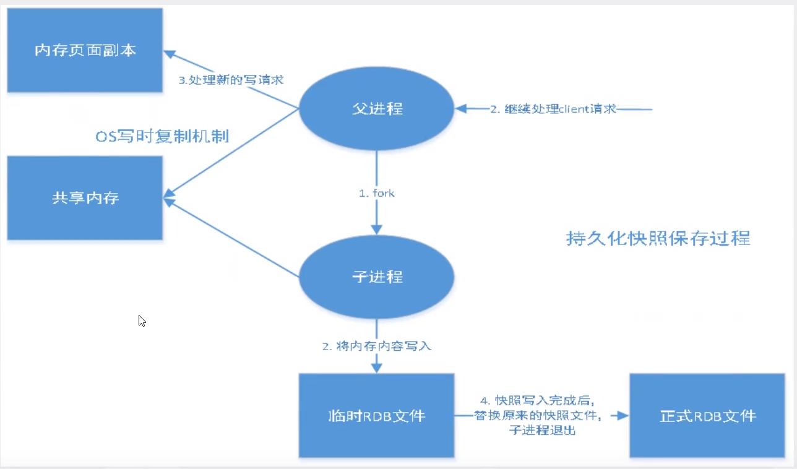
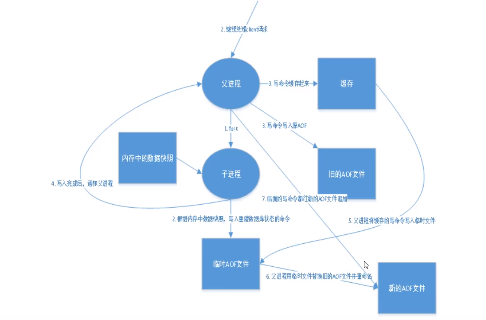
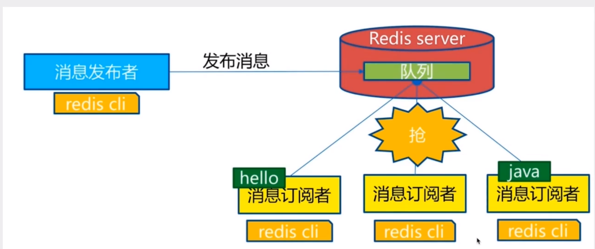
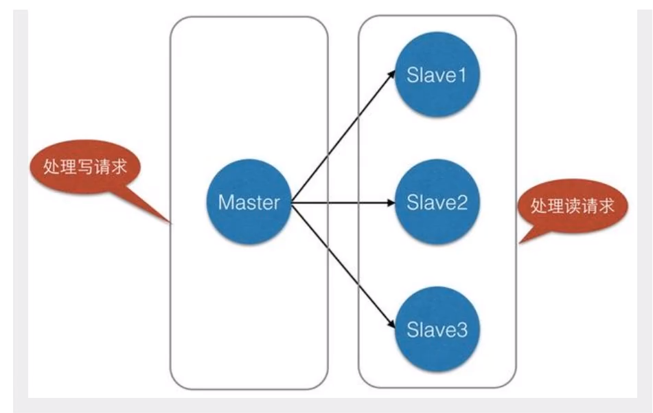
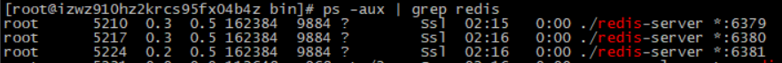
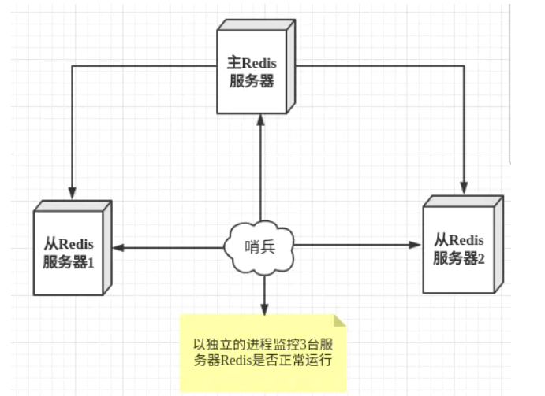
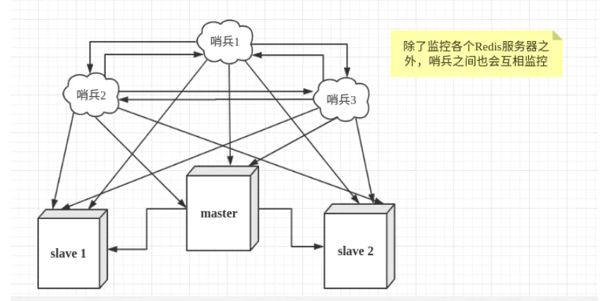
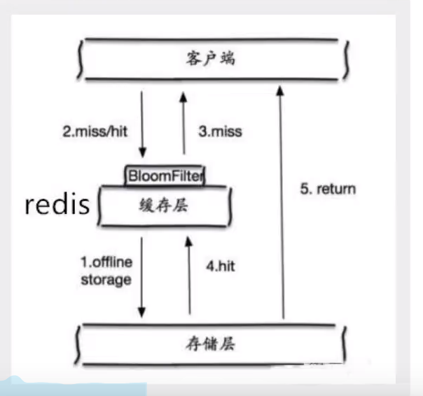

## Redis 是什么

Redis（Remote Dictionary Server )，即远程字典服务，是一个开源的使用ANSI [C语言](https://baike.baidu.com/item/C语言)编写、支持网络、可基于内存亦可持久化的日志型、Key-Value[数据库](https://baike.baidu.com/item/数据库/103728)

## Redis能做什么？

1.内存存储、持久化，内存中是断电即逝、所以说持久化很重要（rdb、aof）

2.效率高，可以用与高速缓存

3.发布订阅系统

4.地图信息分析

5.计时器、计数器

## Redis常用命令

#### 1.删除所有key

```
flushall 或 flushdb
```

#### 2.查询所有key

```
keys *
```

#### 3.判断一个key是否存在

```
exists key  #存在返回1，不存在返回0
```

#### 4.给一个key设定过期时间

```
EXPIRE key 10  #最后的参数是多少秒后过期，也可用来更新过期时间
```

#### 5.查看key过期时间

```
ttl key 
#后面是key，当返回值为-2表示过期了
```

#### 6.移动key到某个数据库

```
MOVE key db #后面的db范围是0-15
#select index 可以选择数据库
```

#### 7.判断key的类型

```
type key #返回key的类型
```

#### 8.删除key

```
del [key ...] #删除一个或多个key，返回删除成功的个数
#如：del key1 key2
```

#### 9.查询key的数量

```
#查看当前数据库的key数量
dbsize 
#查看所有数据库的key数量
info keyspace 
```


## String

#### 1.设置

```
set key value #如果value有空格，就添加双引号
```

#### 2.获取

```
get key
```

#### 3.获取字符串的长度

```
strlen key #返回长度
```

#### 4.追加

```
append key string #如果key不存在，会创建
```

#### 5.自增

```
incr key #加1
decr key #减1
incrby key increment #相当于+=
decrby key increment #相当于-=
```

#### 6.截取操作

```
#截取，这个包头包尾，如果end是-1，表示倒数第一个
GETRANGE key start end 
#范围替换，将offset位置开始的字符换成value
SETRANGE key offset value
```

#### 7.设置值并设定过期时间

```
setex key seconds value
```

#### 8.设置值如果不存在

```
setnx key value #分布式锁常用
```

#### 9.批量

```
#设置多个值
mset k1 v1 k2 v2 k3 v3 ...
#获取多个值
mget k1 k2 k3
#如果存在一个值，则都不执行
msetnx k1 v1 k4 v4
```

#### 10.先获取再设置

```
getset k v
#如果k存在，那么设置v，不存在返回nil
```

## List

#### 1.增删

```bash
#获取list长度
LLEN key

#在左边添加元素，返回push后的list长度
LPUSH ls a b c #顺序为c b a
LPUSHX ls a b c #当key不存在时候，不会进行任何操作

#移除并返回左边第一个元素
LPOP key

#在右边添加元素，返回push后的list长度
RPUSH ls a b c #顺序为a b c
RPUSHX ls a b c #key不存在时候，不会进行任何操作

#移除并返回右边第一个元素
RPOP key
```

#### 2.获取

```
#LRANGE key start stop ,-1表示倒数第一，-2表示倒数第二，依次类推，
lrange ls 0 -1 #获取全部
lrange ls 0 4 #获取第一到第五个
lrange ls -4 -1 #倒数第4到倒数第一
```

#### 3.RPOPLPUSH  source des

返回Source被操作的元素，如果source不存在，那么返回nil，des不存在则新建

```
#假设 list1：a,b,c ; list2:1,2,3 执行操作rpoplpush list1 list2后 list1:a,b list2:c,1,2,3
#如果 source与des是同一个list，那么相当于旋转列表
```

#### 4.LINDEX key index

返回key对应索引的值，超过范围返回nil

```
lindex ls -1 #返回最后一个
```

#### 5.LINSERT key BEFORE|AFTER pivot value

把value插到pivot的前面或者后面，如果pivot找不到，则返回-1，如果key不存在，则什么也不会发生。

```
LINSERT ls after b l
```

#### 6.LSET key index value

覆盖对应index 的值为value，设置成功返回OK，超出key范围则返回error

```
lset ls -1 b 
```

#### 7.LTRIM key start stop

保留key 从start 到stop索引之内的值

```
LTRIM ls 1 3
```

#### 8.LREM key count value

从key中移除count个值为value的元素，返回删除的元素的个数

```
count > 0: 从头往尾移除值为 value 的元素。
count < 0: 从尾往头移除值为 value 的元素。
count = 0: 移除所有值为 value 的元素。

lrem ls 1 a #从头往尾移除一个a
lrem ls -1 a #从尾往头移除一个a
lrem ls 0 a #移除所有的a
```

#### 9.阻塞操作

```
# BRPOPLPUSH source destination timeout 与RPOPLPUSH一模一样只不过，source是空的时候，会等待其他人push元素或者达到timeout时限。timeout为0无限等待
#BLPOP与BRPOP比较复杂，请看官网
```

## Hash

相当于map集合

#### 1.hset

```
127.0.0.1:6379> hset user name "" age 18
(integer) 2
```

#### 2.hget

```
127.0.0.1:6379> hget user age
"18"
```

#### 3.hgetall

获取所有字段与值

```
127.0.0.1:6379> HGETALL user
1) "name"
2) ""
3) "age"
4) "18"
5) "sex"
6) ""
7) "address"
8) "bj"
```

#### 4.hlen

获取字段的数量

```
hlen user
```

#### 5.hexists 

返回hash里面field是否存在

```
127.0.0.1:6379> HEXISTS user name
(integer) 1
```

#### 6.hdel

删除指定的字段，可指定多个

```
127.0.0.1:6379> HDEL user sex address
(integer) 2
```

#### 7.hkeys

返回所有的字段

```
127.0.0.1:6379> HKEYS user
1) "name"
2) "age"
```

#### 8.hvals

返回所有的value

```
127.0.0.1:6379> HVALS user
1) ""
2) "18"
```

#### 9.hsetnx

一个字段不存在则创建，存在则操作无效果

```
127.0.0.1:6379> hsetnx user name ddd
(integer) 0
127.0.0.1:6379> hsetnx user sex man
(integer) 1
```

#### 10.hmset

设置多个字段与值

```
127.0.0.1:6379> hmset user e e f f
```

#### 11.hmget

获取多个字段的值

```
hmget user a c e f
```

#### 12.hstrlen

返回指定字段的值的长度

```
127.0.0.1:6379> HSTRLEN user name
(integer) 0
127.0.0.1:6379> HSTRLEN user age
(integer) 2
```

#### 13.hincrby

HINCRBY key field increment，增加 `key` 指定的哈希集中指定字段的数值。如果 `key` 不存在，会创建一个新的哈希集并与 `key` 关联。如果字段不存在，则字段的值在该操作执行前被设置为 0

`HINCRBY` 支持的值的范围限定在 64位 有符号整数

```
127.0.0.1:6379> HINCRBY user age 18
(integer) 36
127.0.0.1:6379> HINCRBY user age 18
(integer) 54
127.0.0.1:6379> HINCRBY user money 1000
(integer) 1000
127.0.0.1:6379> hkeys user
1) "name"
2) "age"
3) "sex"
4) "money"
127.0.0.1:6379> hgetall user
1) "name"
2) ""
3) "age"
4) "54"
5) "sex"
6) "man"
7) "money"
8) "1000"
```

#### 14.hincrbyfloat

为指定`key`的hash的`field`字段值执行float类型的`increment`加。如果`field`不存在，则在执行该操作前设置为0.如果出现下列情况之一，则返回错误：

- `field`的值包含的类型错误(不是字符串)。
- 当前`field`或者`increment`不能解析为一个float类型。

```
127.0.0.1:6379> HINCRBYFLOAT user score 65.8
"65.8"
127.0.0.1:6379> hget user score
"65.8"
127.0.0.1:6379> HINCRBYFLOAT user score 12.335
"78.135"
```

## Set

不可重复

#### 1.SADD 

SADD key member [member ...]，添加元素，元素不能重复

```
sadd iset s1 s2 s3
```

#### 2.SCARD

返回集合元素的数量

```
scard iset
```

#### 3.SREM

SREM key member [member ...]，移除被指定的元素

```
srem iset s1 s2
```

#### 4.SMEMBERS

返回集合的所有元素

```
smembers iset
```

#### 5.SMOVE

SMOVE source destination member,将source的member移动到des里

```
SMOVE iset iset2 s3
```

#### 6.随机

SPOP key [count]，随机返回并删除count个元素

```
spop iset 3
```

SRANDMEMBER key [count] ，随机返回但不删除count个元素

```
SRANDMEMBER iset 1
```

#### 7.差集、交集、补集

1.差集：SDIFF key [key ...]，返回一个集合与给定集合的差集的元素.

```
#注意以第一个集合为基准
sdiff iset iset2
127.0.0.1:6379> SMEMBERS iset2
1) "s3"
2) "s5"
3) "s4"
4) "s1"
127.0.0.1:6379> SMEMBERS iset3
1) "s2"
2) "s5"
3) "s4"
4) "s1"
127.0.0.1:6379> sdiff iset2 iset3
1) "s3"
127.0.0.1:6379> sdiff iset2 iset2
(empty array)
127.0.0.1:6379> sdiff iset3 iset2
1) "s2"
```

2.交集 ：SINSER key [key ...]，，

```
127.0.0.1:6379> SINTER iset2 iset3
1) "s5"
2) "s4"
3) "s1"
```

3.并集 ：SUNION key [key ...]，

```
127.0.0.1:6379> SUNION iset2 iset3
1) "s2"
2) "s5"
3) "s4"
4) "s3"
5) "s1"
```

## Zset

有序集合

#### 1.zadd

添加

```
127.0.0.1:6379> zadd iset 50 s1
(integer) 1
127.0.0.1:6379> zadd iset 50 s1 60 s2 70 s3
(integer) 2
```

#### 2.zcard

返回有序集合的元素个数

```
127.0.0.1:6379> zcard iset
(integer) 3
```

#### 3.zcount

返回指定分数范围的元素个数

```
127.0.0.1:6379> ZCOUNT iset 20 30
(integer) 0
127.0.0.1:6379> ZCOUNT iset 20 80
(integer) 3
```

#### 4.zincrby

为有序集key的成员member的score值加上增量increment

```
127.0.0.1:6379> ZINCRBY iset 10 s10
"20"
```

#### 5.zrange

根据索引遍历有序集合

```
127.0.0.1:6379> ZRANGE iset 0 -1
1) "s1"
2) "s3"
3) "s2"
127.0.0.1:6379> zrange iset 0 -1 withscores
1) "s1"
2) "50"
3) "s3"
4) "70"
5) "s2"
6) "90"
```

#### 6.zrangebyscore

根据分数获取

ZRANGEBYSCORE key min max [WITHSCORES] [LIMIT offset count] ,min和max可以是-inf和+inf，

```
#根据最大最小区间取值
127.0.0.1:6379> ZRANGEBYSCORE iset -inf +inf
1) "s6"
2) "s1"
3) "s2"
4) "s3"
127.0.0.1:6379> ZRANGEBYSCORE iset -inf +inf withscores
1) "s6"
2) "20"
3) "s1"
4) "50"
5) "s2"
6) "90"
7) "s3"
#根据分数区间取值
127.0.0.1:6379> ZRANGEBYSCORE iset 3 5
1) "s3"
2) "s4"
3) "s5"
127.0.0.1:6379> ZRANGEBYSCORE iset 3 5 withscores
1) "s3"
2) "3"
3) "s4"
4) "4"
5) "s5"
6) "5"
# ‘(’代表闭区间也就是说<3,没有‘(’表示开区间即<=3
127.0.0.1:6379> ZRANGEBYSCORE iset (3 5 withscores
1) "s4"
2) "4"
3) "s5"
4) "5"
127.0.0.1:6379> ZRANGEBYSCORE iset (3 (5 withscores
1) "s4"
2) "4"
```

#### 7.zrangebylex

根据member的字符数组Ascii码进行排序，分数必须相同

ZRANGEBYLEX key min max [LIMIT offset count] ,limit用法与mysql两个参数的limit用法一致

```
#查询所有，-表示最小，+表示最大
127.0.0.1:6379> ZRANGEBYLEX iset2 - +
1) "aaa"
2) "aba"
3) "bbb"
4) "ccc"
#获取a<x<z之间,
127.0.0.1:6379> zrangebylex iset2 (a (z
1) "aaa"
2) "aba"
3) "bbb"
4) "ccc"
#获取a<= x <z之间,
127.0.0.1:6379> zrangebylex iset2 [a (z
1) "a"
2) "aaa"
3) "aba"
4) "bbb"
5) "ccc"
```

#### 8.zrem

删除指定的member

```
127.0.0.1:6379> ZREM iset s10
(integer) 1
```

#### 9.zrevrange

跟zrange一样，不过是从大到小进行排序

```
127.0.0.1:6379> ZREVRANGE iset 0 -1
1) "s5"
2) "s4"
3) "s3"
4) "s2"
5) "s1"
```

#### 10.zrevrangebylex

跟zrangebylex一样，不过是从大到小进行排序

```
127.0.0.1:6379> ZREVRANGEBYLEX iset2 + -
1) "ccc"
2) "bbb"
3) "aba"
4) "aaa"
5) "a"
#获取a<= xx <ccd范围的值
127.0.0.1:6379> ZREVRANGEBYLEX iset2 (ccd [a
1) "ccc"
2) "bbb"
3) "aba"
4) "aaa"
5) "a"
```

#### 11.zrevrangebyscore

跟zrangebyscore一样，不过是从大到小进行排序

```
127.0.0.1:6379> ZREVRANGEBYSCORE iset +inf -inf
1) "s5"
2) "s4"
3) "s3"
4) "s2"
5) "s1"
#获取4<=s<5
127.0.0.1:6379> ZREVRANGEBYSCORE iset (5 4
1) "s4"
```

#### 12.zremrangebylex

根据名称的ascii区间删除的，不要在分数不同的有序集合中使用

```
#删除所有
127.0.0.1:6379> ZREMRANGEBYLEX iset2 - +
(integer) 5
#删除a
127.0.0.1:6379> ZREMRANGEBYLEX iset2 [a [a
(integer) 1
#删除a、d之间，不包括a、d
127.0.0.1:6379> zremrangebylex iset2 (a (d
(integer) 4
```

#### 13.zremrangebyscore

根据分数区间删除

```
#删除分数在0<=s<5的
127.0.0.1:6379> ZREMRANGEBYSCORE iset 0 (5
(integer) 4
```

#### 14.zrank

根据member获取排名，从小到大，排名从0开始，也就是获取索引

```
127.0.0.1:6379> zadd iset 1 s1 2 s2 3 s3 4 s4 5 s5
(integer) 4
127.0.0.1:6379> zrank iset s4
(integer) 3
```

#### 15.zrevrank

根据member获取排名，从大到小，排名从0开始，也就是获取索引

```
127.0.0.1:6379> zrange iset 0 -1 withscores
 1) "s1"
 2) "1"
 3) "s2"
 4) "2"
 5) "s3"
 6) "3"
 7) "s4"
 8) "4"
 9) "s5"
10) "5"
127.0.0.1:6379> ZREVrank iset s5
(integer) 0
```

#### 16.zscore

根据member名称获取分数

```
127.0.0.1:6379> ZSCore iset s5
"5"
```

#### 17.ZINTERSTORE

求交集

ZINTERSTORE destination numkeys key [key ...] [WEIGHTS weight] [SUM|MIN|MAX]

```
destination:放交集的key
numkeys:需要做交集key的个数
weights：权重，做交集运算时每个集合中的member会把自己的score乘以这个权重，默认为1
aggregate[SUM|MIN|MAX]：对于各个key中的相同元素是求和，取最小，还是取最大，默认为sum。
```

```
#模拟数据z1 、 z2
127.0.0.1:6379> zadd z1 10 a 20 b 30 c 60 d
(integer) 4
127.0.0.1:6379> zadd z2 10 g 20 b 30 c 80 d
(integer) 4
#使用z3保存并集结果，指定进行交集的是z1、z2
127.0.0.1:6379> ZINTERSTORE z3 2 z1 z2 
(integer) 3
#z3中，交集的元素的分数默认是z1与z2分数之和（可以设定取最大还是最小）
127.0.0.1:6379> zrange z3  0 -1 withscores
1) "b"
2) "40"
3) "c"
4) "60"
5) "d"
6) "140"
#取分数最大值
127.0.0.1:6379> ZINTERSTORE z3 2 z1 z2 aggregate max
(integer) 3
127.0.0.1:6379> zrange z3  0 -1 withscores
1) "b"
2) "20"
3) "c"
4) "30"
5) "d"
6) "80"
```

#### 18.ZUNIONSTORE

求并集，参数同17

```
127.0.0.1:6379> ZUNIONSTORE z4 2 z1 z2
(integer) 5
127.0.0.1:6379> zrange z4 0 -1 withscores
 1) "a"
 2) "10"
 3) "g"
 4) "10"
 5) "b"
 6) "40"
 7) "c"
 8) "60"
 9) "d"
10) "140"
```

#### 19.zlexcount

返回指定元素字符范围之内的元素个数，

```
127.0.0.1:6379> zrange z4 0 -1 withscores
 1) "a"
 2) "10"
 3) "g"
 4) "10"
 5) "b"
 6) "40"
 7) "c"
 8) "60"
 9) "d"
10) "140"
127.0.0.1:6379> ZLEXCOUNT z4 [a [c
(integer) 1
```

#### 20.zpopmax

ZPOPMAX key [count]，弹出并返回count个最大的元素

zpopmin与这个一样，不过是弹出并返回最小的

```
127.0.0.1:6379> zrange z4 0 -1 withscores
 1) "a"
 2) "10"
 3) "g"
 4) "10"
 5) "b"
 6) "40"
 7) "c"
 8) "60"
 9) "d"
10) "140"
127.0.0.1:6379> ZPOPMAX z4 2
1) "d"
2) "140"
3) "c"
4) "60"
```

## Geospatial

地理位置详解

添加相关城市的经度纬度

```
127.0.0.1:6379> GEOADD china:city 116.40 39.90 beijing
(integer) 1
127.0.0.1:6379> GEOADD china:city 121.47 31.23 shanghai
(integer) 1
127.0.0.1:6379> GEOADD china:city 106.50 29.53 chongqing 114.05 22.52 shenzhen
(integer) 2
127.0.0.1:6379> GEOADD china:city 120.16 30.24 hangzhou 108.96 34.26 xian
(integer) 2
```

## Hyperloglog

基数统计的算法。优点：占用的内存是固定，2^64不同的元素的技术，只需要12kb的内存！

网站基数统计

```
#将元素添加到HyperLogLog中
PFadd
#统计去重后的数量
PFCOUNT
#合并多个HyperLogLog
PFMERGE

127.0.0.1:6379> pfadd k1  a a b b c c 
(integer) 1
127.0.0.1:6379> pfadd k2  a e  b b c c 
(integer) 1
127.0.0.1:6379> PFCOUNT k2
(integer) 4
127.0.0.1:6379> PFCOUNT k1
(integer) 3
127.0.0.1:6379> PFMERGE k3 k1 k2
OK
127.0.0.1:6379> PFCOUNT k3
(integer) 4
```

## Redis事务

redis事务本质：一组命令的集合！一个事务中的所有命令都会被序列化，在事务执行过程中，会按照顺序执行。**一次性、顺序性、排他性**，执行一些列的命令。

redis事务没有隔离级别的概念

所有的命令在事务中，并没有直接被执行！只有发起命令的时候才会执行！

redis单条命令是保证原子性的，但是事务不保证原子性！

redis事务的使用：

开启事务（multi）

命令入队（。。。）

执行事务（exec）

放弃事务（discard）

## 乐观锁

监控：Watch

解除监控：unwatch

悲观锁：认为什么时候都会出现问题，无论做什么都会上锁

乐观锁：认为什么时候都不会出问题，所以不会上锁！更新数据的时候去判断一下，在此期间是否有人修改过这个数据

获取version

更新的时候比较version

客户端1

```
127.0.0.1:6379> MULTI
OK
127.0.0.1:6379(TX)> DECRby money 50
QUEUED
127.0.0.1:6379(TX)> set out 50
QUEUED
127.0.0.1:6379(TX)> exec
(nil)
```

客户端2

```
127.0.0.1:6379> MULTI
OK
127.0.0.1:6379(TX)> INCRby money 80
QUEUED
127.0.0.1:6379(TX)> decrby out 80
QUEUED
127.0.0.1:6379(TX)> exec
1) (integer) 180
2) (integer) -80
```

## Jedis

导入依赖

```xml
<dependency>
            <groupId>redis.clients</groupId>
            <artifactId>jedis</artifactId>
            <version>3.5.2</version>
        </dependency>
        <dependency>
            <groupId>com.alibaba</groupId>
            <artifactId>fastjson</artifactId>
        </dependency>
```

测试代码

```java
 public static void main(String[] args) {
        Jedis jedis = new Jedis("47.112.181.157",6379);
        String ping = jedis.ping();
        System.out.println(ping);
    }
```

sorted set用法

```java
  Jedis jedis = new Jedis("47.112.181.157",6379);
        if (jedis.exists("k1")) {
            jedis.del("k1");
        }
        Map<String,Double> map = new HashMap<>();
        map.put("a", 60D);
        map.put("b", 70D);
        map.put("c", 80D);
        map.put("d", 90D);
        jedis.zadd("k1",map);

        Map<String,Double> map2 = new HashMap<>();
        map2.put("a", 60D);
        map2.put("e", 70D);
        map2.put("f", 80D);
        map2.put("d", 90D);
        jedis.zadd("k6",map2);

        ZParams zParams = new ZParams();
        zParams.weights(1,1);
        zParams.aggregate(ZParams.Aggregate.SUM);
        jedis.zinterstore("k8", zParams,"k1", "k6");

        Set<Tuple> k8 = jedis.zrangeWithScores("k8", 0, -1);
        for (Tuple tuple : k8) {
            System.out.println(tuple.getElement()+tuple.getScore());
        }
```

## redis.conf解释

### 常见配置解析

config get rdbchecksum 在客户端读取

```
#网络
protected-mode yes 保护模式
port 6379 端口
bind 127.0.0.1 -::1 绑定端口
port 端口设置

pidfile /var/run/redis_6379.pid 如果以后台的方式运行，我们就需要一个pid文件

#日志
# Specify the server verbosity level.
# This can be one of:
# debug (a lot of information, useful for development/testing)
# verbose (many rarely useful info, but not a mess like the debug level)
# notice (moderately verbose, what you want in production probably)
# warning (only very important / critical messages are logged)
loglevel notice
logfile "" #日志的文件位置

databases 16 #数据库的数量
always-show-logo no #是否一直显示logo

#快照
持久化，在规定的时间内，执行力多少次操作，则会持久化.rdb .aof
redis 是内存数据库，如果没有持久化，那么数据断电即失

# 如果3600秒内，如果至少有一个key进行了修改，我们即进行持久化操作
save 3600 1
save 300 100
save 60 10000

stop-writes-on-bgsave-error yes #持久化出错后是否继续工作

rdbcompression yes #是否压缩rdb文件，需要消耗一些CPU资源

rdbchecksum yes #保存rdb文件进行错误的校验

dir ./ #rdb文件保存的目录

maxclients 10000 #设置客户能连接redis的最大客户端的数量

maxmemory <bytes> #redis 配置最大的内存容量

maxmemory-policy noeviction #内存到达上限之后的处理策略
1、volatile-lru：只对设置了过期时间的key进行LRU（默认值） 
2、allkeys-lru ： 删除lru算法的key   
3、volatile-random：随机删除即将过期key   
4、allkeys-random：随机删除   
5、volatile-ttl ： 删除即将过期的   
6、noeviction ： 永不过期，返回错误

```

### APPEND ONLY MODE 模式 aof配置

```
appendonly no #默认是不开启aof模式的，默认是使用rdb方式持久化的，在大部分所有的情况下rdb完全够用了

appendfilename "appendonly.aof" 持久化的文件

appendfsync always  #每次修改都会sync ，消耗性能
appendfsync everysec #没秒执行一次sync，可能会丢失这一秒的数据
appendfsync no #不执行同步 ，这个时候操作系统自己同步，速度最快
```

## RDB持久化

Redis是内存数据库，如果不将内存中的数据库状态保持到磁盘，那么一旦服务器进程退出，服务器中的数据库状态就好丢失，所以Redis提供了持久化功能

### 什么是RDB（Redis DataBase）



在指定的时间间隔内将内存中的数据集快照写入磁盘，也就是行话讲的Snapshot快照，它恢复时是将快照文件直接读进内存里

Redis会单独创建（fork）一个子进程来进行持久化，会先将数据写入到一个临时文件中，待持久化过程都结束了，再用这个临时文件替换上次持久化好的文件。整个过程是不进行任何IO操作的。这就确保了极高的性能。如果需要进行大规模数据的恢复，且对于数据恢复的完整性不是非常敏感，那RDB方式要比AOF方式更加的高效，RDB的缺点是最后一次持久化后的数据可能丢失。

一般情况下不需要修改这个配置的！

rdb保存的文件是dump.rdb 都是我们的配置文件中快照中进行配置的

### 触发机制

```
1.save 规则满足的情况下，会自动触发rdb规则

2.执行flushall,也会触发我们的rdb规则，但会删除内存中所有的key

3.退出redis，也会产生rdb文件

```

### 如何恢复

```
只要rdb文件在redis的启动目录即可以了，redis启动的时候会自动检查dump.rdb恢复其中的数据
查看rdb存在的位置：config get dir
```

优点：

1.适合大规模的数据恢复

2.对数据的完整性要求不高

缺点：

1.需要一定的时间间隔进程操作！如果redis意外宕机了，那么就会丢失最后一次修改的数据。

2.fork进程的时候，会占用一定的内容空间

## AOF （append only file）

将我们的所有命令都记录下来，history，恢复的时候就把这个文件全部再执行一遍

```
appendonly no #默认是不开启aof模式的，默认是使用rdb方式持久化的，在大部分所有的情况下rdb完全够用了

appendfilename "appendonly.aof" 持久化的文件

appendfsync always  #每次修改都会sync ，消耗性能
appendfsync everysec #没秒执行一次sync，可能会丢失这一秒的数据
appendfsync no #不执行同步 ，这个时候操作系统自己同步，速度最快
```



以日志的形式来记录每个写操作，将redis执行过的所有指令记录下来（读指令不记录），只许追加文件但不可以写文件，redis启动之初会读取文件重新构建数据，换言之，redis重启的话就根据日志文件的内容将写指令从前到后执行一次以完成数据的恢复工作

### 错误修复

如果appendonly.aof文件有错，那么redis服务是启动不起来的，只需要调用bin目录下的

./redis-check-aof [--fix] <file.aof> 命令即可修复

```
./redis-check-aof --fix appendonly.aof 
```

### 优缺点

优点：

1.每次修改都同步记录，文件的完整性会更好

2.每秒同步一次，可能会丢失一秒的数据

3.从不同步，效率最高！

缺点：

1.相对于数据文件来说，aof远远大于rdb，修复的速度也比rdb慢！

2.aof运行效率也要比rdb慢

### 同时开启两种持久化方式

- 在这种情况下，当redis重启的时候会优先载入AOF文件来恢复原始的数据，因为在通常情况下AOF文件保存的数据集要比RDB文件保存的数据集要完整
- RDB的数据不实时，同时使用两者时服务器重启也只会找AOF文件，那要不要使用AOF呢？作者建议不要，因为RDB更适合用于备份数据库（AOF在不断变化不好备份），快速重启，而且不会有AOF可能潜在的Bug，留着作为一个万一的手段

### 性能建议

- 因为RDB文件只能用作后备用途，建议只在Slave上持久化RDB文件，而且只要15分钟备份一次就够了，只保留save 900 1这条规则
- 如果启用AOF，好处是在最恶劣情况下也知乎丢失不超过两秒数据，启动脚本较简单只load自己的AOF文件就可以了，代价一是带来了持续的IO，二是AOF rewrite的最后将rewrite过程中产生的新数据写到新文件造成的阻塞几乎是不可避免的。只要硬盘许可，应该尽量减少AOF rewrite的频率，AOF重写的基础大小默认值64M太小了，可以设到5G以上，默认超过原大小100%大小重写可以改到适当的数值
- 如果不Enable AOF，仅靠Master-Slave Replication 实现高可用也可以，能省掉一大笔IO，也减少了rewrite时带来的系统波动，代价是如果Master/slave 同时挂掉（断电），会丢失十几分钟的数据启动脚本也要比较两个Master/Slave的RDB文件，载入较新的那个，微博就是这种架构。

## Redis发布订阅

Redis发布订阅（pub/sub）是一种消息通信模式：发送这（pub）发送信息，订阅者（sub）接收消息。

Redis 客户端可以订阅任意数量的频道

订阅/发布消息图



### 常用命令

```
#订阅给定的模式(patterns)。
PSUBSCRIBE pattern [pattern ...]

#查看订阅与发布系统状态
PUBSUB subcommand [argument [argument ...]]

#将信息发送到指定的频道
PUBLISH channel message

#退订所有给定模式的频道
PUNSUBSCRIBE [pattern [pattern ...]]

#订阅给定的一个或多个频道的信息
SUBSCRIBE channel [channel ...]

#退订给定的频道
UNSUBSCRIBE [channel [channel ...]]
```

### 测试

订阅端：

```
127.0.0.1:6379> SUBSCRIBE asshole #订阅频道 addhole
Reading messages... (press Ctrl-C to quit)
1) "subscribe"
2) "asshole"
3) (integer) 1
1) "message"
2) "asshole"
3) "fuck you"
1) "message"
2) "asshole"
3) "hehe"
1) "message"
2) "asshole"
3) "\xe4\xbd\xa0\xe5\xb0\xb1\xe6\x98\xaf\xe4\xb8\xaa\xe9\xb8\xa1\xe5\xb7\xb4"
```

发送端：

```
127.0.0.1:6379> PUBLISH asshole "fuck you" #发送消息到频道asshole
(integer) 1
127.0.0.1:6379> PUBLISH asshole "hehe"
(integer) 1
127.0.0.1:6379> PUBLISH asshole "你就是个鸡巴"
(integer) 1
```


## REPLICATION 主从复制

### 架构图



主从复制，读写分离！80%的情况下都是在进行读操作！减缓服务器的压力！架构中经常使用！最低配：一主二从！

### 概念

主从复制，是指将一台Redis服务器的数据，复制到其他的Redis服务器，前者称为主节点（master/leader) ，后者称为从节点（slave/follower）；数据的复制是单向的，只能从主节点到从节点。Master以写为主，Slave以读为主。

### 主从复制的作用主要包括

1. 数据冗余：主从复制实现了数据的热备份，是持久化之外的一种数据冗余方式。
2. 故障恢复：当主节点出现问题时，可以由从节点提供服务，实现快速的故障恢复；实际上是一种服务的冗余
3. 负载均衡：在主从复制的基础上，配合读写分离，可以由主节点提供写服务，由从节点提供读服务（即写Redis数据时应连接主节点，读Redis数据时应用连接从节点），分担服务器负载；尤其是在写少读多的场景下，通过多个从节点分担读负载，可以大大提高Redis服务器的并发量。4
4. 高可用基石：除了上述作用以外，主从复制还是哨兵和集群能够实施的基础，因此说主从复制是Redis高可用的基础。


一般来说，要将Redis运用于工程项目中，只使用一台Redis是万万不能的，原因如下：

1. 从结构上，单个Redis服务器会发生单点故障，并且一台服务器需要处理所有的请求负载，压力较大；
2. 从容量上，单个Redis服务器内存容量有限，就算一台Redis服务器内存容量为256G,也不能将所有内存用作Redis存储内存，一般来说，单台Redis最大使用内存不应该超过20G

电商网站上的商品，一般都是一次上传，无数次浏览的，说专业点就是多读少写

### 环境配置

#### 只配置从库，不用配置主库

```bash
#查看当前库的信息
info replication

127.0.0.1:6379> info replication
# Replication 
role:master #角色
connected_slaves:0  #从机数量
master_failover_state:no-failover
master_replid:dcb9874f1a8b6b85e89730826b4a0017888e06ef
master_replid2:0000000000000000000000000000000000000000
master_repl_offset:0
second_repl_offset:-1
repl_backlog_active:0
repl_backlog_size:1048576
repl_backlog_first_byte_offset:0
repl_backlog_histlen:0
```

#### 从库要修改的配置

```
#端口，改成不一样，防火墙对应的端口要开发
port 6379

#后台运行需要的pid文件，改成不一样的文件名
pidfile /var/run/redis_6379.pid

#日志名称，改成不一样
logfile "6379.log"

#rdb数据备份的文件名，也要不一样
dbfilename dump6379.rdb

#从机配置，这样从机一启动就完成了配置
replicaof localhost 6379

#如果主机有密码，要在从机的配置文件里加入以下
masterauth 主机的密码

```



#### 一主二从

默认情况下三台都是主机（Master）

任意挑选出两台作为从机，只要让从机任老大即可

```bash
#slave 主机ip 端口号 或者直接在redis.conf配置，启动就是从机
SLAVEOF 47.112.181.157 6379 

#如果主机断开了，手动输入以下命令，让自己变成老大
slaveof no one 
```

```bash
info replication#查看连接是否成功

master_link_status:up #从机状态为up表示连接成功

connected_slaves:2 #主机会显示已连接详情
slave0:ip=127.0.0.1,port=6380,state=online,offset=336,lag=0
slave1:ip=127.0.0.1,port=6381,state=online,offset=336,lag=0
```

#### 细节

主机可读可写，从机只能读，不能写

主机断开重启后，功能没有影响，同样的从机也是一样的，断开重来后，功能照旧

#### 复制原理

Slave启动成功连接到master后发送一个sync同步命令

master接到命令，启动后台的存盘进程，同时收集所有接收到的用于修改数据集命令，在后台进程执行完毕之后，master将传送整个数据文件到slave，并完成一次完全同步。

全量复制：slave服务在接收到数据库文件数据后，将其存盘并加载到内存中。

增量复制：master继续将新的所有收集到的修改命令依次传给slave，完成同步。

但是只要是重新连接master，一次完全同步（全量复制）将被自动执行。

## 哨兵模式

**主从切换技术的方法是：当主服务器宕机后，需要手动把一台从服务器切换为主服务器，这就需要人工干预，费事费力，还会造成一段时间内服务不可用。**这不是一种推荐的方式，更多时候，我们优先考虑**哨兵模式**。

### 一、哨兵模式概述

哨兵模式是一种特殊的模式，首先Redis提供了哨兵的命令，哨兵是一个独立的进程，作为进程，它会独立运行。其原理是**哨兵通过发送命令，等待Redis服务器响应，从而监控运行的多个Redis实例。**



这里的哨兵有两个作用

- 通过发送命令，让Redis服务器返回监控其运行状态，包括主服务器和从服务器。
- 当哨兵监测到master宕机，会自动将slave切换成master，然后通过**发布订阅模式**通知其他的从服务器，修改配置文件，让它们切换主机。

然而一个哨兵进程对Redis服务器进行监控，可能会出现问题，为此，我们可以使用多个哨兵进行监控。各个哨兵之间还会进行监控，这样就形成了多哨兵模式。



用文字描述一下**故障切换（failover）**的过程。假设主服务器宕机，哨兵1先检测到这个结果，系统并不会马上进行failover过程，仅仅是哨兵1主观的认为主服务器不可用，这个现象成为**主观下线**。当后面的哨兵也检测到主服务器不可用，并且数量达到一定值时，那么哨兵之间就会进行一次投票，投票的结果由一个哨兵发起，进行failover操作。切换成功后，就会通过发布订阅模式，让各个哨兵把自己监控的从服务器实现切换主机，这个过程称为**客观下线**。这样对于客户端而言，一切都是透明的。

### 二、Redis配置哨兵模式

配置3个哨兵和1主2从的Redis服务器来演示这个过程。

| 服务类型 | 是否是主服务器 | IP地址         | 端口  |
| -------- | -------------- | -------------- | ----- |
| Redis    | 是             | 192.168.11.128 | 6379  |
| Redis    | 否             | 192.168.11.129 | 6379  |
| Redis    | 否             | 192.168.11.130 | 6379  |
| Sentinel | -              | 192.168.11.128 | 26379 |
| Sentinel | -              | 192.168.11.129 | 26379 |
| Sentinel | -              | 192.168.11.130 | 26379 |

### sentinel.conf配置

```
#哨兵端口
port 26379

# 禁止保护模式
protected-mode no
# 配置监听的主服务器，这里sentinel monitor代表监控，mymaster代表服务器的名称，可以自定义，192.168.11.128代表监控的主服务器，6379代表端口，2代表只有两个或两个以上的哨兵认为主服务器不可用的时候，才会进行failover操作。这里要写具体的ip地址，否则会报找不到主机的异常
sentinel monitor mymaster 47.112.181.157 6379 2

# sentinel author-pass定义服务的密码，mymaster是服务名称，123456是Redis服务器密码
# sentinel auth-pass <master-name> <password>
sentinel auth-pass mymaster 123456


# 启动哨兵进程
./redis-sentinel ../sentinel.conf
```

**从机被哨兵选为主机后，会从配置文件中移除它作为从机的配置，把其他从机的主机ip配置改成它的ip**

**原来的主机恢复后，也只能当作现任主机的从机**

### 优点

1. 哨兵集群，基于主从复制模式，所有的主从配置优点，它全有
2. 主从可以切换，故障可以转移，系统的可用性就好更好
3. 哨兵模式就是主从模式的升级，手动到自动，更加健壮

### 缺点

1. Redis不好在线扩容的，集群的容量一旦到达上限，在线扩容十分麻烦
2. 实现哨兵模式的配置是很繁琐的，里面有很多的选择

## 缓存穿透

### 概念

缓存穿透的概念很简单，用户想要查询一个数据，发现redis内存数据库没有，也就是缓存没有命中，于是向持久层数据库查询。发现也没有，于是本次查询失败。当用户很多的时候，缓存都没有命中，于是都去请求了持久层数据库。这会给持久层数据库造成很大的压力，这时候就相当于出现了缓存穿透

### 布隆过滤器

布隆过滤器是一种数据结构，对所有可能查询的参数以hash形式存储，在控制层先进行校验，不符合则丢弃，从而避免了对底层存储系统的查询压力



## 线上修改Redis配置

### 1.获取

```bash
#获取全部redis配置
config get *
#获取指定配置，如获取连接空闲多久后关闭的设置
config get tcp-keepalive #这个默认是60秒
```

### 2.设置

```bash
#设置空闲连接超时时间关闭
config set tcp-keepalive 60
```

