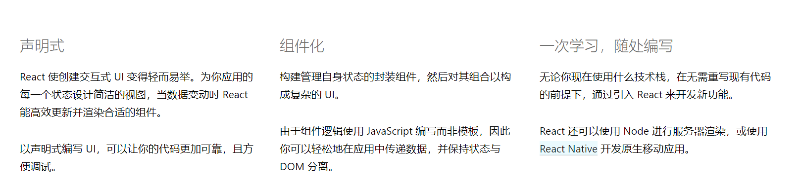
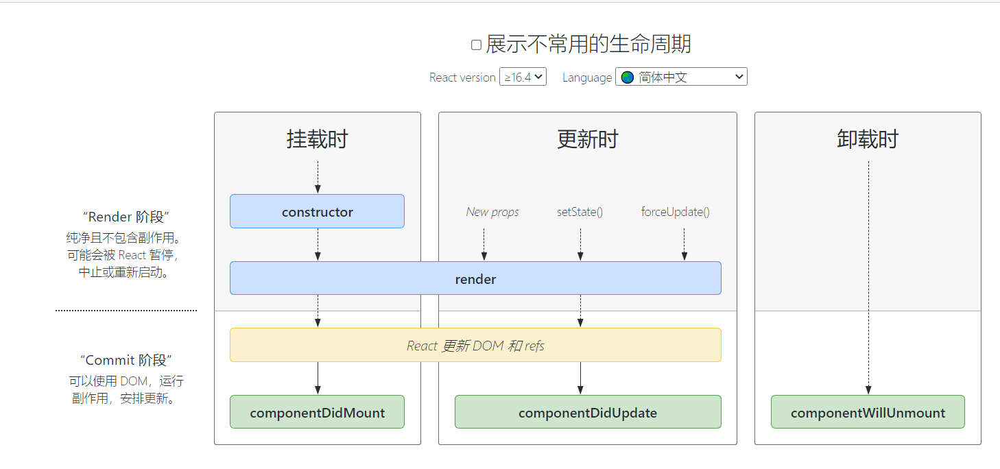

### 什么是React

>用于构建用户界面的JavaScript库

### 三大特性



### vscode快捷键

```js
// tagName.className 如div.helloworld 就会变成下面
<div className="helloworld"></div>

//使用插件生成的组件模板
rpc
```


### 构建react项目

```bash
npx create-react-app helloworld
```

### HelloWorld

删除src下除index.js外的文件，清空index.js的东西，加入以下

```js
import React from 'react'
import ReactDom from 'react-dom'

const element = <h1>hello world</h1>

ReactDom.render(element,document.getElementById('root'))
```

### 启动项目

```
npm start
```

### debug

在根目录下创建vscode目录，添加launch.json文件，加入以下内容

```js
{
    "version": "0.2.0",
    "configurations": [
        {
            "name": "edge",
            "type": "edge",
            "request": "launch",
            "url": "http://localhost:3000",
            "webRoot": "${workspaceFolder}/src",
            "sourceMapPathOverrides": {
                "webpack:///src/*": "${webRoot}/*"
            }
        }
    ]
}
```

### 小案例

动态显示当前时间

```react
let user = {id:1,date: ''}
let i = 0
function clock() {
    user.date = new Date().toLocaleTimeString()
    const element = (
        <div>
            <h1>ID是{user.id}</h1>
            <h1>当前时间是{user.date}</h1>
            <h1>{i++}</h1>
        </div>
    )
    reactDom.render(element,document.getElementById('root')) 
}
clock()
setInterval(clock,1000)
```

### JSX

javaScript的语法扩展

### 组件

#### 函数式组件

##### 基本的函数式组件

```react
function Welcome(){
    return <h1>这是我的welcome标签</h1>
}

ReactDom.render(Welcome(),document.getElementById('root'))
```

##### 组件传值

```react
function Welcome(props){
    return <h1>姓名：{props.name}，年龄：{props.age}</h1>
}

const welcome = <Welcome name="张三" age={17}></Welcome>

ReactDom.render(welcome,document.getElementById('root'))
```

#### 类组件

##### 单组件

```react
class Welcome extends React.Component {
    render() {
        return <h1>姓名：{this.props.name},年龄：{this.props.age}</h1>
    }
}

const welcome = <Welcome name="张三" age={17}></Welcome>

ReactDom.render(welcome,document.getElementById('root'))
```

#### 多组件抽取

##### 例子1

```react
function formatDate(date) {
  return date.toLocaleDateString();
}

function Avatar(props) {
  return (
    
  );
}

function UserInfo(props) {
  return (
    <div className="UserInfo">
      <Avatar user={props.user} />
      <div className="UserInfo-name">{props.user.name}</div>
    </div>
  );
}

function Comment(props) {
  return (
    <div className="Comment">
      <UserInfo user={props.author} />
      <div className="Comment-text">{props.text}</div>
      <div className="Comment-date">
        {formatDate(props.date)}
      </div>
    </div>
  );
}

const comment = {
  date: new Date(),
  text: 'I hope you enjoy learning React!',
  author: {
    name: 'Hello Kitty',
    avatarUrl: 'https://placekitten.com/g/64/64',
  },
};
ReactDOM.render(
  <Comment
    date={comment.date}
    text={comment.text}
    author={comment.author}
  />,
  document.getElementById('root')
);

```

##### 简便例子

```react
function App(props){
    return (
    <div>
        <UserInfo user={props.user}/>
        <div>内容：{props.user.content}</div>
    </div>
    )
}
function UserInfo(props){
    return (
        <h1>姓名：{props.user.name},年龄：{props.user.age}</h1>
    )
}

const val = {
    name: 'jimmy',
    age: 19,
    content: '今晚打老虎'
}

const app = <App user={val}></App>

ReactDom.render(app,document.getElementById('root'))
```

### state与生命周期

列出了两种生命周期的使用

```react
import React from 'react'

class IClock extends React.Component{
    constructor(props) {
        super(props)
        this.state = {
            date: new Date(),
            flag: true
        }
    }

    componentDidMount() {
        this.timerID = setInterval(() => {
            this.setState({
                date: new Date(),
                flag: !this.state.flag
            })
        }, 1000);
    }

    componentWillUnmount() {
        clearInterval(this.timerID)
    }


    render() {
        const flag = this.state.flag
        return (
            <div>
                <h2 style={{display: flag?'':'none'}}>
                    当前时间：{this.state.date.toLocaleTimeString()}
                </h2>
            </div>
        )
    }
}

export default IClock
```

### 事件绑定

第一个对象默认是事件对象

```react
import React from 'react'

class Btn extends React.Component{
    constructor(props){
        super(props)
        this.state = {isToggle: true}
        this.handleClick = this.handleClick.bind(this)//为了能在handleClick中使用this
    }

      handleClick(e){
        e.preventDefault()//阻止a标签跳转
        console.log(e)
    }

    render(){
        const isToggle = this.state.isToggle
        return(
            <div>
                <a href='http://www.baidu.com' onClick={this.handleClick} target='blank'>百度一下</a>
            </div>
        )
    }
}

export default Btn
```

如果想传递自己的参数则这样做

```react
render(){
        const isToggle = this.state.isToggle
        return(
            <div>
                <button onClick={e=> this.handleClick(e,123)}>点我</button>
                //或者
                 <button onClick={this.handleClick.bind(this, 111)}>点我</button>
            </div>
        )
    }
```

### 条件渲染

&&运算符的妙用，true && expression总是返回expression

```react
function Mailbox(props) {
  const unreadMessages = props.unreadMessages;
  return (
    <div>
      <h1>Hello!</h1>
      {unreadMessages.length > 0 &&
        <h2>
          You have {unreadMessages.length} unread messages.
        </h2>
      }
    </div>
  );
}

const messages = ['React', 'Re: React', 'Re:Re: React'];
ReactDOM.render(
  <Mailbox unreadMessages={messages} />,
  document.getElementById('root')
);
```

三目运算符渲染

```react
render() {
  const isLoggedIn = this.state.isLoggedIn;
  return (
    <div>
      {isLoggedIn
        ? <LogoutButton onClick={this.handleLogoutClick} />
        : <LoginButton onClick={this.handleLoginClick} />
      }
    </div>
  );
}
```

### 阻止条件渲染的案例

```react
import React, {PureComponent} from "react"

class Text extends PureComponent{
    constructor(props){
        super(props)
    }
    render(){
        if (!this.props.isShow) {
            return null
        }
        return(
            <div>今晚打老虎</div>
        )
    }
}

class ShowTest extends PureComponent{
    constructor(props){
        super(props)
        this.state = {isShow: true}
        this.handleToggleShow = this.handleToggleShow.bind(this)
    }
    handleToggleShow(){
        this.setState(state => ({
            isShow : !state.isShow
        }))
    }
    render(){
        return(
            <div>
                <Text isShow={this.state.isShow}/>
                <button onClick={this.handleToggleShow}>切换</button>
            </div>
        )
    }
}

export default ShowTest
```

### 数组的Map遍历渲染

注意map遍历的时候没有大括号

const names = ['css','javascript','java','c#','c++','c','python','go']

```react
import React, {PureComponent} from "react"
import { DivComponent } from "./style"

class DivTest extends PureComponent{
    constructor(props){
        super(props)
    }

    render(){
        const names = this.props.names
        const liNames = names.map((v) =>
            <li key={v.toString()}>
                <a href="#">{v.toUpperCase()}</a>
            </li>
        )
        return(
            <DivComponent>
                <ul>
                    <li>
                        <a href="#">首页</a>
                    </li>
                    {liNames}
                    <li>
                        <a href="#">本地书签</a>
                    </li>
                </ul>
            </DivComponent>
        )
    }
}

export default DivTest
```

css

```scss
import styled from "styled-components";

export const DivComponent = styled.div`
    border: 1px solid red;
    height: 35px;
    padding: 0 100px;
    background-color: #96B97D;
    ul {
        margin: 0;
        padding: 0;
        list-style: none;
        text-align: center;
    }
    li {
        display: inline-block;       
    }
    a {
        display: block;
        padding: 6px 12px;
        text-decoration: none;
        color: #F8FFFF;  
        font-size: 14px;
        :hover{
            color: #1E1E1E
        }      
    }  
`;
```

### 类似v-model的例子

```react
import React, { PureComponent } from 'react'

export default class VModel extends PureComponent {
    constructor(props) {
        super(props)
        this.state = { value: '' }
        this.handleChange = this.handleChange.bind(this)
        this.handleSubmit = this.handleSubmit.bind(this)
    }

    handleChange(e) {
        let val = e.target.value
        console.log(val)
        this.setState({ value: val })
    }

    handleSubmit(e) {
        alert(this.state.value)
        e.preventDefault()
    }

    render() {
        return (
            <div>
                <form onSubmit={this.handleSubmit} >
                <input type="text" value={this.state.value} onChange={this.handleChange} />
                    <br />
                    <input type="submit" value="提交"/>
                </form>
            </div>
        )
    }
}
```

### react整合element-react

按照官网上的教程安装，缺什么装什么，注意要在stc/index.js下面要导入element的主题

```react
import React from 'react'
import ReactDom from 'react-dom'
import { SelectTest } from './components/selectTest'
import 'element-theme-default';
import Zmd from './components/zmd';


const view = 
<div>
    <SelectTest/>
    <Zmd/>
</div>

ReactDom.render(view,document.getElementById('root'))
```

### 走马灯案例

```react
import React, { PureComponent } from 'react'
import { Carousel } from 'element-react'
import { SelectWrapper } from './style'

export default class Zmd extends PureComponent {
    constructor(props){
        super(props)
        this.state = {
            activeIndex: 0,
        }
        this.handleChange = this.handleChange.bind(this)
    }

    handleChange(currIndex,prevIndex){
        this.setState({
            activeIndex: currIndex
        })
    }


    render() {
        return (
            <SelectWrapper>
                <Carousel 
                interval="4000" 
                type="card" 
                height="200px" 
                onChange={this.handleChange}
                >
                    {
                        [1, 2, 3, 4, 5, 6].map((item, index) => {
                            return (
                                <Carousel.Item key={index} >
                                    <div 
                                    className={this.state.activeIndex===index?'subCard subCardColor':'subCard'}
                                    >
                                        {item}
                                    </div>
                                </Carousel.Item>
                            )
                        })
                    }
                </Carousel>
            </SelectWrapper>
        )
    }
}
```

### Select下拉框案例

```react
import React, { PureComponent } from 'react'
import { Select } from 'element-react'

export class SelectTest extends PureComponent {
    constructor(props) {
        super(props);

        this.state = {
            options: [{
                value: '选项1',
                label: '黄金糕'
            }, {
                value: '选项2',
                label: '双皮奶'
            }, {
                value: '选项3',
                label: '蚵仔煎'
            }, {
                value: '选项4',
                label: '龙须面'
            }, {
                value: '选项5',
                label: '北京烤鸭'
            }],
            value: 0
        };
        this.handleChange = this.handleChange.bind(this)
    }

    handleChange(value) {
        this.setState({
            value: value
        })
    }

    render() {
        return (
            <div>
                <Select value={this.state.value} placeholder="请选择" onChange={this.handleChange}>
                    {
                        this.state.options.map((el, i) => {
                            return <Select.Option key={el.value} label={el.label} value={i} />
                        })
                    }
                </Select>
                <p>{this.state.options[this.state.value].label}</p>
            </div>
        )
    }
}
```

### Es6新特性名称赋值案例

```react
import React from 'react'


export class HandleInput extends React.Component {
    constructor(props) {
        super(props);
        this.state = {
            isGoing: true,
            numberOfGuests: 2
        };

        this.handleInputChange = this.handleInputChange.bind(this);
    }

    handleInputChange(event) {
        const target = event.target;
        const value = target.type === 'checkbox' ? target.checked : target.value;
        const name = target.name;

        this.setState({
            [name]: value
        });
    }

    render() {
        return (
            <form>
                <label>
                    参与:
                    <input
                        name="isGoing"
                        type="checkbox"
                        checked={this.state.isGoing}
                        onChange={this.handleInputChange} />
                </label>
                <br />
                <label>
                    来宾人数:
                    <input
                        name="numberOfGuests"
                        type="number"
                        value={this.state.numberOfGuests}
                        onChange={this.handleInputChange} />
                </label>
            </form>
        );
    }
}
```

### 汇率转换案例

```react
import React, { PureComponent } from 'react'

export default class VModel extends PureComponent {
    constructor(props) {
        super(props)
        this.state = { rmb: '',dol: '' }
        this.rmbChange = this.rmbChange.bind(this)
        this.dolChange = this.dolChange.bind(this)
        this.handleSubmit = this.handleSubmit.bind(this)
    }

    rmbChange(e) {
        this.setState({
            rmb: e.target.value,
            dol: this.subNum(e.target.value/this.props.exchangeRate)
        })
    }

    dolChange(e) {
        this.setState({
            rmb: this.subNum(e.target.value*this.props.exchangeRate),
            dol: e.target.value
        })
    }

    subNum(num){
        if((!num || !num instanceof Number)){
            console.log(num)
            return ''
        }
        let str = num.toString()
        let index = str.indexOf('.')
        if(index === -1 || (str.substring(index+1,str.length).length<=4)){
            return str
        }
        return str.substring(0,index)+'.'+str.substring(index+1,index + 5)
    }

    handleSubmit(e) {
        alert(this.state.value)
        e.preventDefault()
    }

    render() {
        let rmb = this.state.rmb
        let dol = this.state.dol
        return (
            <div>
                <form onSubmit={this.handleSubmit} >
                RMB:<input type="text" value={rmb} onChange={this.rmbChange} />
                <br />
                dollar:<input type="text" value={dol} onChange={this.dolChange} />
                <br />
                    <input type="submit" value="提交"/>
                </form>
            </div>
        )
    }
}
```

### 类似插槽案例

#### 案例

```react
import React, { PureComponent } from 'react'

export default class NestedTest extends PureComponent {
    render() {
        return (
            <div>
                <div>
                    {this.props.left}
                </div>
                <div>
                    {this.props.right}
                </div>
            </div>
        )
    }
}
```

#### 使用

```react
import React from 'react'
import ReactDom from 'react-dom'
import 'element-theme-default';
import NestedTest from './components/nested';

const p = <p>今晚打老虎</p>

const s1 = <select><option value="1" label="aaa"></option></select>

const view = 
<div>
    <NestedTest left={p} right={s1}/>
</div>

ReactDom.render(view,document.getElementById('root'))
```

### 处理Radio框的案例

```react
import React, { PureComponent } from 'react'

export default class InputTest extends PureComponent {
    constructor(props){
        super(props)
        this.state = {
            t: '',
            cb: true,
            ta: '',
            sex: '1'
        }
        this.handleChange = this.handleChange.bind(this)
    }
    
    handleChange(e){
        let target = e.target
        let name = target.name
        let type = target.type
        let value;
        if(type === 'checkbox'){
            value = target.checked
        }else if(type === 'radio'){
            value = target.value
        }else{
            value = target.value
        }

        this.setState({
            [name]: value
        })
    }


    render() {
        return (
            <div>
                普通文本：<input type="text" name='t' value={this.state.t} onChange={this.handleChange} /><br />
                复选框： <input type="checkbox" name='cb' checked={this.state.cb} onChange={this.handleChange}/><br />
                文本域: <input type="textarea" name='ta'value={this.state.ta} onChange={this.handleChange} /><br />
                男 <input type="radio" name='sex' value='1' onChange={this.handleChange} checked={this.state.sex==='1'}/>
                女 <input type="radio" name='sex' value='0' onChange={this.handleChange} /><br />
               <p>{this.state.t}</p>
               <p>{this.state.cb?'true':'false'}</p>
               <p>{this.state.ta}</p>
               <p>{this.state.sex}</p>
            </div>
        )
    }
}
```

### React生命周期演示

#### 生命周期



#### 案例

```react
import React, { PureComponent } from 'react'

export default class LifeCycle extends PureComponent {
    constructor(props) {
        super(props)
    
        this.state = {
             count: 0
        }
        this.handleClick = this.handleClick.bind(this)
        console.log('构造函数');
    }
    componentDidMount() {
        console.log('componentDidMount挂载完成');
    }
    componentDidUpdate(prevProps, prevState) {
        console.log('componentDidUpdate更新完毕')
    }
    componentWillUnmount() {
        console.log('componentWillMount卸载');
    }

    handleClick(){
        this.setState({
            count: this.state.count+1
        })
    }
    
    
    render() {
        console.log('render渲染')
        let count = this.state.count
        return (
            <div>
                <button onClick={this.handleClick}>+1</button>
                {
                    count<=3
                    ?  <IContent count={count}/>
                    :  <p>超过3次</p>
                }
            </div>
        )
    }
}
class IContent extends PureComponent{

    constructor(props) {
        super(props)
    
        this.state = {
             
        }
    }
    
    componentWillUnmount() {
        console.log('componentWillMount卸载');
    }

    render(){
        let count = this.props.count
        return(
            <div>
               次数：{count}
            </div>
        )
    } 
}
```

#### 挂载

constructor ---》 render ---》componentDidMount

componentDidMount适合发送请求获取数据

#### 更新

 render ---》componentDidMount

三个操作会触发更新

1. 调用setState
2. forceUpdate()被调用
3. 组件收到新的props

**注意**：在render与componentDidMount调用setState时要加个条件，不然会死循环

#### 卸载

componentWillUnmount

当条件渲染不满足时，触发卸载，场景：清理定时器

### 组件通讯

#### 父传子

```react
import React, { PureComponent } from 'react'

export default class Parent extends PureComponent {
    constructor(props) {
        super(props) 
        this.state = {
             value:'给儿子的'
        }
    }  
    render() {
        return (
            <div>
                <Son msg={this.state.value}></Son>
            </div>
        )
    }
}
class Son extends PureComponent {
    render() {
        return (
            <div>
                {this.props.msg}
            </div>
        )
    }
}
```

#### 子传父

```react
import React, { PureComponent } from 'react'

export default class Parent extends PureComponent {
    constructor(props) {
        super(props) 
        this.state = {
             value:'给儿子的',
             son: ''
        }
        this.getChildMsg = this.getChildMsg.bind(this)
    }
    getChildMsg = (msg) => {
        console.log('从子组件收到的消息：'+msg);
        this.setState({
            son: msg
        })
    }
    
    render() {
        return (
            <div>
                <Son msg={this.getChildMsg} value={this.state.value}></Son>
                {
                    this.state.son!==''
                    ?<p>父组件收到的消息：{this.state.son}</p>
                    :<span> </span>
                }
            </div>
        )
    }
}
class Son extends PureComponent {
    constructor(props) {
        super(props)
    
        this.state = {
             count: 0
        }
        this.handleClick = this.handleClick.bind(this)
    }
    handleClick(){
        this.setState({
            count: this.state.count+1
        })
    }
    
    render() {
        let count = this.state.count
        const msg = '爬爬爬'
        return (
            <div>
                <div>父组件的消息：{this.props.value}</div>
                {
                    count<3
                    ? <button onClick={this.handleClick}>点击它三次：{count}</button>
                    : <p>{this.props.msg(msg)}给父组件的消息：{msg}</p>
                }
            </div>
        )
    }
}
```

#### 兄弟相传

两个没有任何关联的组件，通过一个父组件共享信息

```react
import React, { PureComponent } from 'react'

export default class Parent extends PureComponent {
    constructor(props) {
        super(props) 
        this.state = {
            count: 0
        }
        this.getCount = this.getCount.bind(this)
    }

    getCount = (count) =>{
        this.setState({
            count: count
        })
    }
    
    render() {
        return (
            <div>
                <Son1 count={this.state.count}></Son1>
                <Son2 getCount={this.getCount}></Son2>
            </div>
        )
    }
}
class Son1 extends PureComponent {
 
    render() {
        return (
            <div>
                这是Son1:{this.props.count}
            </div>
        )
    }
}
class Son2 extends PureComponent {
    constructor(props) {
        super(props) 
        this.state = {
            count: 10086
        }
        this.handleClick = this.handleClick.bind(this)
    }

    handleClick(){
        this.setState({
            count: this.state.count+1
        })
    }

    componentDidMount() {
        this.props.getCount(this.state.count)
    }

    componentDidUpdate(prevProps, prevState) {
        this.props.getCount(this.state.count)
    }
    
   
    render() {
        return (
            <div>
                <button onClick={this.handleClick}>Son2:{this.state.count}</button>    
            </div>
        )
    }
}
```

### Context的使用

好像不能传对象

```react
import React, { PureComponent } from 'react'
import { DivDemo } from './style'


const { Provider, Consumer } = React.createContext()

export default class ContextTest extends PureComponent {
    constructor(props) {
        super(props)

        this.state = {

        }
    }

    render() {
        const user = ['aaa','bbb','ccc']
        return (
            <Provider value={user}>
            <DivDemo>
                <div className={'test1'}>
                        <Test2>
                        </Test2>
                </div>
            </DivDemo>
            </Provider>
        )
    }
}

class Test2 extends PureComponent {

    render() {
        return (
            <DivDemo>
                <div className={'test2'}>
                    <Test3></Test3>
                </div>
            </DivDemo>
        )
    }
}
class Test3 extends PureComponent {

    render() {
        return (
            <DivDemo>
                <div className={'test3'}>
                    <Consumer>
                        {data => <span>{data[0]}</span>}
                    </Consumer>
                </div>
            </DivDemo>
        )
    }
}
```

### Render props渲染复用

```react
import React, { PureComponent } from 'react'
import { Img } from './style'


export default class MouseTest extends PureComponent {
    render() {
        return (
            <div
                style={{ height: '900px', border: '1px solid red', }}             
            >
                <Mouse render={(mouse)=>{
                    return(
                        <p>{'x:'+mouse.x+',y:'+mouse.y}</p>
                    )
                }}/>
                <Mouse render={(mouse)=>{
                    return(
                        <div style={{ height: '300px', border: '1px solid red'}}   >
                             
                        </div>
                    )
                }}/>

            </div>
        )
    }
    
}
class Mouse extends PureComponent{
    constructor(props) {
        super(props)

        this.state = {
            x: 0,
            y: 0
        }
        this.handleMouseMove = this.handleMouseMove.bind(this)
    }

    handleMouseMove(e) {
        this.setState({
            x: e.clientX,
            y: e.clientY
        })

    }

    componentDidMount() {
        window.addEventListener('mousemove',this.handleMouseMove)
    }
    
     componentWillUnmount() {
        window.removeEventListener('mousemove',this.handleMouseMove)
    }
    
    render() {
        return this.props.render(this.state)
    }
}
```

### React路由

#### 介绍

>现在的前端应用大多都是SPA（单页应用程序），也就是只有一个HTML页面的应用程序，因为它的用户体验更好、对服务器的压力更小，所以更受欢迎。为了有效的使用单个页面来管理原来多页面的功能，前端路由应运而生
>
>前端路由的功能：让用户从一个视图（页面）导航到另一个视图（页面）
>
>前端路由是一套映射规则，在React中，是URL路径与组件的对应关系
>
>使用React路由简单来说，就是配置路径与组件配对

#### 基本使用

##### 安装

```bash
yarn add react-router-dom
```

##### 导入路由核心Router、Route、Link

```
import { BrowserRouter as Router, Route, Link } from 'react-router-dom'
```

##### 使用Router包裹整个应用

```react
 <Router>
                <div>
                    <h1>Router基础</h1>
                    <Link to='/first'>页面一</Link>
                    <Route path='/first' component={First}></Route>
                </div>
            </Router>
```

##### 使用Link作为导航菜单（路由入口）

```react
 <Link to='/first'>页面一</Link>
```

##### 使用Route组件配置路由规则和要展示的组件（路由出口）

```react
import React, { PureComponent } from 'react'
import { BrowserRouter as Router, Route, Link } from 'react-router-dom'
import First from './components/first'

export default class RouterTest extends PureComponent {
    render() {
        return (
            <Router>
                <div>
                    <h1>Router基础</h1>
                    <Link to='/first'>页面一</Link>
                    <Route path='/first' component={First}></Route>
                </div>
            </Router>
        )
    }
}
```

#### 编程式路由

```js
 this.props.history.push('/first')//跳转到某个路由上
//返回上一页
<button onClick={()=>{this.props.history.go(-1)}}>返回上一页</button>
```

#### 默认路由

打开页面进入的路由，路径为’/‘就是默认路由

```js
<Route path='/' component={First}></Route>
```

