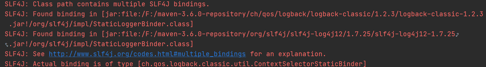
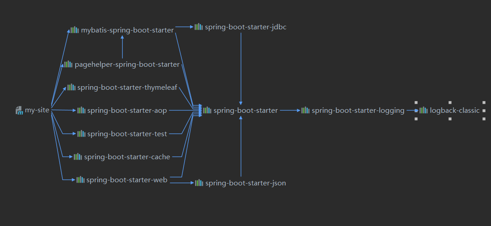
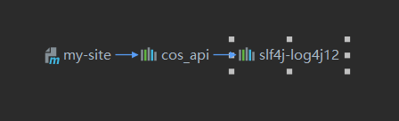

## 基本信息

非常简单的开源博客项目，只需要导入数据库就能跑起来了，基本后台技术为Springboot + mybatis +thymeleaf +mysql，还有一些图床模块，前台应该是bootstrap + jquery，基本上没有什么技术含量，代码风格花里胡哨，总喜欢整些没用的东西，不过仍然非常值得一看。

## 项目分析

### 1.日志jar包冲突



上来就是暴击，虽然不影响项目启动，但是看着不舒服，分别找到这两个jar的依赖关系图





虽然不知道原理是什么，但是只要把下面的slf4j-log4j12排除即可

```xml
<exclusions>
   <exclusion>
      <groupId>org.slf4j</groupId>
      <artifactId>slf4j-log4j12</artifactId>
   </exclusion>
</exclusions>
```

### 2.判断用户是否在线

简单粗暴，登录后直接把用户对象放在Session里面，基本流程如下


