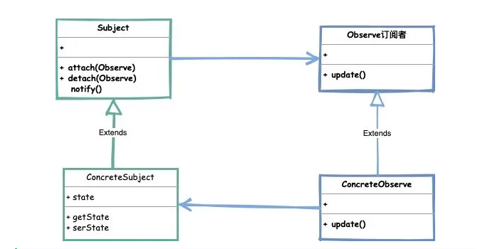
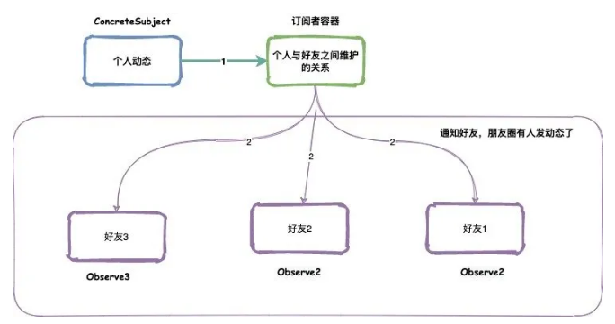

<h1 align="center">观察者模式</h1>

消息队列（MQ），一种能实现生产者到消费者单向通信的通信模型，这也是现在常用的主流中间件。

常见有 RabbitMQ、ActiveMQ、Kafka等  他们的特点也有很多 比如 **解偶**、**异步**、**广播**、**削峰** 等等多种优势特点。

在设计模式中也有一种模式能有效的达到**解偶**、**异步**的特点，那就是**观察者模式**又称为**发布订阅模式**。

## 定义

### 什么时观察者模式？它的目的是什么？

>当一个对象的状态发生改变时，已经登记的其他对象能够观察到这一改变从而作出自己相对应的改变。通过这种方式来达到减少依赖关系，解耦合的作用。

以QQ空间为例，我为主题，我的好友们为订阅者，我发一条动态，我的好友们都能收到这条动态

### 看看主要角色



>- Subject（主题）: 主要由类实现的可观察的接口，通知观察者使用attach（附属）方法，以及取消观察的detach(分离)方法。
>- ConcreteSubject（具体主题）: 是一个实现主题接口的类，处理观察者的变化
>- Observe（观察者）: 观察者是一个由对象水岸的接口，根据主题中的更改而进行更新。

### 具体代码实现

要有一个主题定义，有订阅、取消订阅、通知的功能

```java
public interface Subject {
    //订阅
    void attach(Observe observe);
    //取消订阅
    void detach(Observe observe);
    //发布动态，通知观察者
    void notifyObservers(String message);
}
```

主题的实现，添加了一个容器维护订阅关系

```java
public class ConcreteSubject implements Subject {
    private final List<Observe> observes = new ArrayList<>();
    @Override
    public void attach(Observe observe) {
        observes.add(observe);
    }

    @Override
    public void detach(Observe observe) {
        observes.remove(observe);
    }

    @Override
    public void notifyObservers(String message) {
        for (Observe observe : observes) {
            observe.update(message);
        }
    }
}
```

定义观察者，接受主题的消息

```java
public interface Observe {
    void update(String message);
}
```

创建具体的观察者，处理自身的业务逻辑

```java
public class ConcreteObserve implements Observe {
    @Override
    public void update(String message) {
        System.out.println("收到了消息："+message);
    }
}
```

测试

```java
public class Test {
    public static void main(String[] args) {
        Subject subject = new ConcreteSubject();
        ConcreteObserve o1 = new ConcreteObserve();
        ConcreteObserve o2 = new ConcreteObserve();
        subject.attach(o1);
        subject.attach(o2);
        subject.notifyObservers("今晚打老虎");
    }
}
```

测试结果

```bash
收到了消息：今晚打老虎
收到了消息：今晚打老虎
```

通过ConcreteSubject 维护了一个订阅关系，在通过notifyObservers 方法通知订阅者之后，观察者都获取到消息从而处理自己的业务逻辑。



达到了解耦合的效果，同时也减少了依赖关系，每个观察者根本不要知道发布者处理了什么业务逻辑，也不用依赖发布者任何业务模型，只关心自己本身需要处理的逻辑就可以了

如果有新的业务添加进来，我们也只需要创建一个新的订阅者，并且维护到observers 容器中即可，也符合我们的开闭原则。

这里只是一种同步的实现方式，我们还可以扩展更多其他的异步实现方式，或者采用多线程等实现方式。

异步的观察者实现

```java
public class SendNewPersonObserver implements Observe {
    ExecutorService pool = Executors.newFixedThreadPool(2);
    @Override
    public void update(String message) {
        Future<String> future = pool.submit(new Callable<String>() {
            @Override
            public String call() throws Exception {
                TimeUnit.SECONDS.sleep(3);
                // 处理响应的业务逻辑
                return "调用发券服务，返回结果";
            }
        });
        try {
            // 假设等待200毫秒 没有获取到返回值结果则认为失败
            System.out.println(future.get(4000, TimeUnit.MILLISECONDS));
        } catch (Exception e) {
            // 执行异步获取失败
            // 记录日志，定时任务重试等
        }
        // 第一种不关心返回值结果
        Thread thread = new Thread(new Runnable() {
            @Override
            public void run() {
                // 模拟服务调用 线程睡3秒钟
                try {
                    TimeUnit.SECONDS.sleep(3);
                } catch (InterruptedException e) {
                    e.printStackTrace();
                }
                System.out.println("发送新人优惠券");
            }
        });
        thread.start();
        System.out.println("执行异步返回");
    }
}
```

