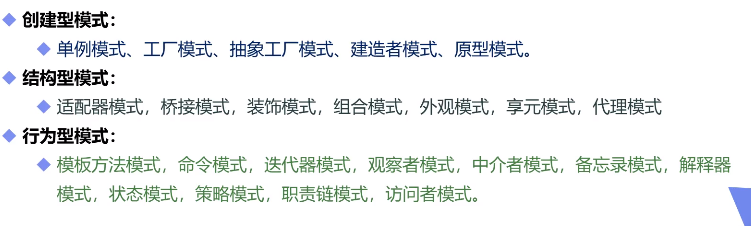
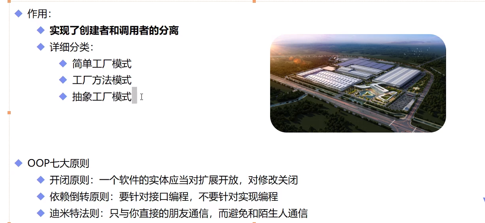
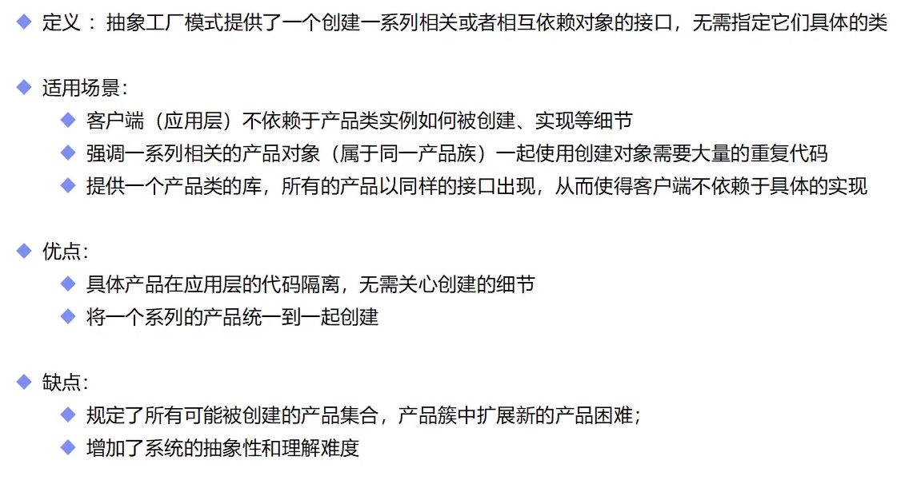
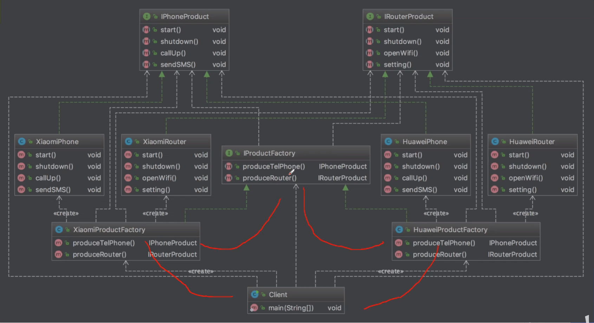

## 理论

### 概念

- 设计模式（Design Pattern）是前辈们对代码开发经验的总结，是解决特定问题的一系列套路。它不是语法规定，而是一套用来提高代码可复用性、可维护性、可读性、稳健性以及安全性的解决方案。

### 设计模式的意义

- 设计模式的本质是面向对象设计原则的实际运用，是对类的封装性、继承性和多态性以及类的关联关系和组合关系的充分理解。

### 正确使用设计模式具有以下优点

- 可以提高程序员的思维能力、编程能力和设计能力
- 使程序设计更加标准化、代码编制更加工程化，使软件开发效率大大提高，从而缩短软件的开发周期。
- 使设计的代码可重用性高、可读性强、可靠性高、灵活性好、可维护性强

## 设计模式汇总



## OOP七大原则（面向对象七大原则）


## 工厂模式



### 本质

- 实例化对象不使用new，用工厂方法代替
- 将选择实现类，创建对象统一管理和控制。从而将调用者跟我们的实现类解耦

### 三种方式

- 简单工厂模式（静态工厂模式）
  - 用来生产同一等级结构中的任意产品（对于增加新的产品，需要覆盖已有代码）
- 工厂方法模式
  - 用来生产同一等级结构中的固定产品（支持增加任意产品）
- 抽象工厂模式
  - 围绕一个超级工厂创建其他工厂。该超级工厂又称为其他工厂的工厂

### 实现

#### 公共代码

```java
interface Car{
    void name();
}
class XiaoMi implements Car{
    @Override
    public void name() {
        System.out.println("小米汽车");
    }
}
class Tesla implements Car{
    @Override
    public void name() {
        System.out.println("特斯拉");
    }
}
```

#### 简单工程模式

```java

class CarFactory{
    public static<T> T buildCar(Class<T> tClass) throws IllegalAccessException, InstantiationException {
        if (Car.class.isAssignableFrom(tClass) && Car.class != tClass) {
            return tClass.newInstance();
        }
        return null;
    }
}
class Consumer {
    public static void main(String[] args) throws InstantiationException, IllegalAccessException {
        Car car = CarFactory.buildCar(XiaoMi.class);
        car.name();
        Car car1 = CarFactory.buildCar(Tesla.class);
        car1.name();
    }
}
```

#### 工厂方法模式

```java
interface CarFactory{
    Car getCar();
}
class XiaoMiCarFactory implements CarFactory{
    @Override
    public Car getCar() {
        return new XiaoMi();
    }
}
class TeslaCarFactory implements CarFactory{
    @Override
    public Car getCar() {
        return new Tesla();
    }
}
class Consumer {
    public static void main(String[] args){
        CarFactory carFactory = new XiaoMiCarFactory();
        carFactory.getCar().name();
    }
}
```

### 小结

- 简单工厂模式（静态工厂模式）
  - 虽然某种程度上不符合设计原则，但实际使用最多
- 工厂方法模式
  - 不修改已有类的前提下，通过增加新的工厂类实现拓展
- 抽象工厂模式
  - 不可以增加产品，可以增加产品族

## 抽象工厂模式

### 概念





